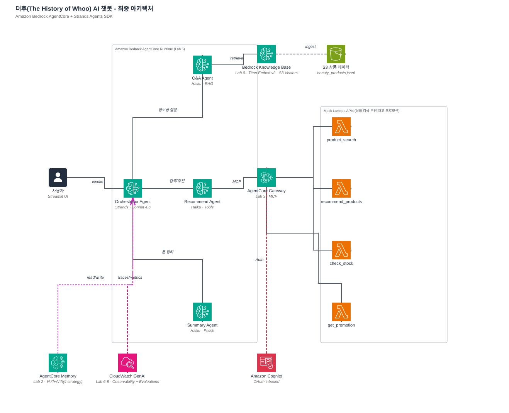

# 시작하기 전에

> **왜 AgentCore인가?** Amazon Bedrock AgentCore는 모든 프레임워크·모델과 호환되는 프로덕션 에이전트 플랫폼입니다. AWS는 기존 Amazon Bedrock Agents를 계속 지원하지만, 신규 구축에는 AgentCore + Strands Agents 조합을 권장합니다. 이 워크샵은 처음부터 AgentCore로 구축합니다.

## 실습 환경

Workshop Studio 가 제공하는 임시 AWS 계정에서 진행합니다.

* **리전**: `us-east-1`
* **IDE**: SageMaker Studio Code Editor (Python 3.11, 5GB)
* **언어 / 프레임워크**: Python 3.11+, Strands Agents SDK, AgentCore SDK

## 사용하는 AWS 서비스

| 서비스 | 역할 |
|---|---|
| Amazon Bedrock | 언어 모델 (Claude) + Knowledge Base |
| Amazon Bedrock AgentCore | Runtime, Memory, Gateway, Observability, Evaluations |
| Amazon S3 / S3 Vectors | 샘플 데이터 저장 + 벡터 스토어 |
| AWS Lambda | Mock 상품 검색·추천·재고·프로모션 API |
| Amazon CloudWatch | 에이전트 로그·트레이스·대시보드 |
| AWS IAM | 권한 관리 |

## 1단계. Workshop Studio 접속

이벤트 링크로 접속하면 임시 AWS Console 이 열립니다. 리전이 `us-east-1` 인지 우측 상단에서 확인하세요.

## 2단계. Bedrock 모델 access 확인

> Bedrock **Model access** 페이지는 2025년에 retired 됐습니다. 서버리스 foundation model 은 첫 호출 시 자동 활성화되므로 콘솔에서 미리 승인 받을 필요 없습니다.

이 워크샵이 사용하는 모델:

- **Claude Sonnet 4.6** — Orchestrator
- **Claude Haiku 4.5** — 서브 Agent + LLM-as-judge
- **Titan Embed Text v2** — Knowledge Base 임베딩

### `AccessDeniedException` 이 Lab 중에 나올 경우

Anthropic 모델은 최초 호출 시 **use case 제출**을 요구할 수 있습니다. Console → Amazon Bedrock → **Model catalog** 에서 해당 모델 페이지로 들어가 양식을 제출하면 수 초 내 활성화. 자세한 절차는 [AWS 공식 문서](https://docs.aws.amazon.com/bedrock/latest/userguide/model-access.html) 참고.

## 3단계. Pre-Lab 으로 이동

[**Pre-Lab. 인프라 셋업**](00-pre-lab-셋업.md) 에서 스크립트 3개로 인프라 + Python 환경을 준비합니다. 약 15분.

## 워크샵 전체 구조

Lab 을 따라가면서 박스 하나씩 채워집니다.

---

준비됐으면 [**Pre-Lab**](00-pre-lab-셋업.md) 으로 이동하세요.
