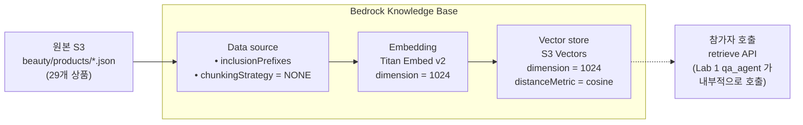

# Lab 0. 더후(The History of Whoo) 데이터 준비하기

*— Bedrock Knowledge Base + S3 Vectors 로 근거 기반 검색 준비하기*

**예상 소요 시간**: 15분

> Pre-Lab 을 아직 안 돌리셨다면 먼저 [Pre-Lab. 인프라 셋업](00-pre-lab-셋업.md) 을 완료하세요. 이 Lab 은 `KB_ID`, `AWS_REGION` 이 설정돼 있다는 전제입니다.

## 이 Lab 의 목표

- KB 를 구성하는 3 개 핵심 요소(**S3 원본 / Vector Store / Embedding 모델**)와 그 연결 관계를 이해
- 각 요소의 파라미터(chunking 전략, vector dimension, data source prefix) 가 어떤 의미인지 정리
- 준비된 KB 에 실제 쿼리를 날려 semantic search 가 의도대로 동작하는지 확인

## 전체 구조



3 개 요소의 **dimension 이 정확히 일치** 해야 하고, **chunking 전략** 이 retrieve 품질을 좌우합니다. 아래에서 하나씩 봅니다.

## 1단계. S3 에 올라간 원본 데이터 구조 이해

### 개념 먼저

KB 는 임의의 S3 prefix 를 data source 로 받습니다. **"prefix 아래의 파일 1 개 = chunk 1 개 ~ 여러 개"** 로 변환되는데, 여기서 **파일을 어떻게 쪼개느냐** 가 retrieve 결과 품질의 80% 를 결정합니다.

이 Lab 의 data source 구성:

| 설정 항목 | 값 | 의미 | 조정 포인트 |
|---|---|---|---|
| S3 prefix | `beauty/products/` | 이 하위 파일만 인덱싱 | 여러 prefix 동시 지정 가능 |
| 파일 구조 | `<product_id>.json` 29개 (파일당 1상품) | **파일 1개 = 상품 1개 = chunk 1개** | 대안: 1개 JSONL (아래 참고) |
| chunkingStrategy | `NONE` | 파일을 자르지 않음, 파일 전체가 1 chunk | FIXED_SIZE / HIERARCHICAL / SEMANTIC 도 가능 |

**상품별 개별 파일 + NONE chunking 을 선택한 이유**

- 상품 1 개의 JSON (~700 byte, ~200 토큰) 은 Titan v2 의 8192 토큰 한도 안에 여유롭게 들어갑니다.
- 상품 자체가 **자연스러운 의미 단위** (이름·성분·사용법·가격이 한 묶음) 라 인위적으로 자르면 오히려 품질이 저하됩니다.
- retrieve 시 `numberOfResults=3` 을 요청하면 **서로 다른 상품 3 개**가 관련도 순으로 반환됩니다. 한 파일에 29 상품을 JSONL 로 묶으면 chunk 가 1 개라 top-3 요청도 같은 답이 반복됩니다.

**다른 chunking 전략의 적용 시점**

| 전략 | 적합한 데이터 | 주의 |
|---|---|---|
| `NONE` | 한 파일이 이미 자연스러운 단위 (JSON 레코드, FAQ 한 쌍 등) | 파일 토큰 한도 초과하면 실패 |
| `FIXED_SIZE` (기본값, 300-500 토큰) | 긴 PDF, 기사, 매뉴얼 | 문장 중간에 잘려 의미 손상 가능 |
| `HIERARCHICAL` | 장·절 구조가 명확한 매뉴얼 | 메타데이터 설정 필요 |
| `SEMANTIC` (신규) | 주제가 섞인 긴 문서 | 비용 ↑, retrieve 품질 ↑ |

▶ **실행 — 데이터 훑어보기**

```bash
export DATA_BUCKET=$(aws cloudformation describe-stacks \
  --stack-name thewhoo-${PARTICIPANT_ID} --region $AWS_REGION \
  --query 'Stacks[0].Outputs[?OutputKey==`DataBucket`].OutputValue' \
  --output text)

# 상품 1개의 JSON 구조 확인
aws s3 cp s3://$DATA_BUCKET/beauty/products/WHOO-00101.json - \
  | python3 -c "import sys,json; print(json.dumps(json.load(sys.stdin), indent=2, ensure_ascii=False))"
```

```json
{
  "product_id": "WHOO-00101",
  "brand": "더후",
  "name": "더후 천기단 화현 크림",
  "category": "스킨케어 > 크림",
  "skin_type": ["건성", "복합성", "모든 피부"],
  "price_krw": 195000,
  "key_ingredients": ["천기단(天氣丹) 복합 성분", "장뇌삼", "영지", "청아교"],
  "usage_guide": "세안 후 토너, 에센스 다음 단계에서...",
  "highlights": ["한방 왕실 처방 기반", "피부 탄력·수분 동시 케어", "더후 대표 라인"],
  ...
}
```

총 **29개 상품**을 카테고리별로 보려면:

```bash
python3 scripts/count-categories.py
```

```
총 29개 상품

  스킨케어: 12개
  메이크업: 8개
  바디: 4개
  헤어: 3개
  향수: 2개
```

### 실제 서비스에 적용할 때 조정할 것

- **파일 단위 결정**: 검색의 자연스러운 단위가 무엇인지 먼저 정의 (상품 / 문서 / FAQ / 정책 조항 등)
- **파일 크기**: 임베딩 모델 토큰 한도 내인지 확인. 초과하면 chunking 전략 전환
- **업데이트 주기**: 정적 데이터면 ingestion 1회, 실시간이 필요하면 Lambda + S3 event → KB sync 자동화

## 2단계. Vector Store (S3 Vectors) 구성 이해

### 개념 먼저

Bedrock KB 는 vector store 를 여러 옵션 (Aurora pgvector, S3 Vectors, Neptune Analytics, 외부 Pinecone/Redis) 에서 고를 수 있습니다. 이 워크샵은 **Amazon S3 Vectors** 를 씁니다.

이 Lab 의 vector index 구성:

| 설정 항목 | 값 | 의미 | 조정 포인트 |
|---|---|---|---|
| vector bucket | `thewhoo-vec-<pid>` | 계정 내 unique 이름 | 조직 네이밍 규칙에 맞게 변경 |
| index name | `beauty-products` | bucket 안의 인덱스 식별자 | 복수 도메인 별로 분리 가능 |
| dimension | `1024` | **Titan Embed v2 와 일치 필수** | 다른 임베딩 모델이면 숫자 변경 |
| distanceMetric | `cosine` | 방향성 (의미 유사도) 기반 | 다른 옵션: `euclidean` (크기 기반) |
| dataType | `float32` | 고정 | - |

**S3 Vectors 를 선택한 이유**

- **관리 비용 거의 0**: 최소 collection 과금 없이 저장량 · 쿼리 단위 과금.
- **Aurora 대비**: VPC/보안그룹/DB 관리 불필요.
- **성능**: 수만 - 수십만 규모 벡터에 충분. 수백만 규모 + 실시간 인덱싱이 필요하면 OpenSearch 나 Aurora pgvector 가 더 적합.

### 실제 서비스에 적용할 때 조정할 것

- **dimension**: 임베딩 모델을 바꾸면 이 값도 바뀝니다. Titan v2 = 1024, Cohere Embed = 1024, OpenAI ada-002 = 1536 등. KB 생성 후엔 변경 불가 → 재생성 필요.
- **distanceMetric**:
  - `cosine` (대부분 문서 검색) — 의미 유사도
  - `euclidean` — 수치 차이. 추천 시스템 등에서 가끔
- **vector store 선택 기준**:
  - < 10만 벡터, 저비용 우선 → **S3 Vectors** (이 워크샵)
  - 100만+ 벡터, 실시간 인덱싱 → **Aurora pgvector / Pinecone**
  - RDBMS 와 join 필요 → **Aurora pgvector**
  - 외부 제공업체 선호 → **Pinecone / Redis Enterprise**

## 3단계. Knowledge Base 전체 구성 이해

### 개념 먼저

Bedrock KB 는 **"data source → embedding → vector store"** 파이프라인을 한 리소스로 묶은 것입니다. 생성 시 3가지 설정을 조합합니다:

```python
bedrock_agent.create_knowledge_base(
    name="thewhoo-kb-w001",
    roleArn=kb_role_arn,                        # KB 가 S3 읽기, Titan 호출, S3 Vectors 쓰기 수행
    knowledgeBaseConfiguration={
        "type": "VECTOR",
        "vectorKnowledgeBaseConfiguration": {
            "embeddingModelArn": "<Titan Embed v2 ARN>",  # 1024차원 임베딩
        },
    },
    storageConfiguration={
        "type": "S3_VECTORS",
        "s3VectorsConfiguration": {
            "vectorBucketArn": "<bucket ARN>",
            "indexArn":        "<index ARN>",
        },
    },
)
```

그 다음 **data source** 를 이 KB 에 attach:

```python
bedrock_agent.create_data_source(
    knowledgeBaseId=kb_id,
    name="beauty-products",
    dataSourceConfiguration={
        "type": "S3",
        "s3Configuration": {
            "bucketArn":         f"arn:aws:s3:::{bucket}",
            "inclusionPrefixes": ["beauty/products/"],
        },
    },
    vectorIngestionConfiguration={
        "chunkingConfiguration": {"chunkingStrategy": "NONE"},
    },
)
```

마지막으로 **ingestion job** 을 시작하면 "S3 파일 읽기 → Titan 으로 임베딩 → S3 Vectors 에 쓰기" 가 돌아갑니다:

```python
bedrock_agent.start_ingestion_job(knowledgeBaseId=kb_id, dataSourceId=ds_id)
```

▶ **실행**
Pre-Lab 의 `bootstrap_kb.py` 가 위 3 단계를 이미 수행했습니다. 상태 확인:

```bash
# KB 상태
aws bedrock-agent get-knowledge-base \
  --knowledge-base-id $KB_ID \
  --region $AWS_REGION \
  --query 'knowledgeBase.{name:name, status:status, storageType:storageConfiguration.type}'

# Ingestion job 진행도
aws bedrock-agent list-ingestion-jobs \
  --knowledge-base-id $KB_ID \
  --data-source-id $(aws bedrock-agent list-data-sources \
      --knowledge-base-id $KB_ID \
      --region $AWS_REGION \
      --query 'dataSourceSummaries[0].dataSourceId' --output text) \
  --region $AWS_REGION \
  --query 'ingestionJobSummaries[0].{status:status, stats:statistics}'
```

`status=COMPLETE`, `numberOfDocumentsScanned=29`, `numberOfDocumentsIndexed=29` 이면 완료.

### 실제 서비스에 적용할 때 조정할 것

- **role 권한**: `kb-inline` policy 가 `bedrock:InvokeModel` (임베딩), `s3:GetObject/ListBucket` (원본 읽기), `s3vectors:*` (쓰기/검색) 을 가져야 함
- **여러 data source**: 한 KB 에 data source 여러 개 attach 가능. 상품 / FAQ / 매뉴얼 분리해서 같은 vector store 공유
- **ingestion 재실행**: 파일 추가/변경 시 `start_ingestion_job` 재호출. **incremental** 지원 (변경된 파일만 재임베딩)

## 4단계. Retrieve API 로 semantic search 테스트

### 개념 먼저

KB 가 준비되면 boto3 의 `bedrock-agent-runtime` 클라이언트가 제공하는 `Retrieve` API 로 검색합니다 (IAM action 은 `bedrock:Retrieve`). 핵심 파라미터:

```python
client.retrieve(
    knowledgeBaseId=KB_ID,
    retrievalQuery={"text": "건성 피부에 좋은 보습크림"},   # 자연어
    retrievalConfiguration={
        "vectorSearchConfiguration": {
            "numberOfResults": 3,                        # top-N
            # "overrideSearchType": "SEMANTIC",          # 기본값
            # "filter": {...},                           # metadata 필터 (선택)
        }
    },
)
```

반환 구조:

```python
{
    "retrievalResults": [
        {
            "content": {"text": "<chunk 내용 — 여기선 상품 JSON>"},
            "score": 0.712,                  # cosine 유사도 (0-1, 높을수록 관련)
            "location": {"s3Location": {...}},
            "metadata": {...},
        },
        ...
    ]
}
```

▶ **실행**
```bash
python3 scripts/pretty-retrieve.py "건성 피부에 좋은 보습크림"
```

출력 예시:

```
Query: "건성 피부에 좋은 보습크림"
KB: MNUBMHKQMM  |  Top 3 results

=== [1] 관련도 0.712 ===
  상품ID : WHOO-00101
  이름   : 더후 천기단 화현 크림  (더후)
  카테고리: 스킨케어 > 크림
  피부타입: 건성, 복합성, 모든 피부
  가격   : 195,000원
  성분   : 천기단 복합 성분, 장뇌삼, 영지, 청아교
  특징   : 한방 왕실 처방 기반 / 피부 탄력·수분 동시 케어 / 더후 대표 라인
  평점   : 4.8

=== [2] 관련도 0.654 ===
  ...
```

다른 쿼리로도 시도:

```bash
python3 scripts/pretty-retrieve.py "지성 피부 클렌저"
python3 scripts/pretty-retrieve.py "향수 플로럴"
python3 scripts/pretty-retrieve.py "천기단 복합 성분"
```

관련도 `score` 가 쿼리-상품 semantic 유사도입니다. 보통 0.5 이상이면 의미 있는 결과.

### 실제 서비스에 적용할 때 조정할 것

- **`numberOfResults`**: default 5. 너무 크면 LLM context 낭비, 너무 작으면 중요한 정보 누락. **3-5 가 일반적**.
- **`score` threshold**: 낮은 점수 (예: `< 0.4`) 는 무시하고 "관련 상품 없음" 으로 처리하는 fallback 로직 권장.
- **metadata filter**: `retrievalConfiguration.vectorSearchConfiguration.filter` 로 카테고리·가격대 등 제한 가능. 예: `{"stringContains": {"key": "category", "value": "스킨케어"}}`.
- **hybrid search**: `overrideSearchType: "HYBRID"` 로 semantic + keyword 결합. 정확 키워드 매칭이 중요한 도메인 (상품 코드 등) 에 유용.

## 여기까지 됐으면 성공

- [ ] `echo $KB_ID` 가 값을 돌려줌
- [ ] `aws s3 ls s3://$DATA_BUCKET/beauty/products/ | wc -l` 이 29
- [ ] Ingestion job `status=COMPLETE`, 29 documents indexed
- [ ] `pretty-retrieve.py` 결과에 쿼리와 관련된 상품 3개가 다른 상품으로 나옴
- [ ] score 가 0.5 이상

## 문제 발생 시

| 증상 | 원인/해결 |
|---|---|
| retrieve 결과 비어있음 | Ingestion 아직 진행 중 (~2분). `list-ingestion-jobs` 로 `COMPLETE` 확인 후 재시도 |
| top-3 가 모두 같은 chunk | Data source 가 `products.jsonl` 하나로 되어 있음. `scripts/reindex-kb.sh $PARTICIPANT_ID` 로 상품별 파일 분할 재실행 |
| `AccessDenied` on retrieve | `AgentRuntimeRole` 에 `bedrock:Retrieve` 권한 확인 (IAM action 은 service prefix `bedrock-agent-runtime` 가 아니라 `bedrock` 입니다 — 헷갈림 주의) |
| score 가 전부 0.3 이하 | 쿼리와 데이터 언어 불일치 (예: 영어 쿼리, 한국어 데이터). 같은 언어로 재시도 |
| KB 가 `DELETE_UNSUCCESSFUL` 에서 안 지워짐 | **삭제 순서 문제**입니다. KB 는 삭제될 때 벡터 스토어의 데이터를 지우는데, 벡터 버킷이나 KB IAM role 이 **먼저** 사라지면 지울 대상/권한이 없어 실패합니다. `failureReasons` 에 "Unable to delete data from vector store" 가 보이면 이 경우입니다. <br>▶ 복구: 없어진 **벡터 버킷 + 인덱스**(`thewhoo-vec-<pid>` / `beauty-products`, dimension 1024 · cosine) 와 **KB role**(`thewhoo-kb-role-<pid>`) 을 다시 만든 뒤 `delete-knowledge-base` 재시도 → 정상 삭제됩니다. <br>▶ 예방: `cleanup-all.sh` 는 KB 가 목록에서 사라진 것을 확인한 다음에 벡터 버킷을 지웁니다. 수동 삭제 시에도 **KB → 벡터 버킷 → role** 순서를 지키세요. |

## 다음 단계

지금은 Python 스크립트로 **직접** retrieve 를 호출했지만, 실제 챗봇에선 이 호출을 **Strands Agent 의 tool** 로 등록해 LLM 이 자율적으로 판단하도록 합니다.

[**Lab 1. 상품 정보를 이해하고 답하는 챗봇**](02-lab1-상품정보-답하는-챗봇.md) 로 이동.
