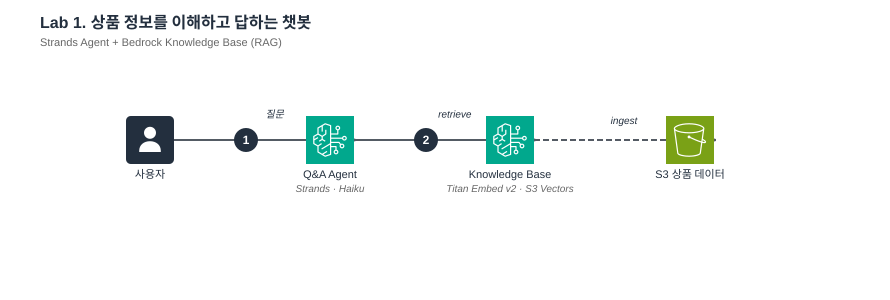
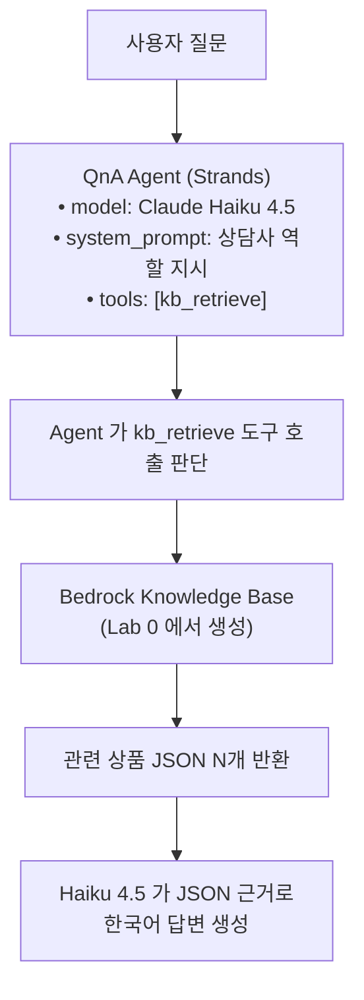

# Lab 1. 상품 정보를 이해하고 답하는 챗봇 만들기

*— Strands Agent + Knowledge Base 로 근거 기반 답변 만들기*



**예상 소요 시간**: 45분

> **전제**: [Pre-Lab](00-pre-lab-셋업.md) 과 [Lab 0](01-lab0-데이터-준비하기.md) 을 완료하고 `KB_ID`, `AWS_REGION` 환경변수가 설정돼 있어야 합니다. 터미널이 끊겼다면:
> ```bash
> cd ~/thewhoo-agentcore-workshop && source .venv/bin/activate
> eval "$(./scripts/print-env.sh w001)"   # 화면에 출력 없음이 정상 (변수로 설정됨)
> echo "KB_ID=$KB_ID"                     # 값이 찍히면 OK
> ```

## 이 Lab 의 목표

- **Strands Agent** 의 핵심 3요소 (model / system_prompt / tools) 가 각각 어떤 역할인지 이해
- `@tool` 데코레이터로 함수를 Agent 의 도구로 등록하는 패턴
- Agent 가 도구를 **언제 호출할지 어떻게 판단하는지** (docstring / 파라미터 타입의 역할)
- KB retrieve 호출 파라미터 (`numberOfResults`, `filter` 등) 를 도메인에 맞게 조정하는 법

## 지금 만드는 구조



## 1단계. KB retrieve 도구 설계

### 개념 먼저

Strands Agent 의 **tool** 은 일반 Python 함수에 `@tool` 데코레이터를 붙인 것입니다. Agent 가 자율적으로 "이 도구를 호출해야겠다" 고 판단하는데, 그 판단 근거는:

| 판단 재료 | 어떻게 쓰이나 |
|---|---|
| 함수 이름 | LLM 에게 tool 의 identifier 로 전달됨 |
| **Docstring** | LLM 이 "이 도구를 언제 쓰는가" 를 이해하는 데 **가장 중요한 정보** |
| 파라미터 타입 힌트 | JSON schema 로 변환되어 LLM 이 어떤 인자를 채워야 할지 알림 |
| 반환 타입 힌트 | 생략 가능 |

**즉, tool 의 동작은 docstring 설계가 80%.** 동일한 함수라도 docstring 을 어떻게 쓰느냐에 따라 호출 정확도가 크게 달라집니다.

이 Lab 의 `kb_retrieve` 도구 구성:

```python
@tool
def kb_retrieve(query: str) -> str:
    """Bedrock Knowledge Base에서 뷰티 상품 정보를 검색합니다.

    Args:
        query: 검색할 질문이나 키워드

    Returns:
        관련 상품 정보 텍스트 (최대 3개 청크)
    """
```

| 설계 포인트 | 값 | 의미 | 조정 포인트 |
|---|---|---|---|
| 도구 이름 | `kb_retrieve` | LLM 이 tool ID 로 인식 | 도메인별로 직관적 이름 (예: `search_products`) |
| 첫 줄 docstring | "Bedrock Knowledge Base에서 뷰티 상품 정보를 검색" | LLM 이 "언제 이 도구를 쓸지" 판단 | 여기에 **조건**을 명시하면 더 정확해짐 |
| `query: str` | 자연어 쿼리 | LLM 이 사용자 질문을 쿼리로 어떻게 변환할지 결정 | `Args: query` 에 "한국어 가능" 명시 |
| 반환 `str` | 청크 최대 3개를 `---` 구분자로 이어 붙인 텍스트 | LLM 이 바로 읽을 수 있는 단일 문자열로 반환 | 파싱이 필요하면 반환 타입을 `list[dict]` 로 바꿀 수 있음 |

**retrieve 내부**는 Lab 0 에서 본 boto3 `bedrock-agent-runtime` 클라이언트의 `Retrieve` API 를 그대로 호출:

```python
# 개념 설명용 의사코드 — 실제 코드는 src/tools/kb_retrieve.py 참고
response = _get_client().retrieve(
    knowledgeBaseId=os.environ["KB_ID"],
    retrievalQuery={"text": query},
    retrievalConfiguration={
        "vectorSearchConfiguration": {"numberOfResults": 3}
    },
)
chunks = []
for r in response.get("retrievalResults", []):
    text = r.get("content", {}).get("text", "")
    score = r.get("score", 0)
    if text:
        chunks.append(f"[관련도: {score:.2f}]\n{text}")
return "\n\n---\n\n".join(chunks)
```

전체 코드는 `src/tools/kb_retrieve.py` (52줄) 에서 볼 수 있습니다.

### 실제 서비스에 적용할 때 조정할 것

- **도구 description (docstring) 에 조건 명시**: 예를 들어 "재고 조회는 다른 도구를 쓰세요" 같은 배제 조건을 넣으면 Agent 가 잘못된 도구 선택을 덜 함
- **파라미터 확장**: `category: str | None = None`, `price_max: int | None = None` 같이 metadata filter 를 인자로 노출하고 `retrievalConfiguration.vectorSearchConfiguration.filter` 로 전달 가능
- **결과 필터링**: `score < 0.4` 인 결과는 return 에서 제외하고 빈 리스트 반환 → Agent 가 "관련 상품 없음" 을 인지

## 2단계. Q&A Agent 구성

### 개념 먼저

`Agent(model, system_prompt, tools)` 이 3가지가 Strands Agent 의 전부입니다. 각 역할:

| 구성 요소 | 역할 | 이 Lab 값 |
|---|---|---|
| `model` | LLM 선택. BedrockModel 클래스로 래핑 | Claude Haiku 4.5 — 이 워크샵은 `us.` prefix 가 붙은 **US geography cross-region inference profile ID** 를 사용합니다 (`us.anthropic.claude-haiku-4-5-20251001-v1:0`). 공식 model card 의 기본 모델 ID 는 prefix 없이 `anthropic.claude-haiku-4-5-20251001-v1:0` 이며, cross-region inference profile 은 미국 내 여러 리전에 요청을 자동 분산해 처리 용량과 가용성을 확보하는 호출 방식입니다. 자세한 내용은 [Cross-region inference](https://docs.aws.amazon.com/bedrock/latest/userguide/cross-region-inference.html) 참고. |
| `system_prompt` | 에이전트의 **정체성과 행동 규칙** | "뷰티 상담사, 근거 기반 답변, 지어내지 말 것" |
| `tools` | 호출 가능한 도구 목록 | `[kb_retrieve]` (1개) |
| `callback_handler` | stream 출력 제어 (optional) | `None` (중간 출력 억제) |

이 Lab 의 system prompt:

```python
SYSTEM_PROMPT = """당신은 더후(The History of Whoo) 전문 상담사입니다.
Bedrock Knowledge Base(KB) 의 검색 결과를 우선 사용해 정확하게 답변합니다.

KB 에 담긴 것은 정적인 상품 정보(성분·사용법·가격·피부타입·특징)입니다.

[답변 원칙]
1. KB 검색 결과에 명시된 사실은 그대로 인용하고 출처 상품명을 함께 보여 주세요.
2. KB 결과에서 직접 답을 못 찾았더라도, 일반적으로 잘 알려진 화장품 성분의 효능
   (예: 세라마이드는 피부 장벽 강화에 도움)은 **신뢰할 수 있는 범위 안에서 간결하게**
   설명해 주세요. "기술적 오류", "데이터베이스 오류" 같은 시스템 사과 표현은
   사용하지 않습니다.
3. 효능을 단정하지 말고 "도움이 될 수 있습니다" 같은 부드러운 어조를 사용하세요.
   의료적 치료·완치·진단 표현은 금지합니다.
4. 가능하면 KB 에서 같이 추천할 수 있는 상품을 1~2개 함께 안내하세요.

[KB 범위 밖 주제 — 추측 금지]
다음 주제는 KB 만으로는 정확히 답할 수 없으므로, 별도 서비스(Gateway 도구)
가 필요하다는 사실을 자연스럽게 안내하세요. 사과조 fallback 은 사용하지 말 것.
- 재고 유무 / 재고 수량 / 입고 예정일 / 배송 소요시간
- 실시간 할인·쿠폰·프로모션 진행 여부
- 주문·결제·환불·배송 조회

상품 데이터가 KB 에 존재한다는 사실은 곧 "재고가 있다" 는 뜻이 아닙니다.

답변은 친근하고 전문적인 한국어 존댓말로, 추측 없이 작성하세요."""
```

> **📌 실제 코드와 일치**: 위 system prompt 는 `src/agents/qa_agent.py` 의 `SYSTEM_PROMPT` 와 동일합니다.

**이렇게 구성한 이유**

- 역할 정의 — 첫 줄이 답변 톤을 결정합니다.
- **근거 강제 + 범위 명시** — KB 에 담긴 것(정적 상품 정보)과 담기지 않은 것(재고·프로모션·주문)을 명확히 구분해야 "상품이 KB 에 있음 = 재고 있음" 같은 혼동을 막을 수 있습니다. 초기 검증에서 "재고 있어?" 에 "네 있습니다!" 로 답하는 문제가 발생해, **배제 리스트**를 명시적으로 추가했습니다.
- **fallback 문구 지정** — 빈 결과뿐 아니라 범위 밖 질문에도 동일한 안내로 답하게 하여 사용자 경험을 일관되게 유지합니다.
- 언어·톤 지정 — 한국어 존댓말 유지, 추측 금지.

**모델을 Haiku 4.5 로 선택한 이유**

이 Lab 의 Agent 가 수행하는 작업은 (1) "이 질문이 KB 검색으로 답할 수 있는가" 판단 + (2) retrieve 결과를 한국어로 재구성하는 **단순 작업**이므로 Haiku 로 충분합니다.

Lab 4 에서 Orchestrator 가 여러 도구 조합을 결정할 때는 더 강한 모델(Sonnet) 이 필요하지만, 근거가 이미 주어진 답변 생성은 Haiku 가 **속도·비용 측면에서 압도적**입니다.

### 구현

```python
# src/agents/qa_agent.py
def create_qa_agent() -> Agent:
    model = BedrockModel(
        model_id="us.anthropic.claude-haiku-4-5-20251001-v1:0",
        region_name=os.environ.get("AWS_REGION", "us-east-1"),
    )
    return Agent(
        model=model,
        system_prompt=SYSTEM_PROMPT,
        tools=[kb_retrieve],
        callback_handler=None,
    )
```

`src/agents/qa_agent.py` 전체 52줄.

### 실제 서비스에 적용할 때 조정할 것

- **모델 선택 기준**
  - **Haiku**: 근거가 주어진 답변 생성, tool 호출 판단이 단순한 경우
  - **Sonnet**: 다중 도구 조합, 복잡한 reasoning 필요
  - **Opus**: 창의적 생성 (워크샵 범위 밖)
- **system prompt 튜닝 포인트**
  - **법규 표현 금지**: "의료 효능 단정 금지" (화장품법)
  - **브랜드 톤**: "친근한 존댓말 유지"
  - **fallback 동작**: "KB 에서 못 찾으면 '확인되지 않는다' 고 답변"
  - **답변 포맷**: "성분/사용법/주의사항 섹션으로 나눠 응답"
- **temperature / top_p**: `BedrockModel(..., temperature=0.3)` 로 지정. 창의성 vs 일관성 trade-off. RAG 답변은 보통 0.0-0.3.

## 3단계. 실행

```bash
cd ~/thewhoo-agentcore-workshop/src                       # 이미 src 안이면 생략
python run_lab1.py                             # 기본 예제
python run_lab1.py "천기단 화현 에센스 성분 알려줘"   # 직접 질문
python run_lab1.py --chat                      # 대화형
```

> `python` 이 아니라 시스템 Python 이 잡혀 `ImportError: cannot import name 'CacheConfig'` 가 나면
> venv 가 활성화되지 않은 상태입니다 → `cd ~/thewhoo-agentcore-workshop && source .venv/bin/activate` 후 재시도.
> ([Pre-Lab 3-4](00-pre-lab-셋업.md) 참고)

출력 예시:

```
[질문]
더후 천기단 화현 크림 주요 성분이랑 사용법 알려주세요

[답변]
## 🌿 더후 천기단 화현 크림

### 주요 성분
- **천기단(天氣丹) 복합 성분** — 한방 왕실 처방 기반 집중 케어
- **장뇌삼** — 피부 탄력 강화
- **영지·청아교** — 깊은 보습과 영양 공급

### 사용법
1. 세안 후 토너, 에센스를 먼저 사용하세요
2. 적당량을 얼굴 전체에 고르게 펴 발라주세요
3. 아침·저녁 모두 사용 가능합니다
...
```

Agent 가 내부적으로:
1. `kb_retrieve(query="천기단 화현 크림 주요 성분 사용법")` 호출
2. KB 에서 WHOO-00101 상품 JSON retrieve
3. JSON 의 `key_ingredients` / `usage_guide` 를 사람 친화적 문장으로 재구성
4. system prompt 지시대로 한국어·섹션 구조로 출력

## 4단계. 한계 확인 — 재고 질문에 답할 수 없는 이유

```bash
python run_lab1.py "천기단 화현 크림 재고 있어?"
```

출력:

> 재고 정보는 상품 지식창고에서 확인되지 않습니다. 재고 확인은 별도 서비스에서 문의해 주세요.

### 이것이 **정상 동작** 인 이유

KB 는 **정적인 상품 정보**(성분·사용법·가격)만 담습니다. 재고는 실시간으로 바뀌는 값이라 KB 에 넣으면 오히려 독이 됩니다(이전 값으로 hallucination 발생).

**아키텍처 의도**:

| 정보 성격 | 어디에 저장 | 언제 구성되는가 |
|---|---|---|
| **정적** (성분, 사용법, 이미지 URL) | KB | 이 Lab |
| **실시간** (재고, 가격, 프로모션) | Lambda 로 외부 API 랩 → Gateway | Lab 3 |
| **사용자별** (선호, 세션 요약) | Memory | Lab 2 |

Lab 3 에서 재고 조회 도구를 추가하면, Agent 가 "재고" 키워드를 보고 자동으로 KB 대신 재고 도구를 선택합니다.

### 실제 서비스에 적용할 때 조정할 것

- 도메인의 정보를 **정적 / 실시간 / 사용자별** 3 차원으로 분류하고 각각의 저장소 선택
- KB 에 "대충" 다 넣지 말 것. 업데이트 빈도가 일주일 이상이어야 KB 후보
- 실시간 데이터는 **기존 내부 API 를 Lambda 로 랩** 해서 Gateway target 으로 등록 (Lab 3 에서 설명)

## 5단계. Streamlit UI 로 직접 써보기

```bash
cd ~/thewhoo-agentcore-workshop
source .venv/bin/activate
streamlit run src/streamlit_lab1.py --server.port 8501
```

브라우저로 여는 법은 [Streamlit on Code Editor 가이드](streamlit-on-code-editor.md) 참고.

### UI 에서 확인할 것

- **추천 질문 버튼 3개** — 성분 / 사용법 / 한계 확인
- **자유 입력**
- **도구 호출 내역** (접는 섹션) — `kb_retrieve` 호출 횟수와 소요시간. Agent 가 몇 번 retrieve 했는지 관찰

## 여기까지 됐으면 성공

- [ ] `qa_agent` 가 존재하는 상품 질문에 KB 근거로 답함
- [ ] "재고 있어?" 같은 실시간 질문에는 지어내지 않고 모른다고 답함
- [ ] UI 의 "도구 호출 내역" 에서 `kb_retrieve` 가 1-2회 호출된 것 확인

## 잘 안 될 때

| 증상 | 원인/해결 |
|---|---|
| `KB_ID` 환경변수 없음 | `eval "$(./scripts/print-env.sh w001)"` |
| 답변이 영어로 나옴 | system prompt 에 한국어 지시 확인. 모델 ID 오타 확인 |
| 답변이 지어낸 내용 포함 | system prompt 에 "검색 결과에 없는 내용 지어내지 말 것" 강조. 최악의 경우 temperature=0 |
| `AccessDeniedException ... aws-marketplace` | Pre-Lab 의 `grant-sagemaker-permissions.sh` 재실행 |

## 다음 단계

Agent 가 대화를 **기억하지 못하는 한계** 를 느끼셨을 겁니다. 같은 질문을 두 번 해도 첫 번째인 척 답하죠.

[**Lab 2. 대화 맥락을 기억하는 챗봇**](03-lab2-대화를-기억하기.md) 에서 AgentCore Memory 로 이 한계를 해결합니다.
