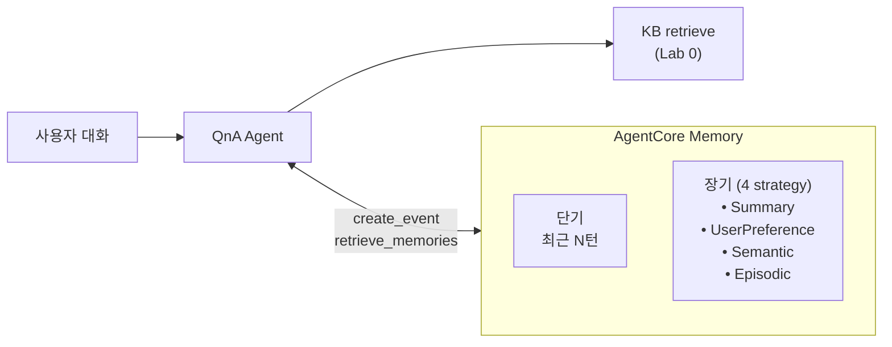
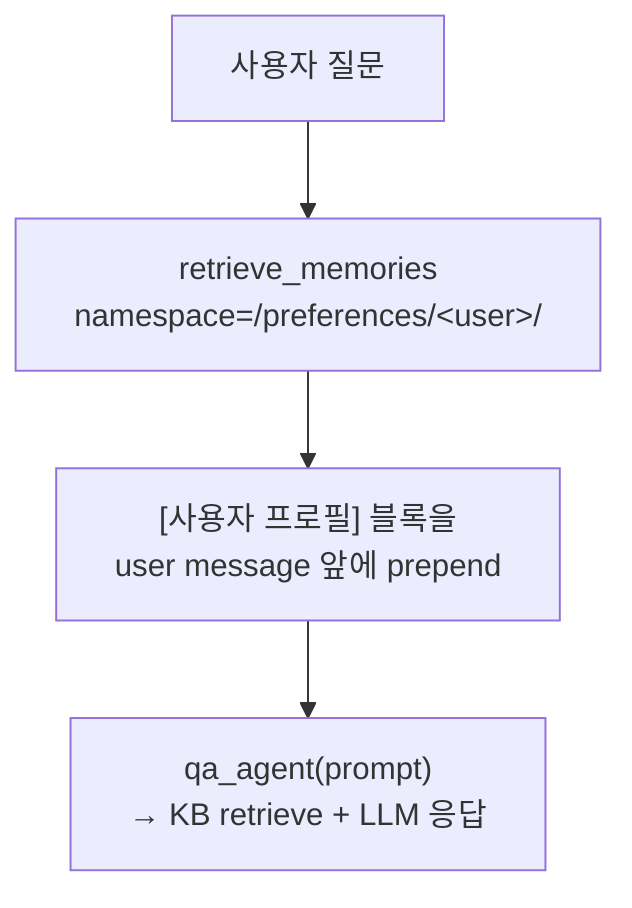

# Lab 2. 대화 맥락을 기억하는 챗봇으로 업그레이드하기

*— 고객 선호와 이전 대화를 기억하는 메모리 붙이기 (AgentCore Memory)*

**예상 소요 시간**: 45분

> **전제**: Lab 1 에서 쓴 `KB_ID`, `AWS_REGION` 이 여전히 설정돼 있어야 합니다. 이 Lab 에서 `AGENTCORE_MEMORY_ID` 를 추가로 생성·export 합니다. 환경변수가 사라졌다면:
> ```bash
> cd ~/thewhoo-agentcore-workshop && source .venv/bin/activate
> eval "$(./scripts/print-env.sh w001)"   # 화면에 출력 없음이 정상 (변수로 설정됨)
> echo "KB_ID=$KB_ID"                     # 값이 찍히면 OK
> ```

## 이 Lab에서 만들 것

* [ ] AgentCore Memory에 **단기 메모리**(세션 내 대화) + **장기 메모리**(4가지 strategy) 구성
* [ ] "건성 피부예요" → 장기 메모리에 **사용자 프로필**로 저장
* [ ] 이후 턴에서 "보습크림 추천해줘" → 프로필을 **자동 반영**해서 건성용 추천
* [ ] 세션 종료 후 재접속해도 **동일 user_id로 프로필이 유지**되는지 확인

## 지금 만드는 구조



## AgentCore Memory 의 Long-term 4가지 Strategy (핵심 개념)

Memory 의 장기 저장은 **strategy** 단위로 "어떤 정보를 뽑아 어느 namespace 에 저장할지" 결정됩니다. AgentCore 가 백그라운드 LLM 으로 각 strategy 의 기준에 맞는 정보를 **자동 추출**합니다.

| Strategy | 무엇을 뽑나 | Namespace 예시 | 읽는 타이밍 | 더후 도메인 예시 |
|---|---|---|---|---|
| **Summary** | 세션 전체 대화 요약 | `/summaries/{actorId}/{sessionId}/` | 재접속 시 이전 세션 요약 로드 | "이번 대화에서 건성·민감성용 크림 3종 추천함" |
| **UserPreference** | 반복되는 선호 (브랜드·스타일·취향) | `/preferences/{actorId}/` | 세션 시작 시 1회 로드 | "건성 피부", "자극 적은 제품 선호", "5만원 이하" |
| **Semantic** | 도메인 사실·지식·엔터티 | `/facts/{actorId}/` | 관련 질문 감지 시 | "더후 비첩 자생 라인은 민감 피부용", "천기단은 탄력·수분 라인" |
| **Episodic** | 상담 에피소드 (의도·액션·결과) | `/episodes/{actorId}/{sessionId}/` · reflectionConfiguration: `/episodes/{actorId}/` | 모호한 참조 ("저번에", "그거") 감지 시 | "'남편 선물' 목적 → 공진단 세트 추천 → 만족" |

> **4개 strategy 를 분리해 사용하는 이유**: 하나로 몰아두면 context window 가 낭비되고 retrieval 정확도가 떨어집니다. 각 strategy 는 다음 측면에서 구분됩니다.
>
> - **추출 알고리즘이 다름**: UserPreference 는 반복 패턴 누적, Episodic 은 사건 단위, Summary 는 축약
> - **주입 타이밍이 다름**: 선호는 세션 시작 시 1회만, 요약은 재접속 시, Episodic 은 "저번에" 같은 참조 감지 시
> - **namespace 격리**: 검색 시 필요한 것만 조회 → 토큰·지연 절약

## 1단계. Memory 리소스 생성

### 개념 먼저

AgentCore Memory 는 **리전별로 여러 개 만들 수 있는 리소스**이고, 이 워크샵에서는 1개만 씁니다. 하나의 Memory 안에 여러 **strategy** 를 붙여 "무엇을 어디에 저장할지" 를 선언적으로 정의합니다. 챗봇 세션에서 `create_event()` 로 턴을 기록하면, AgentCore 가 **백그라운드에서 strategy 기준으로 장기 정보를 추출** 하고, 나중에 `retrieve_memories(namespace=...)` 로 꺼내 씁니다.

이 Lab 에서 만들 구성:

| 설정 항목 | 값 | 의미 | 조정 포인트 |
|---|---|---|---|
| Memory name | `TheWhooMemory` | 리소스 이름 (account 내 unique) | 서비스명에 맞춰 변경 |
| Memory description | "더후(The History of Whoo) 챗봇의 단기·장기 메모리" | 콘솔에서만 표시 | 자유 |
| Strategy 1 — Summary | `namespaces=["/summaries/{actorId}/{sessionId}/"]` | 세션 전체 대화 요약 | namespace 에 `{sessionId}` 포함 → 세션별 |
| Strategy 2 — UserPreference | `namespaces=["/preferences/{actorId}/"]` | 반복 선호 (피부타입·브랜드) | `{sessionId}` 제외 → 세션 넘어 누적 |
| Strategy 3 — Semantic | `namespaces=["/facts/{actorId}/"]` | 도메인 사실·지식 | 용어집·엔터티 중심 |
| Strategy 4 — Episodic | `namespaces=["/episodes/{actorId}/{sessionId}/"]` · `reflectionConfiguration.namespaces=["/episodes/{actorId}/"]` | 상담 에피소드 (의도·액션·결과) | cross-session 학습 |

**이렇게 나눈 이유**

- **검색 비용 관리**: 여러 개를 하나의 거대한 메모리로 합치면 retrieve 시 전체를 벡터 검색해야 해서 느려지고 토큰도 낭비됩니다.
- **주입 타이밍 분리**: UserPreference 는 세션 시작 시 1 회만, Summary 는 재접속 시, Semantic 은 "저번에 말한 거" 같은 참조가 있을 때만 가져옵니다.
- **Namespace 템플릿**: `{actorId}` 같은 placeholder 는 `create_event()` 시 전달한 `actor_id` / `session_id` 로 자동 치환됩니다. 같은 Memory 안에서 여러 사용자·세션을 완벽히 격리할 수 있습니다.

### 만드는 법

**Code Editor 터미널** 에서:

```bash
cd ~/thewhoo-agentcore-workshop
source .venv/bin/activate
python3 scripts/create-memory.py
```

이 스크립트가 하는 일은 5줄로 요약됩니다:

```python
# (1) Memory 가 없으면 생성, 있으면 기존 ID 재사용 (idempotent)
memory = client.create_or_get_memory(name="TheWhooMemory", strategies=[], ...)

# (2) 4가지 strategy 를 순차 등록. 이미 같은 타입이 있으면 건너뜁니다.
client.add_summary_strategy_and_wait(...)           # Summary
client.add_user_preference_strategy_and_wait(...)   # UserPreference
client.add_semantic_strategy_and_wait(...)          # Semantic

# (3) Episodic 도 전용 convenience method 로 등록 (SDK v1.9+)
client.add_episodic_strategy_and_wait(
    memory_id=memory_id,
    name="EpisodicInteractions",
    namespace_templates=["/episodes/{actorId}/{sessionId}/"],
    reflection_namespace_templates=["/episodes/{actorId}/"],  # episodic 의 prefix 여야 함
)
```

**이 스크립트 설계의 3가지 포인트**

1. **`create_memory_and_wait` 대신 `create_or_get_memory`**: 재실행 안전 (idempotent). 이미 `TheWhooMemory` 가 있으면 `Memory with name X already exists` 대신 기존 ID 를 그대로 반환합니다.
2. **strategies 를 한 번에 안 만들고 하나씩 추가**: strategy 는 ACTIVE 가 될 때까지 각각 ~20초 걸리고, 한 번에 만들면 첫 실패 시 전체가 rollback 되어 디버깅이 어렵습니다. 하나씩 추가·ACTIVE 대기하면 실패 지점이 명확합니다.
3. **Episodic 도 전용 convenience method 가 있습니다** (SDK v1.9+): `add_episodic_strategy_and_wait(name=..., namespace_templates=[...], reflection_namespace_templates=[...])` 를 사용합니다. **`reflection_namespace_templates` 는 episodic `namespace_templates` 의 prefix 여야** 하며 (그렇지 않으면 `ValidationException: Reflection namespace ... must be ... prefix of the episodic namespace`), 생략하면 SDK 가 호출 전에 `ValueError` 를 던집니다 (사실상 필수 인자).

> **Episodic 의 reflection 이란?** AgentCore 가 여러 에피소드를 가로질러 **공통 패턴** 을 뽑아내는 자동 통합 단계입니다. 개별 에피소드는 `/episodes/{actorId}/{sessionId}/` 에, 에피소드 간 통찰은 `/episodes/{actorId}/` 에 쌓입니다. 읽을 때는 prefix `/episodes/{actorId}/` 로 retrieve 하면 통합 insight 가 나옵니다.

전체 코드는 `scripts/create-memory.py` (약 100줄) 에서 읽어볼 수 있습니다. 이미 만들어진 Memory 를 완전히 초기화하고 싶으면 `python3 scripts/cleanup-memory.py` 실행 후 재생성.

실행하면 약 1-2분 후 아래가 출력됩니다:

```text
# 예상 출력 — 실행하지 마세요
AGENTCORE_MEMORY_ID=TheWhooMemory-XXXX
```

이 값을 환경변수에 등록:

```bash
export AGENTCORE_MEMORY_ID=<출력된 값>
```

### 실제 서비스에 적용할 때 조정할 것

- **strategy 종류**: 상담 챗봇이면 Summary + Preference 만, 검색 챗봇이면 Semantic 중심 등 용도에 맞춰 1-3개 선택
- **namespace 구조**: 조직·브랜드 별로 데이터를 나누려면 `/preferences/{organizationId}/{actorId}/` 같이 계층 추가
- **retention**: 만료 기간(`eventExpiryDuration`)은 **Memory 리소스 단위** 설정입니다 (strategy 별이 아님). SDK 기본값 90일 (AgentCore Memory 콘솔)
- **strategy 커스텀 prompt**: "무엇을 선호로 뽑을지" 에 대한 추출 프롬프트를 도메인별로 튜닝 가능

**공식 quota 중 설계에 영향 주는 것** ([Quotas](https://docs.aws.amazon.com/bedrock-agentcore/latest/devguide/bedrock-agentcore-limits.html#memory-limits))

| 항목 | 값 | 조정 | 의미 |
|---|---|---|---|
| Memory 리소스 / 리전·계정 | 150 | 가능 | 테넌트별로 Memory 를 쪼개는 설계라면 먼저 확인 |
| **strategy / Memory 리소스** | **6** | **불가** | 이 워크샵은 4개 사용 — 여유 2개. 6개를 넘기려면 Memory 를 분리해야 합니다 |
| 장기추출 토큰 | 150,000/분 | 가능 | `Bedrock-AgentCore` namespace 의 `TokenCount` metric 으로 모니터링 |
| Episodic 장기추출 토큰 | 50,000/분·세션 | 불가 | 긴 세션에서 episodic 추출이 밀리는 원인 |
| `CreateEvent` | 200/초 (actor·session 당 5/초) | 일부 가능 | 매 턴 저장하는 구조에서 동시 사용자 많으면 확인 |
| `RetrieveMemoryRecords` | 30/초 | 가능 | 매 턴 조회 설계의 상한 |
| event 만료 | 최소 7일 ~ 최대 365일 | 불가 | `eventExpiryDuration` 허용 범위 |

### 환경변수가 자주 사라진다면

세션이 끊겨 값이 없어졌을 때 한 줄로 복구합니다.

```bash
cd ~/thewhoo-agentcore-workshop && source .venv/bin/activate
eval "$(./scripts/print-env.sh w001)"   # 화면에 출력 없음이 정상 (변수로 설정됨)
echo "KB_ID=$KB_ID"                     # 값이 찍히면 OK
```

`eval` 은 스크립트의 `export …` 출력을 **환경변수로 설정만** 하고 화면에는 찍지 않습니다. 바로 다음 줄 `echo` 로 값이 들어왔는지 확인하세요. 더 자세한 내용은 [환경변수 복구 가이드](env-recovery.md) 참고.

## 2단계. 첫 번째 대화 — 프로필 수집

### 개념 먼저

Memory 에 **턴(turn)** 을 저장하는 API 는 `create_event()` 입니다. 인자 구조:

```python
client.create_event(
    memory_id=MEMORY_ID,
    actor_id="demo-user",           # 사용자 식별자 (namespace placeholder 로 사용됨)
    session_id="session-abc",        # 같은 세션 턴 묶기
    messages=[
        ("사용자 발화", "USER"),
        ("에이전트 답변", "ASSISTANT"),
    ],
)
```

**핵심 포인트**:

- `actor_id` 는 `namespaces=["/preferences/{actorId}/"]` 의 `{actorId}` 로 치환됨. 즉 **사용자마다 자동으로 저장 공간이 분리**됩니다.
- `session_id` 는 `create_event()` 의 **필수 인자**입니다. namespace 에는 Summary 와 Episodic 이 `{sessionId}` 를 쓰고, Preference / Semantic 은 세션을 넘어 누적하므로 쓰지 않습니다.
- `messages` 의 role 은 `USER` / `ASSISTANT` / `TOOL` 등을 쓸 수 있습니다. 단 **Semantic·UserPreference 추출은 `USER`/`ASSISTANT` 만 처리**하고, Episodic 은 공식 문서 권장대로 `TOOL` 결과까지 넣으면 품질이 올라갑니다.
- 저장 직후엔 장기 메모리에 **아직 없음** — 뒤의 3 단계에서 설명.

▶ **실행**
**Code Editor 터미널** 에서:

```bash
cd ~/thewhoo-agentcore-workshop/src                       # 이미 src 안이면 생략
python run_lab2.py seed
```

이 스크립트가 하는 일:

```python
user_msg = "저는 건성 피부예요. 민감한 편이라 자극 적은 보습 제품을 선호해요."
assistant_msg = "건성이면서 민감한 피부라는 점 기억해 두겠습니다."

MEMORY.create_event(
    memory_id=MEMORY_ID,
    actor_id="demo-user",
    session_id=session_id,
    messages=[(user_msg, "USER"), (assistant_msg, "ASSISTANT")],
)
```

전체 코드는 `src/run_lab2.py` 의 `seed()` 함수 (10줄) 에서 볼 수 있습니다.

### 실제 서비스에 적용할 때 조정할 것

- **사용자 식별 체계**: 여기선 `demo-user` 하드코딩이지만 실서비스에선 앱의 인증 ID(Cognito sub, 내부 user_id 등)를 그대로 `actor_id` 로 넣습니다. 이게 모든 네임스페이스의 격리 기준이 됩니다.
- **session_id 의미**: UI 상의 "대화 창 1개 = 1 session". 앱이 새 대화 시작 버튼을 누르면 새 UUID 를 발급.
- **messages 배치 저장**: 매 턴 `create_event` 를 한 번씩 불러도 되고, 여러 턴을 모아서 한 번에 넣어도 됩니다. 워크샵은 매 턴 1회 호출로 단순화.

## 3단계. 장기 메모리 추출 기다리기

### 기다려야 하는 이유

`create_event` 는 **단기 메모리에 즉시 기록** 하지만, **장기 메모리 (Summary / Preference / Semantic) 추출은 비동기** 입니다. AgentCore 내부적으로:

1. event 를 short-term store 에 append
2. Extraction worker 가 strategy 별로 이벤트 배치를 꺼냄
3. 각 strategy 의 LLM prompt 로 "선호 추출 / 요약 / 사실 추출" 수행
4. 결과를 vector index 에 저장해 `retrieve_memories` 가 읽을 수 있는 상태로 만듦

2-4 단계가 **수십 초 ~ 약 1 분** 걸립니다. 이게 **eventual consistency** 입니다.

### 이 Lab 에서의 처리 방식

데모 단순화를 위해 `sleep 60` 으로 대기합니다.

```bash
sleep 60
```

### 실제 서비스에서의 처리 방식

`sleep 60` 은 데모용 hack. 실서비스에선 아래 두 가지 패턴이 일반적:

- **UI 관점에선 턴 생성 시점에 이미 단기 메모리가 있으므로** 같은 세션 내 즉시 활용은 문제없음. 새 세션 시작 시점에만 장기 데이터가 필요한데, 그때는 이미 이전 세션이 끝난 지 한참 지나서 추출이 완료된 경우가 대부분.
- **회귀 테스트나 수동 트리거가 필요하면** `retrieve_memories` 를 주기적으로 폴링하며 결과가 들어올 때까지 대기 (지수 backoff).

## 4단계. 새 세션에서 사용자 선호 불러오기 + 추천 받기

### 개념 먼저

`retrieve_memories` API 는 3 개 필수 인자로 **어느 네임스페이스를 어떤 쿼리로 검색할지** 지정합니다:

```python
prefs = client.retrieve_memories(
    memory_id=MEMORY_ID,
    namespace=f"/preferences/{actor_id}/",   # 1단계에서 정의한 namespace 템플릿
    query="피부타입 선호",                     # 이 쿼리로 벡터 검색
)
```

- `namespace` 는 **정확히 일치(exact)** 조회입니다. prefix 로 훑으려면 별도 파라미터인 `namespace_path` 를 씁니다. placeholder 를 치환한 전체 경로를 그대로 넣어야 합니다.
- `query` 는 **semantic 검색 쿼리**. 자연어로 "이 문맥에 관련된 것 달라" 형태. 관련 상위 N 개를 돌려줍니다.
- 반환값은 각 항목이 `{'content': {'text': '<JSON 문자열>'}, 'score': float, ...}` 구조. JSON 파싱이 필요한데 `src/memory.py` 의 `_parse_content()` 헬퍼가 이를 처리합니다.

에이전트에 프로필을 주입하는 흐름:



**system prompt 가 아닌 user message 에 넣는 이유**: Bedrock prompt caching 은 **요청마다 고정되는 영역**(system / tools / messages 초반부)에서 캐시 히트가 발생합니다. system prompt 를 모든 사용자 공통으로 유지해 캐시 프리픽스를 최대화하고, 사용자마다 달라지는 프로필은 **user message** 에 넣어 **캐시되는 프리픽스 뒤쪽**에 배치하는 것이 권장됩니다. 이렇게 하면 system 영역의 캐시 히트를 유지한 채 사용자별 가변 부분만 새로 처리할 수 있습니다. 자세한 내용은 [Bedrock prompt caching 문서](https://docs.aws.amazon.com/bedrock/latest/userguide/prompt-caching.html) 를 참고하세요.

▶ **실행**
```bash
python run_lab2.py
```

기본 질문 `보습크림 하나 추천해줘` 에 대한 답변 직전, 상단에 **`[프로필]`** 섹션으로 Memory 에서 불러온 선호가 찍힙니다:

```
[프로필] user=demo-user
  - 사용자는 건성 피부이며 민감한 편이다.
  - 자극이 적은 보습 제품을 선호한다.

[질문]
보습크림 하나 추천해줘

[답변]
(건성·민감성 피부를 고려한 추천)
```

직접 질문:

```bash
python run_lab2.py ask "세럼도 있어?"
```

### KB 에 맞는 상품이 없을 때 — "근거 기반" 과 "프로필 반영" 이 함께 작동

위 질문의 실제 답변 예시:

```
[프로필] user=demo-user
  - 건성 피부를 가지고 있음
  - 민감한 피부를 가지고 있음
  - 자극이 적은 보습 제품을 선호함

[질문]
세럼도 있어?

[답변]
현재 검색된 결과 중에는 건성·민감한 피부 전용으로 분류된 세럼이
정확히 보이지 않네요. ...
참고로 건성 피부용 크림으로는 더후의 '천기단 화현 크림'
(195,000원) 이 있는데, 천기단 복합 성분과 장뇌삼이 함유되어 있고
피부 탄력·수분을 동시에 케어하는 제품입니다!
```

이 응답은 **의도된 정상 동작** 입니다. 샘플 KB 에는 건성·민감용 세럼이 없어서:

1. Lab 1 의 system prompt 규칙("KB 에 없으면 지어내지 말 것")에 따라 **없다고 솔직하게 안내**
2. Memory 에서 주입된 **프로필(건성·민감·저자극)** 을 고려해 KB 에 실제로 있는 **크림 (더후 천기단 화현 크림)** 을 대안으로 제안

즉 **Lab 1 의 "근거 기반 hallucination 억제" + Lab 2 의 "프로필 기반 대안 제시"** 가 함께 동작한 케이스입니다. 지어낸 세럼을 추천했다면 오히려 실패. 실제로 KB 에 세럼이 있는지 확인하려면:

```bash
cd ..        # src/ 에서 실행 중이었다면 프로젝트 루트로
python3 scripts/pretty-retrieve.py "세럼"
```

데이터가 적으면 `data/` 에 세럼을 추가하고 `./scripts/reindex-kb.sh w001` 로 재색인하면 됩니다 (둘 다 루트 기준 경로).

### 실제 서비스에 적용할 때 조정할 것

- **`namespace` 와 `query` 는 개발자가 쌍으로 설계하는 계약입니다.**
  - `namespace` 는 strategy 등록 시 `namespaces=["/preferences/{actorId}/"]` 처럼 먼저 정의해 둔 **저장 주소 체계** 에서 하나를 정확히 지정합니다. wildcard (`*`) 는 불가, placeholder (`{actorId}` 등) 는 치환된 실제 값으로.
  - `query` 는 해당 namespace 의 **데이터 성격에 맞는 검색어**. 각 namespace 마다 "이 주소를 조회할 때는 이 query" 를 코드에 고정해 두는 패턴이 일반적입니다.
  - **조회 목적에 따라 query 전략이 다릅니다**:

    | 상황 | 권장 query |
    |---|---|
    | 세션 시작 시 **프로필 일괄 로드** (발화 받기 전) | `"피부타입 선호"`, `"알러지"` 같은 **도메인 고정 키워드** |
    | 질문 자체가 프로필과 직결 ("건성용 보습크림 추천") | **사용자 질문 그대로** |
    | 모호한 참조 ("저번에 말한 그거") 해석 | 이전 턴을 요약한 문자열 또는 **도메인 어휘로 일반화** |

  Lab 2 는 **세션 시작 시 일괄 로드** 용도라 `query="피부타입 선호"` 로 고정. Lab 4 Orchestrator 는 사용자 발화를 그대로 query 로 전달합니다.
- **retrieve 쿼리 어휘 튜닝**: "피부타입 선호" 대신 실제 도메인 어휘로 (예: 쇼핑몰이면 `"구매 선호 브랜드 가격대"`, 금융이면 `"위험 선호도"`)
- **반환 개수 제한**: SDK `retrieve_memories` 의 `top_k` 기본값은 **3** 입니다 (원 API `topK` 기본값은 10, 최대 100). 토큰 아끼려면 `top_k=3` 식으로 제한
- **score threshold**: 관련도 낮은 항목은 컷 (예: `score > 0.4` 만 prompt 에 주입)
- **프로필 주입 포맷**: `[사용자 프로필]\n- ...` 형태는 예시일 뿐. 도메인별 프롬프트 템플릿으로 변형 가능

## 5단계. 코드 속 로직 살펴보기

4단계까지 동작은 확인했으니, 이제 **어떤 3줄이 이 Lab 의 핵심**인지 코드에서 확인합니다. 실제 서비스에 이식할 때는 아래 3줄 패턴만 조합하면 됩니다.

`src/run_lab2.py` 의 `ask()` 함수 발췌 (실제 코드):

```python
profile = fetch_profile(user_id)                               # (1) Memory 에서 프로필 조회
prompt  = "[사용자 프로필]\n" + "\n".join(profile) + \
          f"\n\n[질문]\n{question}"                            # (2) 프로필을 질문 앞에 prepend
response = str(agent(prompt))                                   # (3) 조립된 프롬프트로 Q&A Agent 호출
```

각 줄의 역할:

1. **`fetch_profile(user_id)`** — 이 사용자의 Memory 를 조회해 **선호 문장 리스트** 로 반환.
2. **`prompt = ...`** — 1번 결과를 `[사용자 프로필]` 블록으로 포장해 질문 앞에 **prepend** (사용자 메시지에 주입). system prompt 는 건드리지 않음 → prompt caching 유지.
3. **`agent(prompt)`** — Lab 1 에서 만든 `qa_agent` 에 조립된 프롬프트를 넘김. Agent 내부에서 KB retrieve + Haiku 4.5 응답 생성.

### fetch_profile() 이 실제로 조회하는 것

`src/run_lab2.py` 안의 `fetch_profile()` 은 **두 개의 namespace** 를 순회해 결과를 합칩니다:

```python
for ns, q in [
    (f"/preferences/{user_id}/",        "피부타입 선호"),
    (f"/summaries/{user_id}/session/",  "이전 대화 요약"),
]:
    for p in client.retrieve_memories(memory_id=..., namespace=ns, query=q):
        lines.append(_parse(p["content"]["text"]))
```

즉 이 Lab 의 실습 코드는 **4개 strategy 중 2개(UserPreference, Summary) 만 조회**합니다.

### Semantic, Episodic 은 왜 등록만 해두고 조회 안 하나

| Strategy | Lab 2 에서 등록? | Lab 2 에서 조회? | 어디서 사용? |
|---|---|---|---|
| UserPreference | ✅ | ✅ | Lab 2 의 `fetch_profile` — 세션 시작 시 프로필 로드 |
| Summary | ✅ | ✅ | Lab 2 의 `fetch_profile` — 재접속 시 이전 세션 요약 |
| Semantic | ✅ | ❌ | Lab 4 Orchestrator 또는 실서비스에서 "저번에 말한 거" 같은 참조가 들어올 때 |
| Episodic | ✅ | ❌ | Lab 4 Orchestrator — cross-session 상담 패턴 (의도·액션·결과) 활용 시 |

**등록과 조회는 분리** 됩니다. 등록해 두면 AgentCore 가 `create_event` 로 쌓이는 이벤트에서 자동으로 해당 strategy 정보를 추출·누적해 둡니다. 조회는 **필요한 시점에 필요한 namespace 만** 꺼내 쓰는 게 토큰과 latency 측면에서 유리합니다.

참고로 `src/memory.py` 에는 **4개 strategy 중 3개(preferences / summaries / episodes) 를 한꺼번에 조회하는** `retrieve_session_context()` 함수도 준비돼 있으며, 이는 Lab 4 Orchestrator 가 사용합니다.

전체 코드는 `src/run_lab2.py`, `src/memory.py` 에 있습니다.

## 6단계. Streamlit UI로 메모리 동작 체감하기

```bash
cd ~/thewhoo-agentcore-workshop
source .venv/bin/activate
streamlit run src/streamlit_lab2.py --server.port 8502
```

브라우저로 여는 법은 [Streamlit on Code Editor 가이드](streamlit-on-code-editor.md) 참고 (Ports 탭에서 8502 Forward → 지구본 아이콘).

**UI에서 확인할 것**:
1. 사이드바 **저장된 선호** — 지금까지 추출된 USER_PREFERENCE 목록
2. "프로필 저장" 버튼으로 "저는 지성 피부예요" 입력 → 60초 대기 후 새로고침하면 선호에 추가됨
3. "새 세션" 버튼으로 세션 ID 재발급 → 피부타입 다시 말하지 않아도 추천 답변이 맞춰짐
4. 사이드바에서 `user_id`를 바꾸면 다른 사용자 시점으로 전환 (선호 목록도 바뀜)

이 흐름이 바로 **맥락 기반 대화형 상품 탐색**의 핵심입니다.


## 7단계. 4-Strategy 동작 확인

| 상황 | 어떤 strategy가 작동? |
|---|---|
| 같은 세션에서 여러 턴 진행 | 단기 (save 누적) |
| 며칠 뒤 재접속해서 "저번에 추천한 거 뭐였지?" | **SUMMARIZATION** (`/summaries/...`) |
| "보습크림 추천" → 건성용으로 자동 필터 | **USER_PREFERENCE** (`/preferences/...`) |
| "남편 선물로 사려는데" 언급 후 며칠 뒤 "선물 포장 돼?" | **EPISODIC** (`/episodes/{actorId}/` reflection) |
| 여러 상담 세션에 걸친 의도·액션·결과 통찰 ("자주 건성용을 선물하시네요") | **EPISODIC** (`/episodes/{actorId}/` reflection) |

## 여기까지 됐으면 성공

* [ ] MEMORY_ID가 발급되고 4가지 strategy(SUMMARIZATION / USER_PREFERENCE / SEMANTIC / EPISODIC)가 등록됨
* [ ] 첫 세션에서 피부타입 말한 뒤, 60초 대기 → 새 세션에서 `retrieve_memories`로 선호 조회 가능
* [ ] `run_with_memory`가 새 세션에서도 기존 선호를 반영해 답변

### Strategy 등록 상태 직접 확인

```bash
python3 -c "
from bedrock_agentcore.memory import MemoryClient
import os
c = MemoryClient(region_name='us-east-1')
for s in c.get_memory_strategies(os.environ['AGENTCORE_MEMORY_ID']):
    t = s.get('type') or s.get('memoryStrategyType')
    print(f\"  {t:40s} {s.get('name')}\")
"
```

출력 예:
```
  SUMMARIZATION                            SessionSummary
  USER_PREFERENCE                          UserPreference
  SEMANTIC                                 SemanticFacts
  EPISODIC                                 EpisodicInteractions
```

4개 타입이 모두 있으면 Memory 준비 완료.

## 잘 안 될 때 확인할 것

| 증상 | 원인/해결 |
|---|---|
| `retrieve_memories` 결과가 빈 리스트 | `create_event` 후 60초 이상 대기. 여전히 비어 있으면 AgentCore Memory 콘솔에서 extraction job 상태 확인 |
| 장기 메모리에 이상한 정보 저장됨 | strategy 기본 프롬프트가 넓게 잡힌 것. `namespaces` + 커스텀 프롬프트로 좁히기 |
| 세션 다른 사용자 정보가 섞임 | `actor_id` 템플릿 변수(`{actorId}`)가 `namespaces` 에 포함되어 있는지 확인 |
| `Memory with name TheWhooMemory already exists` | 재실행은 안전합니다 (`create_or_get_memory` 가 기존 ID 재사용). 이 메시지는 내부적으로 나오는 정보 로그로, 스크립트는 이어서 진행됩니다 |
| `Found multiple strategies of type: semanticMemoryStrategy` | 이전에 같은 타입 strategy 가 중복 등록된 상태입니다. `python3 scripts/cleanup-memory.py` 로 Memory 를 통째로 삭제 후 재생성 |
| `Reflection namespace ... must be ... prefix of the episodic namespace` | Episodic 등록 시 `reflectionConfiguration.namespaces` 를 episodic `namespaces` 의 prefix 로 지정해야 함. 예: episodic `/episodes/{actorId}/{sessionId}/` → reflection `/episodes/{actorId}/` |
| `Unknown parameter ... "reflection"` / `"namespaceTemplates"` | 현행 필드명은 **`namespaceTemplates`** 입니다 (`namespaces` 는 deprecated — SDK 가 DeprecationWarning 을 냅니다). 그리고 reflection 쪽은 **`reflectionConfiguration`** 이 맞습니다 (공식 devguide 예시의 `reflection` 은 오타). 최종 판단은 `botocore` service model 기준. |

## 다음 단계에서 할 것

지금 챗봇은 정보성 질문만 답할 수 있습니다. "재고 있어?", "프로모션 있어?" 같은 **실시간 조회**는 외부 API가 필요합니다. [**Lab 3. 상품 검색·추천 기능 연결하기**](04-lab3-외부-도구-연결하기.md)에서 AgentCore Gateway로 API를 MCP 도구로 등록합니다.
