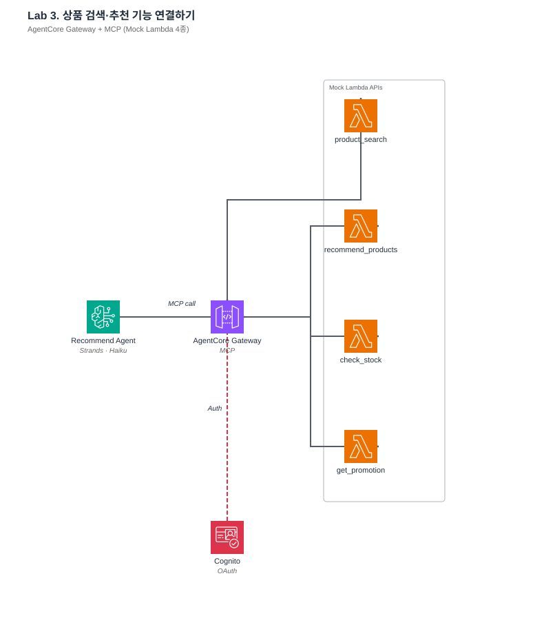
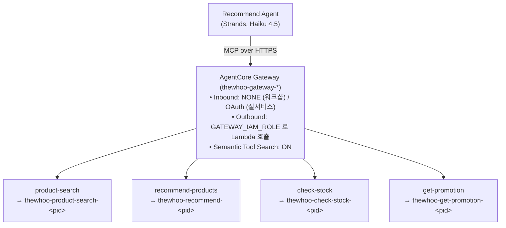

# Lab 3. 외부 도구 연결 — Gateway + MCP

*— 외부 API 를 Agent 가 자율적으로 호출하도록 MCP 도구로 등록*



**예상 소요 시간**: 60분

> **전제**: Pre-Lab 에서 배포한 Mock Lambda 4개 (`thewhoo-*-<pid>`) 가 존재해야 합니다. 이 Lab 에서 `AGENTCORE_GATEWAY_URL` 을 생성·export 합니다.
>
> **Memory 와의 관계**: Lab 3 은 Memory 를 직접 조회하지 않습니다. Agent 는 사용자 발화 자체에서 필수 인자(`skin_type` 등)를 추출합니다. Memory 로 프로필을 자동 공급하는 구조는 Lab 4 Orchestrator 에서 등장합니다.

## 이 Lab 의 목표

- **AgentCore Gateway + MCP** 가 왜 필요한지, 다른 접근법(도구를 @tool 로 직접 붙이기) 과의 차이점 이해
- Gateway 에 Lambda (또는 HTTP API) 를 **target 으로 등록**하고 OpenAPI 를 MCP toolSchema 로 변환하는 흐름
- Agent 가 **여러 도구 중 하나를 선택하는 메커니즘** — description 설계가 왜 결정적인지
- **Semantic Tool Search** 를 언제 켜야 하고 언제 필요 없는지

## 지금 만드는 구조



## Gateway + MCP 를 사용하는 이유 — 3가지

| 이유 | 대안 대비 장점 |
|---|---|
| **단일 프로토콜 (MCP)** | Agent 는 "MCP 서버에 붙기" 만 알면 됨. 백엔드가 Lambda / API Gateway / 온프렘 API 어떤 것이든 Gateway 가 차이를 흡수 |
| **인증 경계 분리** | Inbound = OAuth 또는 IAM SigV4 (사용자/Agent 인증), Outbound = IAM execution role / OAuth / API key (백엔드 종류에 따라). 이 경계를 Gateway 가 강제 (워크샵은 Inbound=NONE, Outbound=GATEWAY_IAM_ROLE 사용) |
| **선언적 도구 추가** | 새 도구는 `create_gateway_target` 호출만. Agent 코드·재배포 불필요 |

대안으로 **Agent 에 `@tool` 로 직접 Lambda 래핑** 도 가능한데 (Lab 1 의 `kb_retrieve` 처럼):

- 장점: 단순
- 단점: Agent 코드에 각 도구의 boto3 호출이 박혀 있어, 도구가 10-20개 늘면 관리 지옥. 인증/권한 관리도 각각 해야 함

**Gateway 를 쓰는 시점 판단 기준**: 도구 3개 이상 / 여러 Agent 가 같은 도구 공유 / inbound 인증 필요 중 하나라도 해당되면 Gateway.

## 1단계. Mock Lambda 4종 이해

Pre-Lab 에서 이미 Lambda 4개가 배포됐습니다. 각 역할:

| 함수 | 파라미터 | 반환 | 언제 Agent 가 선택 |
|---|---|---|---|
| `thewhoo-product-search-<pid>` | `query`, `category`, `price_max` | 키워드 필터링된 상품 목록 | 개인화 없는 단순 검색 |
| `thewhoo-recommend-<pid>` | `skin_type`, `concerns` | 피부타입 매칭된 추천 목록 | 사용자 프로필 기반 추천 |
| `thewhoo-check-stock-<pid>` | `product_id` | 재고 수량, 배송 ETA | 특정 상품의 실시간 재고 |
| `thewhoo-get-promotion-<pid>` | `category` | 진행 중인 프로모션 | 할인/증정/쿠폰 조회 |

Lambda 코드는 `lambdas/` 폴더. 실제 내부는 JSONL 필터링이지만, 개념적으로 **OMS 나 CMS API 를 호출하는 로직** 이라고 이해하면 됩니다.

**OpenAPI 스펙이 이미 각 Lambda 폴더에 있습니다** (`lambdas/product_search/openapi.json` 등). Gateway 는 이걸 보고 "이 함수가 받는 인자" 를 알아냅니다.

## 2단계. Gateway 생성

### 개념 먼저

Gateway 생성 시 핵심 파라미터:

| 파라미터 | 값 | 의미 | 조정 포인트 |
|---|---|---|---|
| `name` | `thewhoo-gateway` | 계정 내 unique | 도메인 명으로 |
| `roleArn` | `AgentRuntimeRole` ARN | **Gateway 가 Lambda 를 호출할 때 assume 하는 role** | Lambda:InvokeFunction 권한 필수 |
| `protocolType` | `MCP` | 프로토콜 고정 | 현재 MCP 만 지원 |
| `protocolConfiguration.mcp.searchType` | `SEMANTIC` | 도구 목록에 빌트인 검색 도구 자동 추가 | 도구 20개 이상이면 ON 권장 |
| `authorizerType` | `NONE` (워크샵) / `CUSTOM_JWT` (프로덕션) | Inbound 인증 | 운영 환경은 JWT 필수 |

**searchType = SEMANTIC 을 켜면**

이 옵션을 활성화하면 Gateway 는 `x_amz_bedrock_agentcore_search` 라는 **빌트인 도구** 를 MCP 도구 목록에 추가해 노출합니다. Agent 는 자연어 쿼리로 이 도구를 호출해 **지금 상황에 적합한 도구 후보**를 질의할 수 있습니다.

```python
x_amz_bedrock_agentcore_search(query="재고 확인")
# → 등록된 도구 중 해당 질의에 의미적으로 가까운 도구 정보를 반환
```

**이 방식의 유용성**: 도구 수가 많을수록(예: 20개 이상), 모든 도구의 description 을 매 호출마다 Agent context 에 올리는 비용이 큽니다. Agent 가 먼저 `x_amz_bedrock_agentcore_search` 로 후보를 좁힌 뒤 실제 도구를 호출하도록 설계하면 토큰 사용량과 선택 정확도를 개선할 여지가 있습니다.

> **참고**: AgentCore 공식 문서는 "빌트인 search 도구를 제공한다" 는 사실까지만 명시하며, Agent 가 이를 언제 호출할지는 참가자가 Agent 로직·프롬프트에 직접 설계해야 합니다. 정량적 절감 효과는 도구 수와 쿼리 특성에 따라 달라지므로 공식 수치는 제공되지 않습니다.

**제약**: Gateway 생성 시에만 설정 가능하며, 나중에 변경하려면 Gateway 를 재생성해야 합니다.

▶ **실행**
Gateway 1개 + Lambda target 4개를 만드는 스크립트 1개로 끝납니다:

```bash
cd ~/thewhoo-agentcore-workshop
source .venv/bin/activate
python3 scripts/create-gateway.py
```

약 30초 후 마지막에 `AGENTCORE_GATEWAY_URL=https://...` 이 출력됩니다. 그대로 export:

```bash
export AGENTCORE_GATEWAY_URL=<출력된 값>
```

스크립트가 수행하는 것 (내부 구현은 `scripts/create-gateway.py` 150줄):

1. CFN Outputs 에서 `AgentRuntimeRoleArn` 자동 조회
2. `create_gateway` 호출 (protocolType=MCP, searchType=SEMANTIC)
3. READY 대기
4. 4개 Lambda 를 순회하며 `create_gateway_target` 호출
5. 각 Lambda 의 `openapi.json` 을 `toolSchema.inlinePayload` 로 변환

재실행 안전 — 이미 `thewhoo-gateway-<pid>` 가 있으면 재사용.

### 실제 서비스에 적용할 때 조정할 것

- **inbound 인증**: 프로덕션에선 반드시 `authorizerType="CUSTOM_JWT"` + Cognito/OAuth provider 연결. 워크샵은 NONE 이지만 외부 네트워크 노출 시 오픈됩니다.
- **outbound IAM role 최소화**: 여기선 `AgentRuntimeRole` 을 공유하지만, Gateway 전용 role 분리하고 Lambda ARN prefix 로 제한하는 게 좋습니다.
- **SEMANTIC search 의 trade-off**: 도구 1-5개면 OFF 가 단순. 20개 이상이거나 동적 추가가 있으면 ON.
- **Gateway 당 도구 수 제한**: 계정·Gateway 당 한도가 있습니다. 도메인 분리 (예: 상품/주문/CS) 별로 Gateway 여러 개 두는 게 관리에 유리.

## 3단계. Lambda 가 MCP 도구로 등록되는 원리

> 2단계에서 실행한 `create-gateway.py` 가 이미 Gateway 생성과 4개 target 등록을 모두 수행했습니다. 이 섹션은 **스크립트가 내부적으로 무엇을 하는지** 를 설명합니다. 개념만 이해하고 다음 단계로 넘어가셔도 실습에는 지장이 없습니다.

### 개념

Lambda 를 MCP 도구로 쓰려면 Gateway 의 **target** 으로 등록해야 합니다. target 이란 **"Agent 가 이 도구를 부르면 실제로 이 Lambda 가 실행됩니다"** 를 Gateway 에 선언해 두는 설정 단위입니다. target 생성 시 지정하는 핵심 항목은 네 가지입니다.

| 파라미터 | 역할 |
|---|---|
| `name` | Gateway 내에서 target 을 식별하는 고유 이름. 알파벳·숫자·하이픈만 허용되며, 언더스코어는 사용할 수 없습니다. |
| `targetConfiguration.mcp.lambda.lambdaArn` | 호출 대상이 되는 실제 Lambda 함수의 ARN. |
| `targetConfiguration.mcp.lambda.toolSchema` | LLM 에게 "이 도구가 어떤 인자를 받고 무슨 일을 하는지" 를 알려주는 JSON. Agent 의 도구 선택 품질을 좌우합니다. |
| `credentialProviderConfigurations` | Gateway → Lambda 호출 시의 인증 방식. `GATEWAY_IAM_ROLE` 로 지정하면 Gateway 의 roleArn 을 그대로 assume 합니다. |

### toolSchema — LLM 에게 도구를 소개하는 명세서

> **이 스펙은 AWS 가 제공하는 게 아니라, 워크샵(=개발자)이 직접 설계한 Mock 도구의 정의입니다.** 실서비스에선 내부 상품 검색·주문 API 가 들어올 자리이며, OpenAPI 의 `required` / `description` 을 어떻게 쓰느냐가 Agent 의 도구 선택·인자 채움 정확도를 좌우합니다.

`toolSchema` 는 Agent(LLM) 가 도구를 호출할 때 참고하는 핵심 정보입니다. 예를 들어 재고 조회 도구의 스키마는 다음과 같습니다.

```json
{
  "name": "check_stock",
  "description": "상품 ID 로 재고 수량과 배송 예정일을 조회합니다.",
  "inputSchema": {
    "type": "object",
    "properties": {
      "product_id": {
        "type": "string",
        "description": "WHOO-XXXXX 형식의 상품 ID"
      }
    },
    "required": ["product_id"]
  }
}
```

각 필드의 의미:

- **`name`** — LLM 이 도구를 식별하는 이름입니다. 코드 안에서 이 이름으로 호출됩니다.
- **`description`** — 이 한 줄이 **Agent 의 도구 선택 정확도를 거의 결정**합니다. 사용자의 의도를 도구에 매핑할 때 LLM 이 가장 먼저 보는 정보이므로, "언제 이 도구를 쓰는지" 를 구체적으로 기술해야 합니다. 모호한 설명은 엉뚱한 도구 호출로 이어집니다.
- **`inputSchema`** — 도구가 받는 인자의 JSON Schema. 각 필드의 `description` 도 중요합니다. LLM 이 이 설명을 읽고 사용자 질문에서 어떤 값을 뽑아 필드에 채울지 결정하기 때문입니다.

OpenAPI 파일을 `toolSchema` 로 변환하는 로직은 `scripts/create-gateway.py` 의 `openapi_to_tool_schema()` 함수(약 30줄)에서 확인할 수 있습니다.

### 이 워크샵 4개 도구의 필수/선택 인자

| 도구 | 필수 (`required`) | 선택 |
|---|---|---|
| `product_search` | 없음 | `query`, `category`, `price_max` |
| `recommend_products` | `skin_type` | `concerns` |
| `check_stock` | `product_id` | 없음 |
| `get_promotion` | 없음 | `category`, `product_id` |

`required` 항목을 못 채우면 Agent 가 사용자에게 되묻거나, 다른 도구로 분기합니다. Lab 4 에서 Orchestrator 가 Memory 로 `skin_type` 을 자동 채우는 구조가 등장합니다.

### target 등록 상태 확인

스크립트 실행 결과로 4개 target 이 정상 등록됐는지 확인합니다. Gateway ID 는 아래처럼 자동으로 조회해 변수에 담아 사용합니다.

```bash
# Gateway ID 자동 조회 (응답 필드명은 'gatewayId')
GW_ID=$(aws bedrock-agentcore-control list-gateways \
  --region us-east-1 \
  --query "items[?contains(name, 'thewhoo-gateway')].gatewayId | [0]" \
  --output text)
echo "GW_ID=$GW_ID"

# target 상태 확인
aws bedrock-agentcore-control list-gateway-targets \
  --gateway-identifier "$GW_ID" \
  --region us-east-1 \
  --query 'items[].[name, status]' --output table
```

아래와 같이 4개 target 이 모두 `READY` 상태로 표시되면 Agent 가 호출할 준비가 완료된 것입니다.

```
---------------------------------
|      ListGatewayTargets       |
+---------------------+---------+
|  recommend-products |  READY  |
|  get-promotion      |  READY  |
|  product-search     |  READY  |
|  check-stock        |  READY  |
+---------------------+---------+
```

**잘 안 될 때 확인할 것**

| 증상 | 원인 / 해결 |
|---|---|
| `AccessDeniedException ... bedrock-agentcore:ListGatewayTargets` | SageMaker Execution Role 에 `bedrock-agentcore-control` 권한이 아직 붙지 않은 상태입니다. **CloudShell** 로 이동해 `cd ~/thewhoo-agentcore-workshop && git pull && ./scripts/grant-sagemaker-permissions.sh` 실행한 뒤 Code Editor 터미널에서 다시 시도하세요. (Code Editor 에서는 self-mutation 제약으로 권한 변경이 불가합니다.) |
| `GW_ID=None` | 2단계의 `create-gateway.py` 가 아직 실행되지 않았거나 생성이 완료되지 않았을 수 있습니다. 아래 명령으로 Gateway 존재 여부를 먼저 확인하세요. <br>`aws bedrock-agentcore-control list-gateways --region us-east-1 --query 'items[].[name,status]' --output table` |
| target 일부가 `CREATING` 으로 표시 | 정상 진행 중입니다. 30초 - 1분 후 다시 조회하면 `READY` 로 전환됩니다. |
| target 일부가 `FAILED` | 해당 target 의 Lambda ARN 또는 OpenAPI 파일이 잘못되었을 가능성이 큽니다. `aws bedrock-agentcore-control get-gateway-target --gateway-identifier "$GW_ID" --target-id <target-id>` 로 상세 오류를 확인한 뒤 `create-gateway.py` 를 다시 실행하세요. |

### 실제 서비스에 적용할 때 조정할 것

- **description 품질이 도구 선택 정확도를 좌우합니다.** OpenAPI 의 `summary` / `description` 에 "이 도구는 X 할 때 사용하고, Y 할 때는 사용하지 마세요" 같이 **사용 조건과 배제 조건** 을 함께 명시하면 오선택을 크게 줄일 수 있습니다.
- **inputSchema 각 필드의 description 을 상세히 작성하세요.** LLM 은 이 설명을 단서로 사용자 발화에서 값을 추출합니다. "상품 ID" 보다 "WHOO-XXXXX 형식의 5자리 숫자를 포함하는 상품 ID" 처럼 구체적으로 쓰는 쪽이 정확합니다.
- **Gateway target 은 Lambda 외에 5가지 타입을 추가로 지원합니다** (boto3 service model `TargetConfiguration.mcp` 기준).
    - `lambda` — 이 워크샵에서 사용. Lambda 함수를 직접 도구로 노출.
    - `openApiSchema` — OpenAPI 스펙 기반 REST API. 이미 존재하는 내부 REST API 를 새 Lambda 없이 바로 등록 가능.
    - `apiGateway` — Amazon API Gateway 엔드포인트 (`restApiId` + `stage`). tool override/filter 설정 가능.
    - `smithyModel` — Smithy 모델 기반 AWS 서비스 API.
    - `mcpServer` — 이미 운영 중인 외부 MCP 서버 (`endpoint` URL) 를 그대로 target 으로 연결. 예: GitHub/Slack 등의 third-party MCP 서버 재사용.
    - `managedKnowledgeBase` — Amazon Bedrock Knowledge Base 를 Gateway target 으로 직접 등록. KB 가 MCP 도구로 자동 노출되며 별도 Lambda 래퍼 불필요.
  실서비스에서 기존 REST API 자산이 많다면 `openApiSchema` / `apiGateway` 가 현실적이고, 이미 구축된 MCP 서버 자산이 있다면 `mcpServer` 로 그대로 연결할 수 있습니다. KB 가 있다면 `managedKnowledgeBase` 로 직접 연결하면 Lab 1 의 `kb_retrieve` 래퍼 없이도 동일한 효과를 낼 수 있습니다.
- **target 이름은 알파벳·숫자·하이픈만 허용됩니다.** 언더스코어를 쓰면 생성 단계에서 실패하니 사내 네이밍 규칙에 유의해 주세요.

## 4단계. Recommend Agent 구성

### 개념 먼저

MCP Client 를 써서 Gateway 에 붙고, 제공되는 도구 목록을 가져와 Agent 의 `tools` 파라미터에 넣습니다.

```python
mcp_client = MCPClient(lambda: streamablehttp_client(GATEWAY_URL))

with mcp_client:
    agent = Agent(
        model=model,
        system_prompt=SYSTEM_PROMPT,
        tools=mcp_client.list_tools_sync(),
    )
    result = agent(question)
```

**중요 — MCP 세션이 열려 있을 때만 도구를 쓸 수 있습니다**

MCP 는 Gateway 와 "연결을 열고 → 필요한 대화 주고받기 → 연결 닫기" 방식으로 동작합니다. Python 의 `with mcp_client:` 블록이 이 **연결 스위치** 역할입니다. 들여쓰기 안에 있는 동안만 Gateway 와 통신할 수 있고, 블록을 빠져나오면 연결이 자동으로 끊깁니다.

주의할 점 3가지:

1. **도구 호출은 `with` 블록 안에서만** — 블록 밖에서 `agent(...)` 를 부르면 "이미 끊긴 전화로 말을 거는" 격이라 실패합니다.
2. **도구 목록만 받고 블록을 닫으면 안 됩니다** — `list_tools_sync()` 는 "Gateway 에 어떤 도구들이 있는지 목록만 가져오는" 메서드입니다. 목록을 받은 뒤 블록을 빠져나와서 나중에 그 도구들을 호출하려 하면, 세션이 이미 닫혀 있어 에러입니다.
3. **Agent 생성과 호출을 같은 블록 안에서 끝내세요** — 일반적인 패턴은 "블록 안에서 Agent 를 만들고, 그 안에서 질문까지 받아 답변을 얻어낸다" 입니다.

잘못된 예 ❌:

```python
with mcp_client:
    tools = mcp_client.list_tools_sync()   # 목록만 받음
# ← 블록 빠져나옴, 세션 종료됨

agent = Agent(tools=tools)
agent("질문")   # ❌ 세션이 닫혀 있어 도구 호출 실패
```

올바른 예 ✅:

```python
with mcp_client:
    agent = Agent(tools=mcp_client.list_tools_sync())
    result = agent("건성 피부에 좋은 세럼 추천해줘")   # ✅ 세션 열려 있음
    print(result)
# ← 답변까지 받았으니 여기서 빠져나와도 OK
```

이 Lab 의 `SYSTEM_PROMPT`:

```python
SYSTEM_PROMPT = """당신은 더후(The History of Whoo)의 상품 추천·검색 도우미입니다.
주어진 도구를 상황에 맞게 선택하여 사용자 질문에 답하세요.

도구 선택 기준:
- 단순 키워드/카테고리 검색 → product-search___product_search
- 피부타입·고민 기반 개인화 추천 → recommend-products___recommend_products (사용자 프로필 반드시 활용)
- 특정 상품의 재고 → check-stock___check_stock
- 현재 진행 중인 할인/증정/쿠폰 → get-promotion___get_promotion

도구 이름은 위에 적힌 전체 이름(`<target>___<tool>`)을 그대로 사용하세요.
Gateway 가 target 이름을 prefix 로 붙여 노출하므로, prefix 를 뺀 짧은 이름으로
호출하면 "tool not found in registry" 로 실패하고 재시도가 발생합니다.

답변은 한국어 존댓말, 핵심 정보 위주로 간결하게.
"""
```

**system prompt 에 도구 선택 기준을 명시** 한 이유: MCP 도구 description 만으로는 LLM 이 헷갈릴 수 있는 edge case 를 여기서 guide. 특히 `product_search` vs `recommend_products` 는 둘 다 상품을 돌려주므로 언제 어느 것을 쓰는지 명확히 해야 함.

### 실제 서비스에 적용할 때 조정할 것

- **tool description vs system prompt**: 도구 자체 설명은 `toolSchema.description` 에, 도구들 간의 **선택 기준**은 system prompt 에 두는 게 유지보수성 좋음
- **여러 세션**: `MCPClient` 는 context manager 라 요청마다 생성·종료하는 게 안전. 상주 서버면 connection pooling 고려
- **fallback**: 도구가 실패하거나 빈 결과 반환 시 Agent 가 "죄송합니다" 로 답하지 않고 다른 도구 시도하도록 system prompt 에 명시

## 5단계. 도구별 동작 확인

4가지 시나리오를 순차 실행합니다. 기본 실행 시 **각 단계에서 어떤 도구가 어떤 인자로 호출되고 어떤 결과를 돌려줬는지** 가 `[도구 호출 내역]` 블록에 표시됩니다.

```bash
cd ~/thewhoo-agentcore-workshop/src                       # 이미 src 안이면 생략
python run_lab3.py
```

출력 예시(시나리오 2 — 개인화 추천):

```
[질문]
건성 피부에 좋은 보습 세럼 추천해줘

[도구 호출 내역]
  → tool call: recommend-products___recommend_products({"skin_type":"건성","concerns":["보습"]})
  ← tool result [success]: {"products":[{"product_id":"WHOO-00105", ...}], "count":3}

[답변]
...
```

각 질문이 호출해야 할 도구:

| 질문 | 기대 도구 |
|---|---|
| `5만원 이하 향수 뭐 있어?` | `product_search` (category=향수, price_max=50000) |
| `건성 피부에 좋은 보습 세럼 추천해줘` | `recommend_products` (skin_type=건성, concerns=[보습]) |
| `WHOO-00101 재고 있어?` | `check_stock` (product_id=WHOO-00101) |
| `민감성에 진정 좋은 거 + 프로모션` | `recommend_products` + `get_promotion` |

도구 호출 출력이 너무 많으면 `--quiet` 옵션으로 끌 수 있습니다.

```bash
python run_lab3.py --quiet
python run_lab3.py "장뇌삼 함유 상품 있어?"   # 이 경우에도 기본 verbose
python run_lab3.py --quiet "장뇌삼 함유 상품 있어?"
```

### 답변이 "일시적인 오류" 로 나올 때

Agent 가 "검색에 일시적인 오류" 같은 사과 답을 한다면, 실제로는 **도구 호출이 실패** 했을 가능성이 높습니다. verbose 출력을 보면 원인이 보입니다.

```
[도구 호출 내역]
  → tool call: product-search___product_search({"query":"향수","price_max":50000})
  ← tool result [error]: AccessDeniedException: ... lambda:InvokeFunction ...
```

자주 발생하는 원인과 해결:

| tool result 내용 | 원인 | 해결 |
|---|---|---|
| `AccessDeniedException ... lambda:InvokeFunction` | Gateway IAM role 에 Lambda 호출 권한이 없음 | Pre-Lab 인프라가 최신인지 확인. `infra/cfn/workshop.yaml` 재배포 또는 `grant-sagemaker-permissions.sh` 재실행 |
| `ResourceNotFoundException ... function not found` | Mock Lambda 가 해당 participant-id 로 배포돼 있지 않음 | `aws lambda list-functions --query "Functions[?starts_with(FunctionName, 'thewhoo-')].FunctionName"` 로 4개 존재 확인 |
| `count: 0` (빈 결과) | 샘플 데이터(`data/beauty_products.jsonl`)에 해당 조건의 상품이 없음 | 정상 동작. KB 보강이 필요하면 `data/` 에 상품 추가 후 ingest |
| 반복 호출 후 fail | Gateway target 상태가 `CREATING` 또는 `FAILED` | 3단계의 target 상태 확인 명령으로 확인 |

## 6단계. 복합 질의 — 도구 조합

```bash
python run_lab3.py "건성에 보습 좋은 거 추천해주고, 그중 재고 있는 거 + 프로모션 있으면 알려줘"
```

Agent 가 순차적으로:

1. `recommend_products(skin_type="건성", concerns=["보습"])` — 추천 목록
2. 상위 N개 상품마다 `check_stock(product_id=...)` — 재고 확인
3. `get_promotion(category="스킨케어")` — 프로모션 조회
4. 결과 종합해 한국어 응답

**여러 도구 호출의 원리**: Agent 가 한 번에 모든 도구를 부르는 게 아니라, 각 단계 결과를 보고 "다음에 뭘 부를지" 를 다시 판단 (ReAct loop). Lab 6 의 trace 에서 이 흐름을 시각화합니다.

## 7단계. Semantic Tool Search 직접 호출

`searchType: SEMANTIC` 으로 생성된 Gateway 는 MCP 도구 목록에 빌트인 검색 도구 `x_amz_bedrock_agentcore_search` 를 함께 노출합니다. 이 도구를 직접 호출해 보면 **자연어 쿼리 → 후보 도구 좁히기** 흐름을 그대로 관찰할 수 있습니다.

▶ **실행**
```bash
cd ~/thewhoo-agentcore-workshop
source .venv/bin/activate
eval "$(./scripts/print-env.sh w001)"

# 기본 쿼리
python3 scripts/run-semantic-tool-search.py

# 직접 쿼리
python3 scripts/run-semantic-tool-search.py "재고 빨리 알려줘"
python3 scripts/run-semantic-tool-search.py "프로모션 확인하고 싶어"
```

### 스크립트 동작 흐름

1. `MCPClient` 로 Gateway 에 접속
2. `list_tools_sync()` 로 등록된 도구 목록 출력 (빌트인 search 도구가 포함되는지 확인)
3. `mcp_client.call_tool_sync(name="x_amz_bedrock_agentcore_search", arguments={"query": ...})` 로 **빌트인 search 도구 직접 호출** → 의미적으로 가까운 도구 후보를 받아옴
4. (선택) 후보 중 첫 번째 도구를 자동으로 후속 호출

기대 출력 예 (도구 목록 부분):

```
[1] 등록된 도구 (5 개)
  - x_amz_bedrock_agentcore_search                       ...
  - product-search___product_search                       ...
  - recommend-products___recommend_products               ...
  - check-stock___check_stock                             ...
  - get-promotion___get_promotion                         ...

[2] x_amz_bedrock_agentcore_search 호출 (query='재고 빨리 알려줘')
  status : success
  result : [{"toolName":"check-stock___check_stock", ...}, ...]
```

### 도구 4개 환경에서의 한계

워크샵 환경은 도구가 4개뿐이라 SEMANTIC 의 효과 체감이 어렵습니다. 도구가 수십 개 규모로 늘어나면 후보 좁히기로 Agent context 사용량을 줄일 수 있고, 잘못된 도구 선택 빈도도 감소합니다. 구체적 절감 폭은 도구 수·쿼리 분포·Agent 구현에 따라 달라지므로 공식 수치는 제공되지 않습니다.

### 빌트인 search 가 안 보이면

Gateway 가 SEMANTIC 으로 생성되지 않은 상태입니다. **searchType 은 Gateway 생성 시에만 지정 가능** 하므로, 다음으로 확인합니다.

```bash
GW_ID=$(aws bedrock-agentcore-control list-gateways \
  --region us-east-1 \
  --query "items[?contains(name, 'thewhoo-gateway')].gatewayId | [0]" \
  --output text)

aws bedrock-agentcore-control get-gateway \
  --gateway-identifier "$GW_ID" \
  --region us-east-1 \
  --query 'protocolConfiguration.mcp.searchType'
```

`SEMANTIC` 이 출력되지 않으면 Gateway 를 재생성해야 합니다. 워크샵에서는 `scripts/create-gateway.py` 가 이미 SEMANTIC 으로 생성합니다.

### Agent 자동 호출과의 관계

Strands Agent 의 system prompt 에 "도구 수가 많을 때는 먼저 `x_amz_bedrock_agentcore_search` 로 후보를 좁힌 뒤 호출하세요" 같은 지침을 명시하면, Agent 가 자율적으로 이 흐름을 사용할 수 있습니다. 다만 공식 문서는 자동 오케스트레이션을 강제하지 않으므로, **참가자가 prompt 또는 코드에서 직접 설계** 하는 것이 권장 패턴입니다.

## 8단계. Streamlit UI 로 도구 호출 시각화

```bash
cd ~/thewhoo-agentcore-workshop
source .venv/bin/activate
streamlit run src/streamlit_lab3.py --server.port 8503
```

브라우저로 여는 법은 [Streamlit on Code Editor 가이드](streamlit-on-code-editor.md) 참고.

**UI 에서 확인할 것**:
1. 사이드바 **연결된 도구** — 4개 MCP 도구 목록
2. 추천 질문 버튼 3개 — 키워드/개인화/복합
3. 답변 아래 "도구 호출 내역" — 어느 도구가 몇 번 / 총 소요시간
4. 복합 질의 → 여러 도구가 **순차 호출** 되는 걸 실시간 관찰

## 9단계. Memory + Gateway 연결 (프로필 자동 반영)

지금까지 Lab 3 은 **사용자 발화 안에 `skin_type` · `concerns` 가 들어있을 때만** 개인화 추천이 동작했습니다. 실서비스에선 고객이 매 질문마다 피부타입을 반복해 말해주지 않습니다. 이 단계에서는 Lab 2 에서 저장한 `UserPreference` 를 Memory 에서 꺼내 **recommend 도구 인자에 자동 주입**하는 흐름을 실제로 실행해 봅니다.

### 전제 확인

- Lab 2 에서 `python run_lab2.py seed` 를 한 번 이상 실행해 Memory 에 프로필이 저장돼 있어야 합니다.
- 환경변수 `AGENTCORE_MEMORY_ID`, `AGENTCORE_GATEWAY_URL` 가 설정돼 있어야 합니다. (없으면 `eval "$(./scripts/print-env.sh w001)"`)

**Memory 에 실제로 저장돼 있는지 확인** — 아래 명령을 먼저 실행해 프로필 문구가 **한 줄 이상 출력**되어야 9단계 실행이 의미 있습니다. 비어 있으면 Lab 2 의 `seed` 를 돌리고 60초 대기 후 재조회.

```bash
cd ~/thewhoo-agentcore-workshop/src
python -c "
from memory import get_memory_client, get_memory_id
import json
recs = get_memory_client().retrieve_memories(
    memory_id=get_memory_id(),
    namespace='/preferences/demo-user/',
    query='피부타입 선호',
)
if not recs:
    print('(비어 있음) → Lab 2 의 python run_lab2.py seed 실행 후 60초 대기')
for r in recs:
    print('-', r['content']['text'])
"
```

▶ **실행**
```bash
cd ~/thewhoo-agentcore-workshop/src
python run_lab3_with_memory.py                      # 기본: demo-user / "보습 세럼 추천해줘"
python run_lab3_with_memory.py "진정 좋은 앰플 추천"   # 피부타입 말하지 않음
python run_lab3_with_memory.py --user alice "크림 추천"
```

출력 흐름:

```
[사용자] demo-user
[Memory 에서 불러온 프로필]
  - 사용자는 건성 피부이며 민감한 편입니다.
  - 자극 적은 보습 제품을 선호합니다.

[질문]
보습 세럼 추천해줘

[도구 호출 내역]
  → recommend-products___recommend_products  {"skin_type":"건성","concerns":["보습","저자극"]}
  ← result [success]  count=3, products=[...]

[답변]
...
```

**핵심 포인트** — 질문 `"보습 세럼 추천해줘"` 에는 피부타입이 없는데, Agent 가 Memory 에서 주입된 프로필을 보고 `recommend_products` 의 `skin_type` 인자를 **건성** 으로 자동 채웠습니다.

### 이 스크립트 안에서 일어나는 일

실제 코드는 `src/run_lab3_with_memory.py` (약 60줄) 에 있습니다. 핵심 3줄:

```python
prefs = fetch_preferences(user_id)    # /preferences/<user>/ 에서 조회
augmented = f"[사용자 프로필]\n- ..." + f"\n[사용자 질문]\n{user_msg}"
response = ask_recommend_agent(augmented)   # 프로필이 포함된 프롬프트를 Agent 에 전달
```

Memory 조회 결과를 **system prompt 가 아닌 user message 에 prepend** 하는 이유는 Lab 2 에서 설명한 prompt caching 유지 때문입니다.

### Lab 4 와의 관계

이 패턴이 **Lab 4 Orchestrator 의 뼈대**입니다. Lab 4 에서는 한 걸음 더 나아가:
- Orchestrator 가 Memory 조회 전담
- 서브 Agent (Q&A / Recommend / Summary) 는 stateless 하게 프로필을 인자로 받기만 함
- 답변 생성 후 `create_event` 로 이번 턴도 Memory 에 저장해 누적

## 10단계. 그래프 데이터(Neptune 등) 와의 통합 패턴

워크샵의 Mock Lambda 4종이 인메모리 JSONL 을 쓰는 것과 달리, 실서비스에서는 **상품·성분·고민** 같은 도메인 지식을 그래프 데이터베이스(Amazon Neptune 등) 로 운영하는 경우가 많습니다. 이런 환경에서 AgentCore Gateway 를 어떻게 붙일지 정리합니다.

### 기존 워크샵 구조와의 차이

| 항목 | 워크샵 (Mock JSONL) | 실서비스 (Neptune) |
|---|---|---|
| 데이터 위치 | Lambda 패키지 내부 JSONL | Neptune cluster |
| 쿼리 방식 | Python 리스트 필터링 | openCypher 또는 Gremlin |
| 도구 등록 | Lambda target | Lambda target (openCypher 래퍼) 또는 openApiSchema target |
| 갱신 주기 | 정적 (재배포 필요) | 동적 (CRUD 그대로) |

### 권장 구조 — Neptune 쿼리를 Lambda 로 감싸 target 등록

```
Agent (Strands)
  → MCP (Gateway)
       → target: search-products-by-concern  → Lambda → Neptune (openCypher)
       → target: ingredients-of-product      → Lambda → Neptune
       → target: products-with-ingredient    → Lambda → Neptune
```

각 Lambda 의 OpenAPI description 에 "이 도구는 X 질문에 사용" 을 명시하면 Agent 가 자율 선택. Lab 3 의 description 작성 가이드와 동일.

### sparse graph 보완 — transitive query 로 implicit 연결 도출

상품-고민 edge 는 있지만 성분-고민 edge 가 없는 경우, 그래프 traversal 로 **공통 패턴** 을 뽑아 implicit 연결을 만들 수 있습니다.

```cypher
-- "건성" 에 좋은 상품들이 공통으로 가진 성분 Top N
MATCH (c:Concern {name: '건성'})<-[:HELPS]-(p:Product)-[:HAS_INGREDIENT]->(ing:Ingredient)
RETURN ing.name AS ingredient, count(p) AS support
ORDER BY support DESC
LIMIT 5
```

이 쿼리를 `discover-ingredients-by-concern` 같은 도구로 Gateway 에 등록해 두면, "건성에 좋은 성분이 뭐가 있어?" 같은 질문에 그래프 추론으로 응답 가능. **edge 를 일일이 추가하지 않아도 된다**는 게 장점.

### 데이터 소스별 분담

여러 저장소가 혼재할 때 어디에 무엇을 둘지 가이드:

| 저장소 | 담는 데이터 | 이유 |
|---|---|---|
| **Neptune (Graph)** | 상품 ↔ 성분 ↔ 카테고리 ↔ 고민 같은 **정적 도메인 관계** | 관계 traversal 이 핵심, CRUD 빈도 낮음 |
| **Bedrock Knowledge Base** | 상품 설명·성분 효능 같은 **자연어 텍스트** | 자연어 검색이 주된 사용 패턴 |
| **AgentCore Memory (Semantic)** | 사용자별로 추출된 **개인화된 사실** ("이 사용자는 알러지가 있음") | 사용자 단위 격리, 비동기 추출 |
| **AgentCore Memory (Episodic)** | 상담 흐름 (의도·액션·결과) | cross-session 패턴 학습 |

### 비용·지연 측면

- **Gateway 자체 latency** 는 일반적으로 수십 ms 수준이고, Neptune 쿼리 실행이 보통 더 큼 → Gateway 가 병목은 아닙니다.
- **N+1 호출 방지** 가 핵심: 도구 description 을 정확히 써 Agent 가 단일 호출로 끝낼 수 있게 설계해야 합니다 (예: `recommend_products` 가 결과에 재고·프로모션을 함께 포함시키면 후속 도구 호출을 줄일 수 있음).
- 비용은 Gateway 호출 단위 + Lambda invocation + Neptune cluster 가동비. 상시 가동 비용은 Neptune 이 가장 크므로 Agent 도입 후에도 Neptune 측 비용 구조는 그대로 유지됩니다.

### 마이그레이션 권장 단계

1. **현재 Neptune 쿼리 카탈로그 정리** — 자주 쓰는 openCypher 쿼리 5-10개 식별
2. **각 쿼리를 Lambda 로 1:1 래핑** — 입력은 dict, 출력은 list 로 단순화
3. **OpenAPI 작성** — `summary` / `description` 에 사용 조건과 배제 조건 명시
4. **Gateway target 등록** — `scripts/create-gateway.py` 와 동일 패턴
5. **PoC 평가** — Lab 8 의 골든셋 평가로 Agent 의 도구 선택 정확도 측정

> sparse graph 의 implicit 연결 도출은 도메인 전문가 검수와 병행해야 합니다. transitive query 로 자동 추론한 결과를 그대로 추천에 사용하면 잘못된 매칭이 누적될 수 있습니다.

## 여기까지 됐으면 성공

- [ ] Gateway 에 4개 target 이 `READY` 로 등록됨
- [ ] 각 도구가 의도한 질문에서만 선택되고, 올바른 인자로 호출됨
- [ ] 복합 질의 시 여러 도구가 순차 호출됨
- [ ] 프로필 주입 시 recommend 도구에 `skin_type`, `concerns` 가 자동 채워짐

## 잘 안 될 때

| 증상 | 원인/해결 |
|---|---|
| Agent 가 엉뚱한 도구 선택 | OpenAPI description 이 모호. "언제 이 도구를 쓰는지" 와 "언제 쓰지 말아야 하는지" 를 description 에 명시 |
| 같은 도구를 반복 호출 | System prompt 에 "이미 얻은 정보로 답할 수 있으면 추가 도구 호출 금지" 추가 |
| `AccessDenied` on Lambda invoke | Gateway role 의 `lambda:InvokeFunction` 권한 + Lambda ARN 범위 확인 |
| `target 이름 validation 실패` | 언더스코어 제거, 알파벳·숫자·하이픈만 사용 |
| MCP session 닫힘 에러 | `with mcp_client:` 블록 안에서 Agent 호출까지 완료해야 함 |

## 다음 단계

Q&A Agent (Lab 1) + Memory (Lab 2) + Recommend Agent (Lab 3) 를 **개별** 로 만들었습니다. [**Lab 4. 에이전트 팀으로 묶기**](05-lab4-에이전트-팀으로-묶기.md) 에서 Orchestrator 아래 하나의 통합 챗봇으로 조립합니다.
