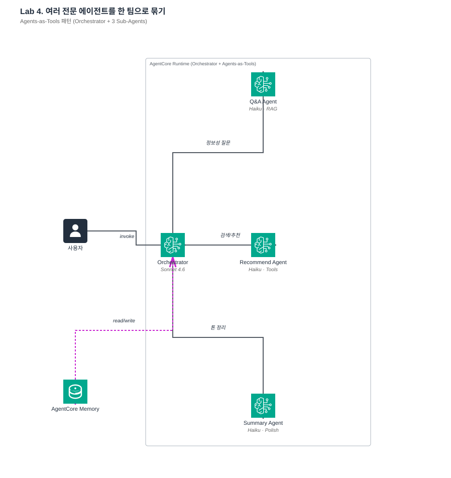
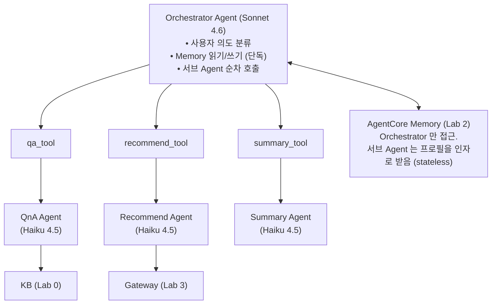

# Lab 4. 에이전트 팀으로 묶기 — Orchestrator + Agents-as-Tools

*— 전문 Agent 3개 (QnA / Recommend / Summary) 를 총괄 Orchestrator 아래 하나로 통합*



**예상 소요 시간**: 45분

> **전제**: Lab 1-3 의 결과물이 모두 필요합니다 — `KB_ID` (Lab 0/1), `AGENTCORE_MEMORY_ID` (Lab 2), `AGENTCORE_GATEWAY_URL` (Lab 3). 한꺼번에 복원하려면:
> ```bash
> cd ~/thewhoo-agentcore-workshop && source .venv/bin/activate
> eval "$(./scripts/print-env.sh w001)"   # 화면에 출력 없음이 정상 (변수로 설정됨)
> echo "KB_ID=$KB_ID  MEM=$AGENTCORE_MEMORY_ID  GW=$AGENTCORE_GATEWAY_URL"
> ```

## 이 Lab 의 목표

- **Agents-as-Tools** 패턴이 왜 단일 거대 Agent 보다 나은지 이해
- **모델 계층화** (Orchestrator=Sonnet, 서브 Agent=Haiku) 의 비용·지연 효과
- Orchestrator 가 **언제 어느 서브 Agent 를 부를지** 판단하는 메커니즘 — docstring + system prompt 의 역할 분담
- Memory 를 Orchestrator 만 접근하게 설계해 서브 Agent 를 **stateless** 로 유지하는 이유

## 지금 만드는 구조



## Agents-as-Tools 패턴 — 설계 배경

### 대안 비교

| 접근 | 장점 | 단점 |
|---|---|---|
| **단일 거대 Agent** (모든 기능을 하나의 Agent 에 통합한 경우) | 단순 | 도구 수 늘면 context pollution, 도구 선택 정확도 저하, 한 가지 일에 잘못 튜닝하면 다른 일 망가짐 |
| **Agents-as-Tools** (이 Lab) | 각 Agent 가 전담 영역에 특화, Orchestrator 는 의도 분류만, 모델 계층화로 비용 절감 | 구조 복잡, latency 한 단계 증가 |
| **Workflow engine** (Step Functions) | 결정론적, 디버깅 쉬움 | LLM 의 동적 판단이 없어 유연성 낮음 |

**Agents-as-Tools 를 적용하는 기준**: 도구·기능이 3개 이상이고 각 영역의 책임 경계가 명확할 때 효과적입니다. 이 Lab 의 뷰티 챗봇은 "정보 검색 / 상품 조회 / 답변 정제" 3가지 책임이 뚜렷하게 구분되므로 이 패턴에 적합한 사례입니다.

### 모델 계층화의 효과

| 역할 | 모델 | 특성 | 선택 이유 |
|---|---|---|---|
| Orchestrator | **Sonnet 4.6** | 상대적 고가, reasoning 성능이 뛰어남 | 여러 도구 중 선택, 다단계 추론이 필요 |
| 서브 Agent (QnA / Recommend / Summary) | **Haiku 4.5** | 상대적 저가, 응답 속도가 빠름 | 입력이 정제되어 있어 단순 생성에 충분 |

> 최신 가격과 리전별 차이는 [Bedrock Pricing](https://aws.amazon.com/bedrock/pricing/) 페이지에서 확인하세요.

**모델 계층화의 효과**: 서브 Agent 를 모두 Sonnet 으로 구성하는 대신 Haiku 로 위임하면 비용이 크게 감소합니다. 서브 Agent 호출 횟수가 늘어날수록 절감 효과는 누적됩니다.

## 1단계. 서브 Agent 를 도구로 래핑

### 개념 먼저

Strands 에서 **Agent 를 도구로 노출** 하는 법은 단순합니다. 래퍼 함수를 만들고 `@tool` 을 붙이면 됩니다:

```python
@tool
def qa_tool(question: str) -> str:
    """상품 정보, 성분, 효과, 사용법 등 정보성 질문에 답변합니다.

    Args:
        question: 고객의 질문

    Returns:
        Knowledge Base 기반 답변
    """
    return ask_qa_agent(question)
```

**설계 포인트**:

| 항목 | 값 | 설계 이유 |
|---|---|---|
| 함수 이름 | `qa_tool` | Orchestrator 가 도구 ID 로 식별합니다. LLM 에게 tool_use ID 로 노출됩니다. |
| Docstring 1번째 줄 | "정보성 질문에 답변" | 이 도구를 언제 사용해야 하는지를 명시해 Orchestrator 의 도구 선택 정확도를 확보합니다. |
| 파라미터 `question` | 한 번의 자연어 입력 | Orchestrator 가 사용자 질문을 그대로 전달합니다. |

`recommend_tool` 은 검색·추천·재고·프로모션을 담당:

```python
@tool
def recommend_tool(request: str) -> str:
    """상품 검색, 개인화 추천, 재고 확인, 프로모션 조회를 수행합니다.

    Args:
        request: 고객의 추천/검색 요청 (피부 타입, 예산, 카테고리 포함)

    Returns:
        추천 상품 목록과 이유
    """
    return ask_recommend_agent(request)
```

> **설계 노트 — Orchestrator 가 Memory 를 전담하는 이유**: 서브 Agent 가 직접 Memory 를 조회하도록 만들면 Memory 접근 로직 중복, 테스트 어려움(Memory 없이는 실행 불가), 권한 분산(모든 Agent 에 Memory read 권한 필요) 문제가 생깁니다. **Orchestrator 가 Memory 를 읽어 프롬프트에 주입**하는 방식을 쓰면 서브 Agent 는 stateless 가 되어 재사용과 테스트가 용이합니다.

### 실제 서비스에 적용할 때 조정할 것

- **도구 이름 형식**: `ask_*` / `get_*` / `do_*` 처럼 동사 접두어 일관성
- **docstring 에 "언제 쓰지 말 것" 도 명시**: "성분 질문이 아니면 이 도구 쓰지 마세요" 같은 배제 조건이 오선택을 크게 줄임
- **Agent 간 입력 형식 통일**: `question` 하나로 통일하거나, 각 Agent 가 expected input 을 파일로 정의하거나

## 2단계. Summary Agent

### 개념 먼저

Summary Agent 는 도구 호출 없이 **텍스트 재구성만** 담당하는 단순 Agent 입니다. 여러 서브 Agent 가 각자 생성한 raw 응답을 브랜드 톤에 맞게 통일하는 후처리 역할을 합니다.

> **범위 명확화**: 이 Summary Agent 는 **"이미 생성된 텍스트를 정제"** 합니다. 여러 상품 리뷰를 수집·분석해 장단점을 추출하는 **"리뷰 요약" 기능과는 다릅니다.** 리뷰 요약이 필요하면 Lab 3 Gateway 에 별도 도구(예: `summarize_reviews`)를 추가해 리뷰 데이터 소스를 연결해야 합니다.

```python
SYSTEM_PROMPT = """당신은 더후(The History of Whoo)의 친절한 응대 전문가입니다.
다른 에이전트가 수집한 정보를 받아, 고객에게 전달할 최종 답변으로 다듬어주세요.
- 핵심 정보는 유지하고 중복은 제거하세요
- 친근하고 전문적인 뷰티 상담 말투를 사용하세요
- 필요시 이모지를 적절히 활용하세요
- 200자 이내로 간결하게 작성하세요"""
```

> **📌 실제 코드와 일치**: 위 `SYSTEM_PROMPT` 는 `src/agents/summary_agent.py` 의 실제 코드와 동일합니다.

**핵심 규칙 — "새로운 정보 생성 금지"**: Summary Agent 가 hallucination 을 일으키지 않도록 가드하는 장치입니다. 이 단계에서 잘못된 정보가 추가되면 QnA / Recommend 가 아무리 정확해도 최종 답변이 훼손됩니다.

### 실제 서비스에 적용할 때 조정할 것

- **브랜드 톤 세부화**: "20대 대상 친근한 반말체" 또는 "B2B 전문적 존댓말" 등
- **금칙어·법규**: 화장품법(의료 효능 단정 금지), 금융법(원금 보장 표현 금지) 등 도메인 규제 반영
- **답변 길이 제한**: Summary Agent 의 system prompt 에 "300자 이내" 같은 제한

## 3단계. Orchestrator Agent

### 개념 먼저

Orchestrator 의 system prompt 는 **의도 분류 → 도구 선택 → 결과 종합** 의 3단 흐름을 지시:

```python
SYSTEM_PROMPT = """당신은 더후(The History of Whoo) AI 챗봇의 오케스트레이터입니다.

고객 요청 유형에 따라 적절한 전문 에이전트를 호출하세요:
- 상품 성분, 효과, 사용법 질문 → qa_tool
- 상품 검색, 추천, 재고, 프로모션 → recommend_tool
- 최종 답변 톤·포맷 정리 → summary_tool

복잡한 요청은 여러 에이전트를 순차적으로 호출해 정보를 조합하세요.
항상 summary_tool로 최종 답변을 정리한 후 고객에게 전달하세요."""
```

> **📌 실제 코드와 일치**: 위 `SYSTEM_PROMPT` 는 `src/agents/orchestrator.py` 의 실제 코드와 동일합니다.

**이 prompt 가 명시하는 3가지**

1. **의사결정 순서** (도구별 용도 목록) — LLM 이 도구를 선택하는 기준을 명시합니다.
2. **도구별 용도 중복 제거** — `qa_tool` 과 `recommend_tool` 이 헷갈리는 상황에서의 기준 역할을 합니다.
3. **복합 질의 처리** — 여러 도구 결과가 나오면 `summary_tool` 로 최종 정제하도록 지시합니다.

**모델 선택**

```python
model = BedrockModel(model_id="us.anthropic.claude-sonnet-4-6", ...)
```

Sonnet 4.6 은 Haiku 대비 reasoning 성능이 우수해 **여러 도구를 조합**해야 하는 판단에 적합합니다. 서브 Agent 를 하나만 호출하는 단순 케이스는 Haiku 로도 충분하지만, 복합 질의(recommend + stock + promotion 조합)에서는 Sonnet 이 훨씬 안정적으로 동작합니다.

> **모델 ID 표기에 대한 참고**: 워크샵 코드는 `us.` prefix 가 붙은 **US geography cross-region inference profile ID** 를 사용합니다 (`us.anthropic.claude-sonnet-4-6`, `us.anthropic.claude-haiku-4-5-20251001-v1:0`). 공식 model card 의 기본 모델 ID 는 prefix 없이 `anthropic.claude-sonnet-4-6` 형태이며, cross-region inference profile 은 미국 내 여러 리전으로 요청을 자동 분산해 처리 용량과 가용성을 확보하는 호출 방식입니다. 실습 환경(us-east-1 기준)에서는 두 표기가 모두 동작하지만, 다른 geography(예: EU, APAC)에서 재현할 때는 [Cross-region inference](https://docs.aws.amazon.com/bedrock/latest/userguide/cross-region-inference.html) 문서를 참고해 해당 geography 의 profile ID(`eu.`, `apac.` 등)를 사용하세요.

### 실제 서비스에 적용할 때 조정할 것

- **의사결정 순서 템플릿화**: "먼저 X 를 확인하고, Y 이면 A 도구, Z 이면 B 도구" 형태로 명시하면 reasoning loop 가 안정적으로 동작합니다.
- **도구 수 증가 시 계층화**: 도구가 10개를 넘으면 Orchestrator 에 전부 노출하지 않고, "상품 도구 / 주문 도구 / CS 도구" 를 묶은 meta-tool 로 계층을 두는 편이 낫습니다.
- **loop 제한**: Strands 단일 `Agent` 는 명시적인 최대 턴 수 파라미터를 노출하지 않습니다. 무한 loop 가 우려되면 `stop_reason` 확인 + 상위에서 timeout 을 걸거나, `Swarm` 등 multi-agent 구조(기본 `max_iterations=20`)를 사용하세요.

## 4단계. Memory 연동 진입점 — thewhoo_chat()

### 개념 먼저

Orchestrator 에 Memory 를 직접 도구로 달지 않고, **진입점 함수 `thewhoo_chat()` 이 Memory 읽기/쓰기를 전담**:

```python
def thewhoo_chat(user_id, session_id, user_msg):
    # 1) 장기 선호 + 에피소드 로드 (UserPreference / Summary / Episodic)
    context = retrieve_session_context(user_id, session_id)

    # 2) Orchestrator 입력 구성
    prompt = f"[사용자 컨텍스트]\n{context}\n\n[질문]\n{user_msg}"

    # 3) Orchestrator 실행
    response = orchestrator(prompt)

    # 4) Memory 에 이번 턴 저장
    save_turn(user_id, session_id, user_msg, str(response))

    return response
```

> **📌 실제 함수명**: `retrieve_session_context()` / `save_turn()` — `src/memory.py` 참고. Lab 5 배포용 `app.py` 의 `thewhoo_chat(payload: dict)` 은 AgentCore Runtime 핸들러 형태로 구조가 다릅니다 (Lab 5 에서 설명).

**이 구조를 선택한 이유**

- Orchestrator 가 Memory 조회를 매 호출 반복할 필요 없음 — 1 회 로드 후 prompt 에 주입합니다.
- 저장은 턴 완료 시 1 회 — 중간에 LLM 이 Memory 를 조작하지 않아 무결성이 확보됩니다.
- 서브 Agent 는 Memory 를 전혀 모름 — 테스트가 쉽고 재사용이 가능합니다.

▶ **실행**
```bash
cd src
python run_lab4.py
```

3가지 시나리오 순차 실행:

| 시나리오 | 질문 | Orchestrator 의 도구 선택 예상 |
|---|---|---|
| ① 맥락 기반 QnA | 천기단 화현 크림 주요 성분 | `qa_tool` 1회 |
| ② 상품 추천 | 건성 피부 보습 세럼 추천 + 재고 | `recommend_tool` (여기서 내부적으로 recommend + check_stock 두 Gateway 도구 호출) |
| ③ 요약 + 프로모션 | 현재 스킨케어 프로모션 정리 | `recommend_tool` → `summary_tool` |

직접 질문:

```bash
python run_lab4.py "방금 추천한 거 주요 성분 알려줘"
python run_lab4.py --chat
```

### 실제 서비스에 적용할 때 조정할 것

- **Memory 조회 범위**: 이 Lab 은 `/preferences/` + `/summaries/` 2 곳만. 필요하면 `/facts/` (Semantic — 도메인 사실·엔터티) 와 `/episodes/` (Episodic — 상담 에피소드) 까지 확장
- **프로필 주입 위치**: user message 에 prepend (이 Lab) vs system prompt (prompt caching 희생) vs Agent 초기화 메시지
- **비동기 저장**: 저장을 `create_event` 동기 호출로 하면 응답 지연. 운영에선 SQS 비동기 권장

## 5단계. Streamlit UI 로 통합 챗봇 시연

```bash
cd ~/thewhoo-agentcore-workshop
source .venv/bin/activate
streamlit run src/streamlit_lab4.py --server.port 8504
```

브라우저로 여는 방법은 [Streamlit on Code Editor 가이드](streamlit-on-code-editor.md) 를 참고하세요.

이 UI 는 워크샵에서 목표로 한 **세 가지 핵심 기능**을 하나의 화면에서 시연합니다.

| 시나리오 | UI 조작 | 확인 포인트 |
|---|---|---|
| ① **맥락 기반 QnA** | "프로필 저장" → "맥락 추천" | 두 번째 질문에서 피부타입을 다시 말하지 않아도 자동 반영됩니다. |
| ② **상품 검색·추천** | "맥락 추천" | Gateway 에 연결된 4개 도구 중 필요한 것만 자동 호출됩니다. |
| ③ **주요 정보 요약** | "복합 요약" | 성분·사용법·프로모션이 하나의 섹션으로 정돈되어 제공됩니다. |

각 답변 아래의 **"도구 호출 내역"** 을 펼치면 Orchestrator 가 어느 서브 Agent 를 어떤 순서로 호출했는지 실시간으로 관찰할 수 있습니다.

## 여기까지 됐으면 성공

- [ ] 단일 질문에 대해 Orchestrator 가 적절한 서브 Agent 1-2개를 호출합니다.
- [ ] 프로필이 recommend 호출 시에만 전달되며 QnA 호출에는 포함되지 않습니다.
- [ ] 연속 대화에서 맥락이 유지됩니다 (예: "방금 추천한 거" 와 같은 참조 해석).
- [ ] 복합 질의 시 여러 서브 Agent 가 순차 호출되고 Summary 로 톤이 정제됩니다.

## 잘 안 될 때

| 증상 | 원인 / 해결 |
|---|---|
| Orchestrator 가 도구를 호출하지 않고 직접 답변 | System prompt 에 "반드시 도구를 사용" 규칙을 강조하고, 각 도구의 docstring 을 구체화합니다. |
| QnA 와 Recommend 가 동시에 호출됨 | 각 docstring 에 배제 조건을 추가합니다. 예: "성분 질문은 QnA, 재고 질문은 Recommend". |
| 프로필이 Recommend 에 전달되지 않음 | Orchestrator prompt 에 사용자 프로필을 `recommend_tool` 호출용 `request` 인자에 포함하도록 명시합니다. |
| 복합 질의 loop 가 종료되지 않음 | system prompt 에 "중복 도구 호출 금지" 와 "충분한 정보가 모이면 즉시 답변 생성" 규칙을 추가합니다. 필요 시 상위 레벨에서 timeout 을 설정합니다. |

## 다음 단계 — Day 1 마무리

Day 1 을 통해 **통합 챗봇** 이 완성되었습니다.

- **Lab 0/1** — 상품 데이터를 KB 로 준비하고 근거 기반 QnA Agent 구성
- **Lab 2** — AgentCore Memory 로 사용자 프로필·세션 맥락 유지
- **Lab 3** — Gateway + MCP 로 외부 API 도구 연결
- **Lab 4 (현재)** — 세 가지를 하나의 Orchestrator 아래로 묶어 통합 챗봇 완성

지금까지는 **로컬 Python 스크립트** 로 실행해 왔습니다. Day 2 에서는 이 챗봇을 **AgentCore Runtime 으로 배포**하고 **운영 품질** 을 체크합니다.
