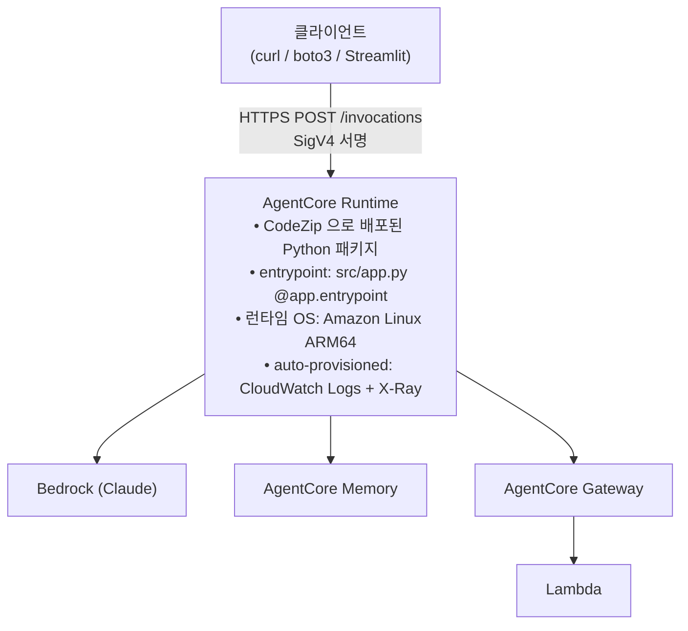

# Lab 5. 실제 서비스처럼 배포하기 — AgentCore Runtime

*— 로컬 Python 스크립트를 HTTPS 엔드포인트로 노출, SigV4 인증으로 다른 시스템이 호출 가능하게*

**예상 소요 시간**: 45분

> **전제**: Lab 4 까지 완료. `KB_ID`, `AGENTCORE_MEMORY_ID`, `AGENTCORE_GATEWAY_URL`, `AWS_REGION` 이 설정돼 있어야 합니다.
>
> **CLI 안내** — 이 Lab 은 AWS 공식 권장 도구인 **AgentCore CLI**(`@aws/agentcore`)를 사용합니다.
>
> 이전 버전 워크샵은 Python `bedrock-agentcore-starter-toolkit` 을 썼습니다. 이 도구는 **AWS 가 공식적으로 legacy 로 표시**했습니다 — GitHub 저장소 설명이 *"Python CLI toolkit for Amazon Bedrock AgentCore (legacy). For new projects, use the AgentCore CLI"* 이고, README·PyPI 에 *"The Starter Toolkit CLI is no longer supported. Please use the AgentCore CLI"* 가 실려 있습니다. Strands 공식 문서도 *"The AgentCore CLI replaces the previously available `bedrock-agentcore-starter-toolkit`"* 라고 적고 있습니다.
>
> 즉 이건 도구가 내보내는 배너에 그치지 않고 **패키지 메타데이터·공식 문서 수준의 표기**입니다. (다만 devguide 의 release notes 페이지에는 별도 지원 종료 항목이 없습니다 — 공지 경로가 저장소·PyPI 쪽입니다.) 두 CLI 의 차이와 기존 프로젝트 이전 방법은 [새 CLI 이전 가이드](새-cli-이전-가이드.md) 를 참고하세요.
>
> **추가 전제조건** (Code Editor 에는 이미 준비돼 있습니다)
>
> | 항목 | 확인 명령 | 필요 버전 | 비고 |
> |---|---|---|---|
> | Node.js | `node --version` | 20 이상 | CLI 가 npm 패키지 |
> | npm | `npm --version` | Node 에 포함 | 전역 설치 경로도 확인: `npm config get prefix` 가 **홈(`~`) 아래**여야 sudo 없이 설치됩니다 |
> | **`uv`** | `uv --version` | 최신 | **Python 에이전트 필수** — 아래 주의 참고 |
>
> ⚠️ **`uv` 는 공식 devguide Prerequisites 에 빠져 있습니다.** CLI 저장소 README 는 *"uv — for Python agents"* 를 요구사항으로 명시하고, CLI 내부 사전점검도 `uv` 를 severity `error` 로 검사합니다. 없으면 `agentcore create` 가 아래 메시지와 함께 **즉시 종료**됩니다 (실측 exit 1):
>
> ```
> 'uv' is required for Python projects. Install from https://github.com/astral-sh/uv#installation
> ```
> 워크샵은 `setup-python.sh` 가 `uv` 를 자동 설치하므로 Pre-Lab 을 정상적으로 마쳤다면 준비돼 있습니다. `uv --version` 이 실패하면 `curl -LsSf https://astral.sh/uv/install.sh | sh` 후 새 터미널을 여세요.
>
> 🚨 **`cdk bootstrap` 은 반드시 직접, `deploy` 보다 먼저 실행하세요.** `agentcore deploy -y` 의 자동 bootstrap 에 맡기면 **새 계정에서 실패합니다** (실측). 아래 **[0단계](#0단계--cdk-bootstrap-계정당-1회)** 에서 다룹니다.

## 이 Lab 의 목표

- **AgentCore Runtime** 이 왜 필요한지 — Lambda / ECS / SageMaker 대비 이점
- **CodeZip vs Container** 두 배포 방식의 선택 기준
- `agentcore.json` 의 각 필드 의미와 튜닝 포인트 — 프로젝트를 코드로 선언하는 IaC 방식
- **Prompt caching** 이 왜 system prompt 에서 동작하고, Memory 주입을 user message 에 두는 이유

## 지금 만드는 구조



## Runtime 선택 기준 — 다른 배포 옵션과 비교

| 옵션 | 장점 | 단점 | 이 워크샵에서 왜 안 쓰나 |
|---|---|---|---|
| **Lambda** | 서버리스, 초저비용 | 15분 timeout, 컨테이너 없음 | Strands + Memory SDK 의 초기화가 무겁고, 세션 유지 힘듦 |
| **ECS Fargate** | 컨테이너 완전 제어 | VPC, ALB, autoscaling 세팅 부담 | 인프라 오버헤드가 워크샵 취지에 안 맞음 |
| **EKS (Kubernetes)** | Pod / HPA / Sidecar 등 K8s 표준 도구 그대로 사용, 다른 마이크로서비스와 같은 cluster | 노드를 상시 가동하므로 idle 시간에도 비용 발생, agent 전용 관측·세션 라우팅을 직접 구현 필요 | 이미 EKS 기반 마이크로서비스 운영 중이라면 유지가 합리적 |
| **SageMaker endpoint** | 모델 서빙 최적화 | agent 워크로드엔 과잉 설계 | Strands agent 는 일반 Python 서버라 더 단순한 옵션이 낫음 |
| **AgentCore Runtime** (이 Lab) | Agent 전용 최적화, OAuth/SigV4/Observability 기본 제공, 요청 단위 과금 | 오케스트레이션 루프를 직접 코드로 작성해야 함 | ✅ 워크샵 선택 — 코드로 배우는 취지에 부합 |
| **AgentCore Harness** | model/tools/memory를 설정값으로 선언하면 오케스트레이션 루프를 AWS가 관리. 코드 불필요 | 프레임워크 선택 불가, bidirectional streaming/hooks 미지원 | 워크샵은 Strands 코드를 직접 작성하며 학습 — Harness 는 실제 서비스 구축 시 대안 |

**AgentCore Runtime 을 쓰는 실질적 이유**:
- OTel 계측 + X-Ray + CloudWatch Logs 가 **배포 시 자동 연결**
- Session ID 기반 고정 라우팅 (동일 session 은 동일 instance 로 → Memory 캐시 효율)
- HTTP 서버 코드 작성 불필요 — `@app.entrypoint` 데코레이터 하나로 endpoint 생성

### 이미 EKS 를 쓰고 있다면

기존 EKS cluster 를 운영 중인 경우, AgentCore Runtime 으로 옮기는 결정은 **트래픽 패턴과 운영 비용** 에 따라 달라집니다.

| 측면 | EKS 유지 | AgentCore Runtime 전환 |
|---|---|---|
| 비용 모델 | 노드 상시 가동 — idle 시간에도 EC2/Fargate 시간당 과금 | 요청 단위 — idle 시 0 |
| 세션 라우팅 | sticky session (ALB / Service / annotation) 직접 설정 | session ID 기반 자동 |
| 관측성 | Prometheus / Grafana / OpenTelemetry 직접 구성 | GenAI Observability + CloudWatch 자동 |
| 워크로드 길이 | 무제한 | 세션 최대 8시간 / 단일 요청 타임아웃 15분 (스트리밍 60분) |
| Sidecar / DaemonSet / ServiceMesh | 그대로 사용 가능 | 사용 불가 |

**판단 기준 요약**:
- agent 트래픽이 **spiky** 하고 idle 비율이 높다 → AgentCore 가 비용 면에서 유리할 가능성
- agent 외 다른 워크로드와의 **K8s 내부 호출 / Sidecar / NetworkPolicy** 가 핵심 → EKS 유지가 합리적
- 두 가지가 섞이면 **AgentCore 로 agent 만 분리** 하고 EKS 는 기존 마이크로서비스 유지하는 하이브리드도 가능

> 절대 비용 비교는 트래픽 패턴·요청 길이·노드 idle 비율에 따라 결과가 달라지므로 워크북에 수치를 명시하지 않습니다. 이전 부하 데이터로 PoC 를 한 번 돌려 비교하시는 편이 정확합니다.

### AgentCore Runtime vs Harness — 어느 쪽으로 만들어야 할까

AgentCore 에는 배포 옵션이 두 가지입니다. **Runtime** (이 Lab) 은 오케스트레이션 루프를 코드로 작성하는 방식이고, **Harness** 는 model·tools·memory 를 설정값으로 선언하면 루프 자체를 AWS 가 관리하는 방식입니다.

| 결정 기준 | **AgentCore Runtime** (이 Lab) | **AgentCore Harness** |
|---|---|---|
| 오케스트레이션 루프 | 직접 코드로 작성 (`@app.entrypoint`) | AWS 관리 — 설정만 선언 |
| 프레임워크 | Strands, LangGraph, CrewAI 등 자유 선택 | Strands 고정 |
| Memory 연동 | SDK 직접 호출 | 설정 한 줄 |
| Gateway / Browser / Code Interpreter 연동 | SDK 직접 호출 | 설정 한 줄 |
| 모델 전환 | 코드 변경 + 재배포 | 설정 변경만 |
| Bidirectional streaming | ✅ | ❌ |
| Hooks / 커스텀 루프 로직 | ✅ | ❌ |
| 비용 추가 | 없음 (Runtime 비용만) | 없음 (Runtime 비용만) |

**언제 Harness 를 선택하나**
- 프로토타입을 빠르게 만들고 싶을 때 — 코드 없이 설정만으로 Memory·Gateway·Browser 를 붙일 수 있음
- 모델을 자주 교체하며 실험하는 단계 — provider 전환이 설정 변경 한 줄
- 표준 ReAct 루프로 충분한 agent — 커스텀 루프 로직이 필요 없는 경우

**언제 Runtime 을 선택하나**
- 프레임워크를 직접 선택해야 하는 경우
- bidirectional streaming, hooks, 커스텀 context 관리 등 루프 제어가 필요한 경우
- 이 워크샵처럼 "내부 동작을 코드로 이해하며 배우는" 경우

공식 비교: [AgentCore harness vs. Runtime](https://docs.aws.amazon.com/bedrock-agentcore/latest/devguide/harness-vs-runtime.html)

## 배포 방식 — CodeZip vs Container

| 방식 | 시점 | 실행 | 언제 쓰나 |
|---|---|---|---|
| **CodeZip** (이 워크샵) | Python zip → S3 업로드 → Runtime 이 실행 | Docker 불필요, 빠름 | 보통의 Python agent 대부분. 패키지 250MB 이하 |
| **Container** | Dockerfile → ECR → Runtime 이 컨테이너 실행 | Docker 환경 필요 | 시스템 패키지 추가, 250MB 초과, 특정 base image |

공식 가이드: [Direct code deployment](https://docs.aws.amazon.com/bedrock-agentcore/latest/devguide/runtime-get-started-code-deploy.html) · [CLI 가이드](https://docs.aws.amazon.com/bedrock-agentcore/latest/devguide/runtime-get-started-cli.html)

## 0단계. CDK bootstrap (계정당 1회)

AgentCore CLI 는 배포를 **CDK 로** 수행합니다. CDK 는 그 리전에 **bootstrap 스택(`CDKToolkit`)** 이 있어야 동작합니다 — 자산을 올릴 S3 버킷·ECR 리포지토리, 버전 표시용 SSM 파라미터가 여기에 들어 있습니다.

### 왜 직접 해야 하나

`agentcore deploy -y` 는 bootstrap 이 없으면 **자동으로 시도합니다.** 하지만 **아직 bootstrap 이 없는 새 계정에서는 이 자동 경로가 실패합니다** (실측):

```
✓ Synthesize CloudFormation
⠋ Check bootstrap status...
CDK bootstrap failed: CloudFormationStack object does not hold a stack
```

메시지가 원인을 전혀 알려주지 않습니다. CDK 라이브러리 내부(`stack-helpers.js`)에서 "스택 객체가 비어 있다" 는 미처리 예외가 올라온 것입니다. 더 나쁜 것은 **실패가 흔적을 남긴다**는 점입니다 — `CDKToolkit` 이 `ROLLBACK_COMPLETE` 라는 껍데기 상태로 남고, 이 상태는 **업데이트가 불가능**해서 이후 모든 `deploy` 가 같은 오류로 막힙니다.

> Workshop Studio 계정은 항상 새 계정이라 **그냥 `deploy` 부터 하면 참가자 전원이 이 지점에서 막힙니다.** 그래서 순서를 뒤집습니다.

▶ **실행 — 한 줄씩** (여러 줄을 한꺼번에 붙여넣으면 중간 줄이 삼켜질 수 있습니다)

```bash
cd ~/thewhoo-agentcore-workshop/agentcore/cdk
```

```bash
ACC=$(aws sts get-caller-identity --query Account --output text); echo "계정: $ACC"
```

계정 번호가 찍히는지 확인한 뒤:

```bash
./node_modules/.bin/cdk bootstrap aws://$ACC/us-east-1
```

> ⚠️ **`npx cdk` 를 쓰지 마세요.** Code Editor 에서 `npx cdk bootstrap` 은 **출력을 한 줄도 내지 않고 즉시 종료**되어, 성공한 것처럼 보이지만 스택이 만들어지지 않습니다 (실측). `./node_modules/.bin/cdk` 를 직접 호출하면 정상 동작합니다. `agentcore create` 가 `agentcore/cdk/node_modules/` 에 `aws-cdk` 를 이미 설치해 두므로 별도 설치는 필요 없습니다.
>
> `--require-approval` 은 **`bootstrap` 에는 없는 옵션입니다** (`deploy` 전용). 붙이면 `Unknown option(s): --require-approval ... will be ignored` 경고가 나옵니다 — 무해하지만 넣지 않는 게 맞습니다.

2~3분 걸립니다. 마지막 줄이 이렇게 나오면 성공입니다 (실측 출력):

```
 ⏳  Bootstrapping environment aws://<계정ID>/us-east-1...
Trusted accounts for deployment: (none)
Using default execution policy of 'arn:aws:iam::aws:policy/AdministratorAccess'.
CDKToolkit: creating CloudFormation changeset...
 ✅  Environment aws://<계정ID>/us-east-1 bootstrapped.
```

> `Newer version of CDK is available` / `NodeVersionSupportWarning` 는 무시하세요 — 워크샵 진행에 영향 없습니다.

확인:

```bash
cd ~/thewhoo-agentcore-workshop
./scripts/check-agentcore-config.sh
#   → ✓ CDK bootstrap 완료 (CDKToolkit=CREATE_COMPLETE) 가 나와야 합니다
```

이후 `agentcore deploy` 는 `Check bootstrap status` 를 통과만 하고 넘어갑니다 — 문제 코드 경로를 아예 타지 않습니다.

> **계정당 1회입니다.** 이미 `✅ ... bootstrapped` 를 본 계정이라면 다시 하지 않아도 됩니다.

### bootstrap 이 권한 부족으로 실패하면

bootstrap 은 **ECR 리포지토리**와 **SSM 파라미터**를 만듭니다. 그래서 `cloudformation:*` 만으로는 부족하고 **`ecr` · `ssm` 권한이 따로 필요합니다** — CloudFormation 이 참가자 자격증명으로 그 서비스들을 호출하기 때문입니다. 없으면 이런 메시지가 나옵니다 (실측):

```
User: ...:assumed-role/AmazonSageMaker-ExecutionRole-.../SageMaker is not authorized
to perform: ecr:DeleteRepository ... because no identity-based policy allows
Resource handler returned message: "Error occurred during operation 'DeleteParameter'."
```

Pre-Lab 의 `grant-sagemaker-permissions.sh` 가 이 권한을 포함하므로 정상적으로 마쳤다면 발생하지 않습니다. 만약 나오면 **CloudShell** 에서 (Code Editor 에는 `iam:PutRolePolicy` 가 없습니다):

```bash
./scripts/grant-sagemaker-permissions.sh
```

그리고 **실패로 남은 껍데기 스택을 반드시 지운 뒤** 다시 bootstrap 하세요:

```bash
aws cloudformation delete-stack --stack-name CDKToolkit --region us-east-1
aws cloudformation wait stack-delete-complete --stack-name CDKToolkit --region us-east-1
aws cloudformation describe-stacks --stack-name CDKToolkit --region us-east-1 2>&1 | tail -1
#   → "Stack with id CDKToolkit does not exist" 가 나와야 깨끗한 상태입니다
```

더 자세한 복구 절차는 [`CDK bootstrap failed`](#cdk-bootstrap-failed--bootstrap-스택이-깨진-경우) 를 보세요.

## 1단계. Runtime 엔트리포인트 (src/app.py) 이해

### 개념 먼저

AgentCore Runtime 은 **HTTP POST `/invocations`** 를 받아 JSON 으로 응답하는 서버를 기대합니다. `BedrockAgentCoreApp` 이 이 서버를 추상화:

```python
from bedrock_agentcore import BedrockAgentCoreApp

app = BedrockAgentCoreApp()

@app.entrypoint
def thewhoo_chat(payload: dict) -> str:
    # payload: 클라이언트가 POST 로 보낸 JSON
    # return: str → BedrockAgentCoreApp 이 {"response": ...} JSON 으로 감싸 응답
    ...
```

이 Lab 의 entrypoint 는 Lab 4 의 `thewhoo_chat()` 을 거의 그대로 재사용합니다:

```python
@app.entrypoint
def thewhoo_chat(payload: dict) -> str:
    # ⚠️ 메시지 키가 호출 경로마다 다릅니다 (실측):
    #   agentcore invoke "..."      (새 CLI) → {"prompt": "..."}
    #   boto3 InvokeAgentRuntime    (스크립트) → {"message": "..."}
    # 두 키를 모두 받아야 CLI 와 스크립트 양쪽에서 동작합니다.
    user_message = payload.get("message") or payload.get("prompt") or ""
    session_id = (
        _get_runtime_session_id()        # AgentCore Runtime 헤더에서 우선 추출
        or payload.get("session_id")
        or str(uuid.uuid4())
    )

    context = retrieve_session_context(ACTOR_ID, session_id)
    prompt = f"[이전 대화 맥락]\n{context}\n\n[현재 요청]\n{user_message}" if context else user_message

    response = orchestrator(prompt)
    response_str = str(response)

    save_turn(ACTOR_ID, session_id, user_message, response_str)
    return response_str
```

**핵심 포인트**:

| 설계 요소 | 값 | 이유 |
|---|---|---|
| `payload` 구조 | `{message \| prompt, session_id}` | 새 CLI 는 `prompt`, boto3 스크립트는 `message` — **둘 다 받아야** 합니다 (실측) |
| `session_id` 우선순위 | Runtime 헤더 → payload → 새 UUID | `agentcore invoke --session-id` 가 헤더로 전달되므로 Runtime 헤더 최우선 |
| `retrieve_session_context` 호출 | 매 invoke 시 | Memory 는 비싸지 않으므로 매번 조회 OK |
| `save_turn` 호출 | 매 invoke 시 | 동기. 응답 지연 우려 시 비동기 큐로 옮길 수 있음 |
| return 형식 | `str` (답변 본문만) | SDK 가 자동으로 `{"response": ...}` 로 감쌈. dict 를 반환하면 이중 래핑됨 |

### 실제 서비스에 적용할 때 조정할 것

- **payload 스키마 확장**: 다국어 지원 시 `locale`, 다중 테넌트면 `tenant_id`, A/B 테스트면 `variant` 같은 필드 추가
- **에러 응답 포맷**: try/except 로 감싸서 `{error: "...", code: "..."}` 형태로 응답 통일
- **streaming**: Strands 의 streaming 응답을 AgentCore Runtime 에서 SSE 로 노출할 수 있습니다 (고급 토픽)
- **auth header 검증**: SigV4 이외에 JWT bearer token 을 직접 검증하려면 `payload` 에 안 오는 header 처리 로직 필요

## 2단계. 프로젝트 설정 — `agentcore.json`

### 개념 먼저

새 AgentCore CLI 는 **프로젝트 전체를 하나의 JSON 으로 선언**합니다. Runtime 뿐 아니라 Memory·Knowledge Base·Gateway·Evaluator·Dataset 까지 같은 파일에서 관리하고, 배포 시 **AWS CDK 가 CloudFormation 으로 변환**해 적용합니다.

즉 "배포 스크립트" 가 아니라 **IaC(Infrastructure as Code)** 방식입니다. 그래서 `deploy` 한 번으로 리소스가 생기고, `remove` 후 `deploy` 로 정확히 되돌립니다.

▶ **실행 — CLI 설치 및 프로젝트 생성**

```bash
cd ~/thewhoo-agentcore-workshop
npm install -g @aws/agentcore
agentcore --version          # 0.27 이상이면 정상 (문서는 0.27.1·0.28.0 에서 확인)
```

> **`EACCES: permission denied` 나 `agentcore: command not found` 가 나면** — npm 전역 설치 경로가 root 소유(`/usr/lib`, `/usr/local`)라서 그렇습니다. **Pre-Lab 의 `setup-python.sh` 가 이미 `~/.npm-global` 로 바꿔 두므로 보통은 발생하지 않습니다.** 그래도 나면 아래 한 번만 실행하세요 (sudo 불필요):
>
> ```bash
> mkdir -p ~/.npm-global
> npm config set prefix ~/.npm-global
> echo 'export PATH="$HOME/.npm-global/bin:$PATH"' >> ~/.bashrc
> export PATH="$HOME/.npm-global/bin:$PATH"
>
> npm install -g @aws/agentcore
> agentcore --version
> ```
>
> **`sudo npm install -g` 는 쓰지 마세요.** root 소유 파일이 생겨 이후 `agentcore update` 나 재설치가 또 막힙니다.
>
> 진단이 필요하면:
> ```bash
> npm config get prefix        # 홈(~) 아래여야 정상
> which -a agentcore           # 비어 있으면 PATH 문제
> npm ls -g --depth=0 | grep agentcore   # 설치 여부
> ```

```bash
# ⚠️ create 는 <이름>/ 하위 디렉터리를 새로 만듭니다.
#    우리는 기존 리포의 src/ 를 배포하므로, 생성된 agentcore/ 만 리포 루트로 옮깁니다.
agentcore create --name ThewhooChat \
  --framework Strands --protocol HTTP \
  --model-provider Bedrock --memory none --build CodeZip

mv ThewhooChat/agentcore ./       # 설정 + CDK 프로젝트를 리포 루트로
rm -rf ThewhooChat                # 쓰지 않는 스캐폴딩 코드 제거

ls agentcore/                     # agentcore.json · aws-targets.json · cdk/ 가 보이면 정상
```

> **왜 옮기나요?** `create` 는 `ThewhooChat/agentcore/`, `ThewhooChat/app/ThewhooChat/main.py` 를 만듭니다. 우리는 Lab 1-4 에서 만든 `src/` 를 배포할 것이므로 스캐폴딩 코드(`app/`)는 버리고, 설정 디렉터리(`agentcore/`)만 리포 루트로 가져옵니다. 그래야 `codeLocation: "src/"` 가 우리 코드를 가리킵니다.
>
> `--output-dir` 옵션이 있지만 이는 **부모 디렉터리만** 지정합니다 — 그 아래에 여전히 `<name>/` 이 생깁니다 (실측: `--output-dir .` → `./ThewhooChat/agentcore/...`). 그래서 옮기는 방식이 가장 간단합니다.

> `--memory none` 인 이유 — Memory 는 Lab 2 에서 이미 만들었습니다. 여기서 또 만들면 두 개가 됩니다. 기존 것은 아래 `envVars` 로 ID 를 넘겨 씁니다.
>
> 새로 시작하는 프로젝트라면 `--memory longAndShortTerm` 한 줄로 **4-strategy 가 자동 선언**됩니다 (Lab 2 에서 스크립트로 한 일이 설정 한 줄로 대체됩니다).

### 우리 코드를 가리키게 설정하기

`agentcore create` 는 `app/ThewhooChat/main.py` 라는 새 에이전트를 만들어 줍니다. 하지만 우리는 **Lab 1-4 에서 만든 `src/` 를 그대로 배포**합니다.

`agentcore/agentcore.json` 의 `runtimes[0]` 을 이렇게 바꿉니다:

```json
{
  "name": "ThewhooChat",
  "build": "CodeZip",
  "entrypoint": "app.py",
  "codeLocation": "src/",
  "runtimeVersion": "PYTHON_3_12",
  "networkMode": "PUBLIC",
  "protocol": "HTTP",
  "envVars": [
    { "name": "KB_ID",                 "value": "<본인 KB_ID>" },
    { "name": "AGENTCORE_MEMORY_ID",   "value": "<본인 MEMORY_ID>" },
    { "name": "AGENTCORE_GATEWAY_URL", "value": "<본인 GATEWAY_URL>" },
    { "name": "AWS_REGION",            "value": "us-east-1" }
  ]
}
```

| 필드 | 역할 | 함정 / 조정 포인트 |
|---|---|---|
| `entrypoint` | `@app.entrypoint` 가 있는 파일 | `codeLocation` **기준 상대경로**. 절대경로 아님 |
| `codeLocation` | zip 에 담길 디렉터리 | 이 아래 전체가 패키징. `__pycache__` 는 미리 지우세요 |
| `runtimeVersion` | Python 버전 | 기본값이 `PYTHON_3_14` 입니다. 의존성 호환을 위해 **`PYTHON_3_12` 로 낮춥니다** |
| `envVars` | 컨테이너 환경변수 | 구 CLI 의 `--env` 를 대체. **객체가 아니라 배열**입니다 — `[{"name":..., "value":...}]`. dict 로 쓰면 `agentcore validate` 가 `expected "array"` 로 거부합니다 |

> ⚠️ **혼동 주의 — 같은 값인데 계층마다 형태가 다릅니다.**
>
> | 계층 | 형태 | 예 |
> |---|---|---|
> | `agentcore.json` 의 `envVars` (CLI 설정) | **배열** | `[{"name":"KB_ID","value":"ABC"}]` |
> | `CreateAgentRuntime` / `UpdateAgentRuntime` API 의 `environmentVariables` | **map** | `{"KB_ID":"ABC"}` |
>
> boto3 로 직접 Runtime 을 만들거나 고칠 때(`scripts/sync-runtime-env.py`)는 map 이고, CLI 설정 파일은 배열입니다. service model 로 확인한 사실이며, 둘을 바꿔 쓰면 각각 다른 방식으로 거부됩니다.
| `executionRoleArn` | **워크샵 role 을 직접 지정** | 생략하면 CDK 가 role 을 자동 생성하지만 **권한이 부족합니다** — 아래 필수 안내 참고 |

### ▶ 실행 — 설정은 이 두 줄로 끝냅니다 (손으로 편집하지 마세요)

```bash
eval "$(./scripts/print-env.sh w001)"      # KB / Memory / Gateway 값을 셸에 올림
python3 scripts/set-agentcore-config.py    # codeLocation·entrypoint·envVars·role 을 한 번에
```

출력에 **다섯 줄이 모두** 보여야 합니다:

```
✓ agentcore/agentcore.json 갱신 완료
    codeLocation   : src/
    entrypoint     : app.py
    runtimeVersion : PYTHON_3_12
    envVars        : KB_ID, AGENTCORE_MEMORY_ID, AGENTCORE_GATEWAY_URL, AWS_REGION
    executionRole  : thewhoo-agent-role-w001
```

> ⚠️ **`eval "$(./scripts/print-env.sh w001)"` 를 먼저 하지 않으면** 스크립트가
> `[ERROR] 환경변수 누락` 으로 멈춥니다. 그 상태에서 `agentcore.json` 을 손으로
> 고치면 `codeLocation` 이 `app/<이름>/` 로 남아 **dev·deploy 가 모두 실패**합니다
> (아래 🚦 관문이 이를 잡아냅니다).

### 🚨 필수 — `executionRoleArn` 을 지정하세요 (생략하면 500 에러)

`executionRoleArn` 을 비워두면 CDK 가 role 을 자동 생성하는데, **그 role 에는 Memory·KB·Gateway 권한이 없습니다.** 실측으로 확인한 자동 생성 role 의 권한 전부입니다:

```
bedrock:InvokeModel / InvokeModelWithResponseStream / CountTokens
bedrock-agentcore:*ConfigurationBundle*   ← Memory 아님, 설정 번들 전용
logs:* / xray:Put*
```

즉 **모델 호출만 됩니다.** 배포는 성공하고 컨테이너도 뜨지만, 첫 invoke 에서 이렇게 죽습니다 (실측):

```
Error: Received error (500) from runtime. Please check your CloudWatch logs.

# CloudWatch 로그의 실제 원인
File "/var/task/memory.py", line 78, in save_turn
  ...
botocore.errorfactory.AccessDeniedException: An error occurred
(AccessDeniedException) when calling the CreateEvent operation
```

> **왜 CDK 가 Memory 권한을 안 주나** — 우리는 `agentcore create --memory none` 으로 만들었습니다. CLI 가 관리하는 Memory 가 없으니 CDK 는 Memory 권한을 줄 이유가 없습니다. Lab 2 에서 **직접 만든** Memory 를 쓰기 때문에 생기는 간극입니다.

Pre-Lab 의 CFN 스택이 만든 `thewhoo-agent-role-<pid>` 를 지정하세요. 이 role 은 필요한 권한을 모두 갖고 있습니다 (`bedrock:Retrieve`, `bedrock-agentcore:*`, `lambda:InvokeFunction`, `s3vectors:*`).

> ✅ **위 `set-agentcore-config.py` 가 이 값을 자동으로 넣습니다.** 별도로 실행할 명령이 없습니다 — 출력의 `executionRole  : thewhoo-agent-role-w001` 줄로 확인하세요.
>
> 계정 ID 는 스크립트가 STS 로 조회합니다. 다른 role 을 쓰려면 실행 전에
> `export AGENT_ROLE_ARN=arn:aws:iam::<account>:role/<role>` 로 덮어쓸 수 있습니다.
>
> **실서비스에서는** 이 role 이 너무 넓습니다(`bedrock-agentcore:*`). 리소스 ARN 별로 제한한 role 을 따로 만드세요.

### ⚠️ `pyproject.toml` 이 필요합니다

새 CLI 는 의존성을 **`pyproject.toml`** 로 읽습니다. `requirements.txt` 만 있으면 이 에러가 납니다:

```
AgentCore CDK synthesis failed: Required project file not found: .../src/pyproject.toml
```

워크샵 저장소에는 `src/pyproject.toml` 이 이미 포함돼 있습니다. 직접 만들 경우:

```toml
[project]
name = "thewhoo-chat"
version = "0.1.0"
requires-python = ">=3.12"
dependencies = [
    "aws-opentelemetry-distro",
    "bedrock-agentcore>=1.9.1,<2.0",
    "botocore[crt]>=1.35.0",
    "mcp>=1.27.0,<2.0",
    "strands-agents>=1.39.0,<2.0",
    "strands-agents-tools>=0.5.2,<1.0",
    "requests-aws4auth>=1.3.0,<2.0",
    "python-dotenv>=1.0.0,<2.0",
]

[build-system]
requires = ["hatchling"]
build-backend = "hatchling.build"

[tool.hatch.build.targets.wheel]
packages = ["."]
```

> `requirements.txt` 는 로컬 개발용(Lab 1-4 실행), `pyproject.toml` 은 **배포 패키징용**입니다. 두 파일의 버전 범위를 맞춰 두세요.

### 실제 서비스에 적용할 때 조정할 것

- **`executionRoleArn` 명시**: 자동 생성 role 은 개발용으로 넓습니다. 프로덕션은 리소스 ARN 별로 제한한 role 을 직접 지정하세요.
- **`build: Container`**: 시스템 패키지가 필요하거나 패키지가 250MB 를 넘으면 컨테이너로 전환합니다.
- **`networkMode: VPC`**: 사내 API 를 호출해야 하면 VPC 설정으로 바꿉니다.
- **여러 환경**: `agentcore/aws-targets.json` 에 dev/prod 타겟을 나눠 두고 `--target` 으로 선택합니다.

## 🚦 2단계 완료 확인 — **여기를 통과하지 않으면 3·4단계가 전부 실패합니다**

▶ **실행**

```bash
cd ~/thewhoo-agentcore-workshop
./scripts/check-agentcore-config.sh
```

```
✓ codeLocation='src/' (디렉터리 존재)
✓ entrypoint='app.py' (src/app.py 존재)
✓ src/pyproject.toml 존재
✓ envVars 3종 설정됨 (KB / Memory / Gateway)
✓ executionRoleArn=thewhoo-agent-role-w001
✓ node / uv / agentcore / AWS 자격증명

✓ 사전점검 통과 — agentcore dev / deploy 를 진행하세요
```

**이 화면이 나와야 다음으로 갑니다.**

### 왜 이 관문이 있나 — 실환경에서 확인된 가장 큰 함정

`agentcore create` 는 `codeLocation` 을 **자기 스캐폴딩 경로(`app/<이름>/`)** 로 둡니다. 워크샵은 기존 `src/` 를 배포하므로 2단계에서 바꿔야 하는데, **그 단계를 건너뛰면 CLI 가 없는 디렉터리를 대상으로 동작합니다.**

그때 나오는 오류가 원인을 전혀 알려주지 않습니다 (실측):

| 명령 | 나오는 오류 | 진짜 원인 |
|---|---|---|
| `agentcore dev` | `❌ Failed to create venv: unknown error` | 없는 경로에서 `uv venv` 실행 |
| `agentcore deploy` | `CDK synth failed: Subprocess exited with error 1` | 없는 경로를 패키징 |

**두 오류의 원인이 같습니다.** 메시지만 보면 venv 문제·CDK 문제로 보여서 엉뚱한 곳을 파게 되고, 실패한 배포가 `CDKToolkit` 스택을 `ROLLBACK_FAILED` 로 만들면 복구에 시간이 더 듭니다.

> **`✗` 가 하나라도 있으면 2단계로 돌아가세요:**
> ```bash
> eval "$(./scripts/print-env.sh w001)"
> python3 scripts/set-agentcore-config.py
> ./scripts/check-agentcore-config.sh    # 다시 확인
> ```

## 3단계. (선택) 로컬에서 먼저 실행 — `agentcore dev`

> ### ⏭️ 시간이 없으면 건너뛰고 [4단계 배포](#4단계-agentcore-runtime-에-배포)로 가세요
>
> `agentcore dev` 는 **배포 전 예비 확인**입니다. Lab 5 의 목표는 4단계 배포이고, 여기서 막혀도 배포·호출·관측(Lab 6·7)에는 영향이 없습니다. **배포된 Runtime 은 `src/.venv` 를 쓰지 않습니다** — 컨테이너가 `pyproject.toml` 로 의존성을 새로 설치합니다.

### 개념 먼저

배포 없이 로컬에서 Runtime 환경을 흉내 냅니다. 내부적으로 **`codeLocation`(=`src/`) 안에 `uv venv` + `uv sync` 로 별도 venv 를 만듭니다** — 루트의 워크샵 `.venv` 와 다른 것입니다.

▶ **실행 — 터미널 2개**

```bash
# 터미널 ① — 서버 (이 창은 그대로 둡니다)
cd ~/thewhoo-agentcore-workshop
agentcore dev --logs
#   → "Application startup complete." 가 보이면 준비 완료

# 터미널 ② — Terminal → New Terminal
cd ~/thewhoo-agentcore-workshop
source .venv/bin/activate
agentcore dev "천기단 화현 크림 주요 성분이 뭐야?"
```

확인할 것은 **두 개**입니다: ① 서버 기동 문구 ② 답변 수신.

### `❌ Failed to create venv: unknown error` 가 나면

```
→ Setting up Python environment...
→ Creating virtual environment...
❌ Failed to create venv: unknown error
Server exited with code 1
```

CLI 가 `uv` 의 stderr 를 받지 못해 그대로 출력한 것이라 **메시지 자체로는 원인을 알 수 없습니다.** 실환경에서 확인된 원인은 두 가지입니다:

| 원인 | 확인 | 조치 |
|---|---|---|
| **`codeLocation` 이 없는 경로** (가장 흔함) | `./scripts/check-agentcore-config.sh` | 위 🚦 관문 참고 — `set-agentcore-config.py` 실행 |
| **`uv` 가 PATH 에 없음** | `which uv` | `export PATH="$HOME/.local/bin:$PATH"` |

> `uv` 는 `spawnSync("uv", ...)` 로 호출되므로 **현재 셸의 PATH** 에 있어야 합니다. `.bashrc` 에 등록돼 있어도 그 셸에 반영 안 됐으면 실패합니다.

그 외 원인은 `src` 안에서 직접 실행하면 실제 메시지가 나옵니다:

```bash
cd ~/thewhoo-agentcore-workshop/src && pwd    # 끝이 /src 인지 확인
rm -rf .venv                                   # ⚠️ 반드시 src 안에서
uv venv                                        # 여기 나오는 메시지가 진짜 원인
```

> ⚠️ **경로를 꼭 확인하세요.** 루트에서 `rm -rf .venv` 를 하면 **워크샵 venv 가 지워집니다.** 그 경우 복구: `./scripts/setup-python.sh && source .venv/bin/activate`

| `uv venv` 메시지 | 조치 |
|---|---|
| `No interpreter found for Python 3.1x` | `git pull` (저장소는 `requires-python >=3.11`) |
| `File exists at .venv` | `rm -rf src/.venv` 후 재시도 |
| `No space left` / `ENOSPC` | `df -h /home/sagemaker-user` → `rm -rf ~/.cache/uv ~/.npm` |

### 웹 inspector 를 보려면 (선택 · 고급)

`--logs` 없이 `agentcore dev` 를 실행하면 웹 UI(**8081**)가 뜹니다. 다만 **Day 1 Streamlit 처럼 포트 포워딩만으로는 열리지 않습니다.** 포워딩한 뒤 지구본을 눌러도 이렇게 됩니다 (실측):

```
connect ECONNREFUSED 0.0.0.0:8081
```

**Streamlit 과 무엇이 다른가** — 두 가지가 겹쳐 막습니다:

| | Streamlit (Day 1, 8501) | `agentcore dev` UI (8081) |
|---|---|---|
| 바인드 주소 | `0.0.0.0` (모든 인터페이스) | **`127.0.0.1` 전용** |
| Host 헤더 검사 | 없음 | **allowlist → 403 Forbidden** |

실측 확인:

```
lsof → node  127.0.0.1:8081 (LISTEN)      ← 0.0.0.0 이 아님
Host: localhost:8081                → 200
Host: <무엇이든 다른 값>              → 403 Forbidden
```

`agentcore dev` 에는 바인드 주소를 바꾸는 옵션이 **없습니다** (`agentcore dev --help` 확인 — `--port` 만 있음). 그래서 설정으로는 풀 수 없고, 두 문제를 동시에 없애는 **작은 프록시**가 필요합니다.

▶ **실행 — 터미널 3개**

```bash
# 터미널 ① dev 서버 (끄지 마세요. xdg-open ENOENT 는 정상입니다)
agentcore dev

# 터미널 ② UI 프록시 (0.0.0.0:8092 → 127.0.0.1:8081, Host 헤더 재작성)
python3 scripts/uiproxy.py 8092 8081
```

그다음 **PORTS** 탭 → **Forward a Port** → **`8092`** → **지구본 아이콘**.

> 포워딩할 포트는 **8092 (프록시)** 입니다. 8081 을 포워딩하면 위 `ECONNREFUSED` 가 납니다.

**시연에는 권하지 않습니다.** 터미널 3개가 필요하고 참가자가 헤매기 쉽습니다. 로컬 inspector 는 개발용 도구이고, **운영 관점의 시각적 확인은 Lab 6·7 의 CloudWatch GenAI Observability 가 훨씬 강력합니다** — span 트리로 Orchestrator → 서브에이전트 → Gateway 도구 호출이 전부 보이고 토큰·지연·캐시까지 나옵니다. 3단계는 위의 `agentcore dev "<질문>"` CLI 방식으로 확인하는 것으로 충분합니다.

> `--no-browser` 는 쓰지 마세요 — `Error: This command requires an interactive terminal` 로 실패합니다 (실측).
>
> 포트 구분: `agentcore dev` = 웹 UI **8081** / `agentcore dev --logs` = API **8080**. **둘은 동시에 못 씁니다.**

## 4단계 전에 — 배포가 실패할 때

### `CDK synth failed: Subprocess exited with error 1`

**가장 흔한 원인은 `codeLocation` 입니다.** 위 🚦 관문을 먼저 실행하세요:

```bash
./scripts/check-agentcore-config.sh
```

> **`NodeVersionSupportWarning` 은 원인이 아닙니다.** 2027년 이후 SDK 안내일 뿐이고, `aws-cdk` 는 `node >= 18`, `aws-cdk-lib` 는 `node >= 20` 이라 Code Editor 의 Node 20 으로 충분합니다 (npm registry 확인).

관문을 통과했는데도 실패하면 CDK 를 직접 실행해 상세 오류를 확보하세요:

```bash
cd ~/thewhoo-agentcore-workshop/agentcore/cdk
node dist/bin/cdk.js synth 2>&1 | tail -30
```

| 상세 오류 | 조치 |
|---|---|
| `ENOSPC` / `no space left` | `df -h /home/sagemaker-user` → `rm -rf ~/.cache/uv ~/.npm` |
| `Cannot find module` | `cd agentcore/cdk && rm -rf node_modules && npm install` |
| `no credentials` / `ExpiredToken` | 터미널을 닫고 **새로 열기** (자격증명 캐시 갱신) |
| `is not authorized to perform` | CloudShell 에서 `./scripts/grant-sagemaker-permissions.sh` → 새 터미널 |

### `CDK bootstrap failed` — bootstrap 스택이 깨진 경우

```
CDK bootstrap failed: CloudFormationStack object does not hold a stack
CDK bootstrap failed: Failed to create change set ... ContainerAssetsRepository
   🛑 Automatic import of existing resource ... needs a DeletionPolicy of 'Retain'
```

앞선 배포 실패로 **`CDKToolkit` 스택이 `ROLLBACK_FAILED` / `DELETE_FAILED` 로 고착**된 상태입니다. 이 상태에서는 그 스택에 어떤 작업도 되지 않아 **반드시 정리해야** 합니다.

▶ **① 상태 확인**

```bash
aws cloudformation list-stacks --region us-east-1 \
  --stack-status-filter ROLLBACK_FAILED UPDATE_ROLLBACK_FAILED DELETE_FAILED CREATE_FAILED \
  --query 'StackSummaries[].[StackName,StackStatus]' --output table
```

▶ **② `CDKToolkit` 이 나오면 — 리소스를 먼저 비우고 스택 삭제**

```bash
ACC=$(aws sts get-caller-identity --query Account --output text)

# ECR 저장소 (이미지가 남으면 CFN 이 스택을 못 지웁니다)
#   ⚠️ 이름에 계정ID·리전이 붙습니다 — 짧은 이름으로는 삭제되지 않습니다
aws ecr delete-repository --region us-east-1 --force \
  --repository-name "cdk-hnb659fds-container-assets-${ACC}-us-east-1"

# S3 staging 버킷 (버전 관리가 켜져 있어 rm --recursive 만으로는 부족)
BUCKET="cdk-hnb659fds-assets-${ACC}-us-east-1"
aws s3 rm "s3://${BUCKET}" --recursive 2>/dev/null
aws s3api delete-objects --bucket "${BUCKET}" --region us-east-1 \
  --delete "$(aws s3api list-object-versions --bucket "${BUCKET}" --region us-east-1 \
    --query '{Objects: Versions[].{Key:Key,VersionId:VersionId}}' --output json 2>/dev/null)" 2>/dev/null
aws s3api delete-bucket --bucket "${BUCKET}" --region us-east-1 2>/dev/null

# SSM 파라미터
aws ssm delete-parameter --name /cdk-bootstrap/hnb659fds/version --region us-east-1 2>/dev/null

# 스택 삭제
aws cloudformation delete-stack --stack-name CDKToolkit --region us-east-1
aws cloudformation wait stack-delete-complete --stack-name CDKToolkit --region us-east-1 \
  && echo "✅ 삭제 완료"
```

▶ **③ 그래도 `DELETE_FAILED` 면 — 막는 리소스를 남기고 삭제**

```bash
# 막는 리소스 확인
aws cloudformation describe-stack-resources --stack-name CDKToolkit --region us-east-1 \
  --query 'StackResources[?contains(ResourceStatus,`FAILED`)].[LogicalResourceId,ResourceType]' \
  --output table

# 나온 LogicalResourceId 를 그대로 나열 (예시)
aws cloudformation delete-stack --stack-name CDKToolkit --region us-east-1 \
  --retain-resources CdkBootstrapVersion ContainerAssetsRepository
aws cloudformation wait stack-delete-complete --stack-name CDKToolkit --region us-east-1
```

> `--retain-resources` 에는 **위 명령에 실제로 나온 이름만** 넣으세요. 이미 삭제된 리소스를 지정하면 `The specified resources to retain must be in a valid state` 가 납니다.

▶ **④ bootstrap 재생성 후 배포**

```bash
ACC=$(aws sts get-caller-identity --query Account --output text)
cd ~/thewhoo-agentcore-workshop/agentcore/cdk
./node_modules/.bin/cdk bootstrap aws://$ACC/us-east-1

cd ~/thewhoo-agentcore-workshop
eval "$(./scripts/print-env.sh w001)"
./scripts/check-agentcore-config.sh && agentcore deploy -y
```

> `npx cdk` 가 아니라 **`./node_modules/.bin/cdk`** 입니다 — [0단계](#0단계--cdk-bootstrap-계정당-1회)의 주의를 참고하세요.

> **진행자용** — 이 복구는 시간이 많이 듭니다(10분+). 워크샵 중 여러 참가자가 동시에 겪으면 **Workshop Studio 계정을 새로 발급**하는 편이 빠릅니다. 애초에 🚦 관문을 지키게 하면 이 상황 자체가 생기지 않습니다.

## 4단계. AgentCore Runtime 에 배포

### 개념 먼저

`agentcore deploy` 가 하는 일:

1. `src/` 를 zip 으로 패키징 (CodeZip)
2. CDK 로 CloudFormation 템플릿 합성
3. 스택 배포 — **Runtime · IAM role · (선언했다면) Memory·KB·Gateway 를 한 번에**
4. **Observability 자동 연결** — CloudWatch Logs, X-Ray, **Transaction Search 활성화**
5. Outputs 로 ARN 반환

> 구 CLI 와 가장 다른 점 — 배포가 **CloudFormation 스택**(`AgentCore-<project>-default`)으로 관리됩니다. 그래서 되돌리기가 정확합니다.

▶ **실행 — 먼저 검증만 (리소스 생성 안 함)**

```bash
./scripts/check-agentcore-config.sh && agentcore deploy --dry-run -y
```

`✓ Dry run complete for 'default'` 가 나오면 설정이 유효합니다. 여기서 실패하면 배포해도 실패하니 **먼저 이걸 통과시키세요**.

▶ **실행 — 실제 배포**

```bash
agentcore deploy -y
```

3-5분 후 다음과 같은 출력이 나옵니다.

📖 **참고용 — 출력 예시**

```
✓ Deployed to 'default' (stack: AgentCore-ThewhooChat-default)
Outputs:
  ApplicationAgentThewhooChatRuntimeArnOutput...: arn:aws:bedrock-agentcore:us-east-1:<account>:runtime/ThewhooChat_ThewhooChat-<id>
  ApplicationAgentThewhooChatRoleArnOutput...:    arn:aws:iam::<account>:role/AgentCore-ThewhooChat-...
  StackNameOutput: AgentCore-ThewhooChat-default
Note: Transaction search enabled. It takes ~10 minutes ...
```

> **`Transaction search enabled`** — Lab 6 의 전제조건을 배포가 알아서 켜 줍니다. 구 CLI 에서는 별도 스크립트로 했던 부분입니다. 다만 trace 인덱싱까지 **약 10분** 걸리니, Lab 6 은 조금 뒤에 확인하세요.

상태 확인:

```bash
agentcore status
```

▶ **재배포 (코드 변경 후)**

```bash
agentcore deploy -y
```

같은 명령입니다. CDK 가 **변경분만** 적용합니다. 무엇이 바뀌는지 미리 보려면 `agentcore deploy --diff`.

### 실제 서비스에 적용할 때 조정할 것

- **CI/CD**: `agentcore deploy -y` 를 그대로 파이프라인에 넣을 수 있습니다. `--dry-run` 을 PR 검증 단계에 두면 설정 오류를 미리 잡습니다.
- **환경 분리**: `agentcore/aws-targets.json` 에 dev/staging/prod 를 정의하고 `--target prod` 로 배포합니다.
- **롤백**: CloudFormation 스택이라 콘솔에서 이전 버전으로 되돌릴 수 있습니다.

## 5단계. 배포된 Agent 호출

### 이 단계는 무엇인가

4단계에서 **배포는 끝났습니다.** 이제 그게 정말 동작하는지 **질문을 던져 확인**합니다.
3단계(`agentcore dev`)와 다른 점은 **어디서 도는가**입니다:

| | 3단계 `agentcore dev` | **5단계 `agentcore invoke`** |
|---|---|---|
| 실행 위치 | 내 Code Editor 안 (localhost) | **AWS 위의 AgentCore Runtime** |
| 접근 범위 | 나만 | HTTPS 엔드포인트 — 다른 시스템도 호출 가능 |
| 목적 | 배포 전 빠른 확인 | **실제 서비스 동작 검증** |

즉 `agentcore invoke` 는 **내 터미널에서 AWS 에 배포된 챗봇을 원격 호출**하는 명령입니다. 응답이 오면 KB 검색·Memory·Gateway 도구까지 전부 클라우드에서 정상 작동한다는 뜻입니다.

▶ **실행 — 단일 호출**

```bash
agentcore invoke "건성 피부에 좋은 보습크림 추천해줘"
```

▶ **실행 — 멀티턴 (세션 유지)**

```bash
# ⚠️ 세션 ID 는 33자 이상이어야 합니다 (아래 주의 참고)
SID="lab5-demo-$(python3 -c 'import uuid; print(uuid.uuid4())')"
echo "$SID"

agentcore invoke --session-id "$SID" "건성 피부에 좋은 보습크림 추천해줘"
agentcore invoke --session-id "$SID" "성분도 알려줘"
```

**두 번째 호출에서 "성분도" 만 물었는데 첫 번째 추천 제품의 성분이 나오면** 세션이 유지되는 것입니다.

> ⚠️ **세션 ID 최소 길이 33자** — 짧은 이름을 쓰면 호출이 아예 거부됩니다 (실측):
>
> ```
> Error: 1 validation error detected: Value at 'runtimeSessionId' failed to
> satisfy constraint: Member must have length greater than or equal to 33
> ```
>
> 공식 [Quotas](https://docs.aws.amazon.com/bedrock-agentcore/latest/devguide/bedrock-agentcore-limits.html#runtime-service-limits) 의 데이터플레인 항목에 *"session ID minimum is 33 characters"* 로 명시돼 있습니다. 그래서 위처럼 UUID 를 붙입니다. `agentcore invoke` 를 `--session-id` 없이 쓰면 CLI 가 알아서 긴 ID 를 만들어 주므로, 멀티턴을 직접 이어갈 때만 이 규칙을 신경 쓰면 됩니다.

> 호출 후 출력 끝에 `To resume: agentcore invoke --session-id <id>` 가 나오므로, 세션 ID 를 따로 적어둘 필요가 없습니다. 응답을 실시간으로 보려면 `--stream` 을 붙이세요.

▶ **실행 — SDK 로 호출 (다른 시스템 연동)**

`agentcore status` 로 Runtime ARN 을 얻어 boto3 로 직접 호출할 수 있습니다.

```python
import json, uuid, boto3

client = boto3.client("bedrock-agentcore")
resp = client.invoke_agent_runtime(
    agentRuntimeArn="<Runtime ARN>",
    runtimeSessionId=str(uuid.uuid4()),   # 33자 이상 필요
    payload=json.dumps({"message": "보습크림 추천"}),
    qualifier="DEFAULT",
)
print(resp["response"].read().decode())
```

> **`payload` 스키마는 `app.py` 가 정합니다.** 이 워크샵의 `app.py` 는 **`message` 와 `prompt` 둘 다** 받습니다:
>
> ```python
> user_message = payload.get("message") or payload.get("prompt") or ""
> ```
>
> 두 키를 모두 받는 이유 — **호출 경로마다 보내는 키가 다릅니다** (실측):
>
> | 호출 방법 | 보내는 키 |
> |---|---|
> | `agentcore invoke "..."` (새 CLI) | `{"prompt": "..."}` |
> | boto3 `invoke_agent_runtime` (위 예시·워크샵 스크립트) | `{"message": "..."}` |
>
> 한쪽만 받으면 다른 쪽 호출이 전부 `"메시지를 입력해주세요."` 로 돌아옵니다. 실서비스에서는 팀 간에 스키마를 하나로 합의하는 게 맞지만, 워크샵은 두 경로를 다 쓰므로 양쪽을 수용합니다.

## 6단계. Streamlit UI — 원격 호출 체감

### 이 단계는 무엇인가

5단계는 **터미널**로 호출했습니다. 6단계는 같은 배포본을 **웹 UI**로 호출해, 사용자가 실제로 쓰는 형태를 봅니다. Lab 4 의 UI 와 화면은 같지만 **답변이 로컬이 아니라 AWS 에 배포된 Runtime 에서 옵니다.**

> **선택 단계입니다.** 브라우저 포트 포워딩이 필요해 시간이 걸립니다. 건너뛰고 7단계(prompt caching) 로 가도 Lab 5 의 목표는 이미 달성된 상태입니다.

```bash
cd ~/thewhoo-agentcore-workshop
source .venv/bin/activate
export AGENT_RUNTIME_ARN=<위에서 배포한 ARN>
streamlit run src/streamlit_lab5.py --server.port 8505
```

브라우저로 여는 법은 [Streamlit on Code Editor 가이드](streamlit-on-code-editor.md) 참고.

**로컬 (Lab 4) 과 달라진 점**:
- 여러 사용자 동시 접속 시 scale-out
- OTel trace 자동 수집 (Lab 6)
- 다른 시스템 (Slack bot, 모바일 앱, 프론트엔드) 이 boto3 로 호출 가능

## 7단계. Prompt Caching 관찰

### 개념 먼저

**Prompt caching** 은 요청의 **앞쪽 고정 영역**을 Bedrock 서버가 캐싱해 다음 호출 시 재처리 비용과 지연을 줄이는 기능입니다. 캐시 가능한 영역은 **system / tools / messages** 필드 모두이며, 명시적인 `cachePoint` 마커가 붙은 지점까지의 토큰이 캐시됩니다.

- **비용 절감**: 캐시 히트 구간의 입력 토큰은 크게 할인됩니다.
- **지연 단축**: 캐시된 토큰은 재처리가 빨라 첫 토큰 응답 시간이 감소합니다.
- **모델별 최소 토큰 요건**: Sonnet 4.6 은 1,024 토큰, Haiku 4.5 는 4,096 토큰 이상이어야 캐시 체크포인트가 활성화됩니다. TTL 은 5분(기본) 또는 1시간을 선택할 수 있습니다.

> 최신 요건과 가격 할인율은 [Bedrock prompt caching 문서](https://docs.aws.amazon.com/bedrock/latest/userguide/prompt-caching.html) 와 모델 카드에서 확인하세요.

**이 워크샵 구조의 캐싱 레이어**

```
[system prompt — 모든 사용자 공통, 고정]     ← 캐시 대상
[등록된 tools — 고정]                         ← 캐시 대상
[사용자 프로필 — 사용자마다 다름]             ← 캐시 프리픽스 이후, 매번 재처리
[사용자 질문 — 매 호출 변경]                  ← 매번 재처리
```

**Memory 프로필을 user message 에 배치한 이유** (Lab 2, Lab 4 와 동일 원칙)

Bedrock prompt caching 은 캐시 프리픽스(앞쪽 고정 영역)에서 히트가 발생합니다. system prompt 를 모든 사용자 공통으로 유지하면 system / tools 영역 전체가 캐시 대상이 되고, 프로필은 그 뒤의 user message 에 두어 가변 부분만 새로 처리되게 합니다. 반대로 사용자마다 다른 프로필을 system prompt 에 넣으면 프리픽스 자체가 사용자별로 달라져 캐시 히트율이 크게 떨어집니다.

### 워크샵 코드의 caching 활성화

`src/agents/orchestrator.py` 의 `BedrockModel` 에 다음 옵션이 박혀 있습니다:

```python
from strands.models import BedrockModel
from strands.models.model import CacheConfig

model = BedrockModel(
    model_id="us.anthropic.claude-sonnet-4-6",
    cache_config=CacheConfig(strategy="auto"),
    ...
)
```

`cache_config=CacheConfig(strategy="auto")` 는 Strands 가 system / tools / messages 모두에 cachePoint 를 자동 삽입하도록 지시합니다. (Strands 1.39 의 deprecated `cache_prompt` / `cache_tools` 는 system / tools 만 커버해서 멀티턴 대화에서 messages 영역이 prefix 길이 기준을 못 채우면 cache 가 동작하지 않습니다.)

옵션이 없으면 Bedrock 측에선 cache 를 만들지 않아 GenAI Dashboard 의 `cache_read_input_tokens` 가 0 으로만 보입니다.

### 확인 방법 — GenAI Observability Dashboard

같은 `session_id` 로 invoke 를 두 번 발생시키고, 두 번째 trace 를 확인합니다. (TTL 기본 5분 안에 호출해야 함)

▶ **실행**

```bash
# runtimeSessionId 는 33자 이상이어야 함 (AgentCore Runtime API 제약)
SESSION_ID="cache-test-$(python3 -c 'import uuid; print(uuid.uuid4())')"
agentcore invoke --session-id "$SESSION_ID" "{\"message\":\"보습크림 추천해줘\"}"
agentcore invoke --session-id "$SESSION_ID" "{\"message\":\"성분도 알려줘\"}"
```

5-10분 trace 인덱싱 대기 후:

1. CloudWatch Console → **GenAI Observability** → Agents → `thewhoo_chat` → Sessions
2. echo 로 출력된 `cache-test-` 로 시작하는 SESSION_ID 값으로 세션 검색 후 클릭 → **두 번째 trace** 클릭
3. span 트리에서 **orchestrator LLM span** 클릭 (Sonnet 호출)
4. 우측 패널 attributes 에서 다음 값 확인:
   - `gen_ai.usage.cache_read_input_tokens` > 0 → **캐시 히트** ✅
   - `gen_ai.usage.cache_write_input_tokens` (1회차에 잡혔던 write 양)
   - `gen_ai.usage.input_tokens` (이번 호출에서 새로 처리한 토큰만)

> ⚠️ **attribute 이름 주의** — Anthropic API 원본 응답은 `cache_creation_input_tokens` 이지만, **span 에 기록되는 이름은 `gen_ai.usage.cache_write_input_tokens`** 입니다. Strands SDK 가 `cache_creation_input_tokens` → 내부 `cacheWriteInputTokens` → span `gen_ai.usage.cache_write_input_tokens` 로 변환합니다 (`strands/models/anthropic.py` → `strands/telemetry/tracer.py` 실측 확인). 콘솔에서 `cache_creation` 으로 검색하면 아무것도 안 나옵니다.

📖 **참고용 — 정상 시그널**

| 호출 | `cache_write_input_tokens` | `cache_read_input_tokens` | `input_tokens` |
|---|---|---|---|
| 1회차 (cache 생성) | ~1,200 | 0 | 적음 (사용자 질문만) |
| 2회차 (cache 히트) | 0 | ~1,200 | 적음 |

> **실측 예** (완주 검증에서 Logs Insights 로 집계한 값):
>
> | 모델 | `input_tokens` | `cache_read` |
> |---|---|---|
> | Sonnet 4.6 (Orchestrator, 캐시 ON) | **69** | **16,393** |
> | Haiku 4.5 (서브에이전트, 캐시 미적용) | 71,631 | 0 |
>
> Sonnet 의 `input_tokens` 가 69 로 극히 작은 것이 캐시가 동작한다는 가장 직관적인 증거입니다 — `inputTokens` 는 **캐시되지 않은 토큰만** 세기 때문입니다.

`cache_read_input_tokens` 양은 **이전 호출의 prefix 중 캐시에서 재사용된 토큰 수** 입니다 (system + tools + 이전 turn 의 messages). 비용·지연이 크게 감소.

### 보조 검증 — Bedrock Converse 단독 (Strands 거치지 않고)

agent 흐름과 무관하게 Bedrock 의 caching API 자체만 테스트하려면:

```bash
python3 scripts/test-prompt-cache.py --model sonnet
```

이 스크립트는 Bedrock Converse 를 직접 호출해 cachePoint 를 박고 두 번 호출하며 `cacheWriteInputTokens` / `cacheReadInputTokens` 를 출력합니다. agent 의 caching 설정과는 별개로 모델·계정의 caching 동작 여부를 확인할 때 유용합니다.

### 실제 서비스에 적용할 때 조정할 것

- **서브 agent 에도 caching 적용**: 이 워크샵은 orchestrator 만 `cache_config=CacheConfig(strategy="auto")` 로 활성화했습니다. recommend / qa / summary agent 도 자주 호출되므로 같은 옵션을 추가하면 Haiku 호출의 cache hit 도 잡힙니다 (Haiku 는 4,096 토큰 이상 prefix 필요)
- **system prompt 길이 확보**: Sonnet 4.6 기준 1,024, Haiku 4.5 기준 4,096 토큰 이상이어야 활성화. 짧으면 정적 예시·가이드라인을 의도적으로 보강
- **cache checkpoint 배치**: 여러 prefix 구간을 개별 캐싱 가능 (예: 공통 system 끝 + 도구 정의 끝). 두 번째 cachePoint 부터 ttl 옵션 (`5m` 기본 / `1h`) 도 분리
- **TTL 5분 고려**: 트래픽이 낮은 시간대 (예: 새벽) 에는 cache 가 만료됨. 정기적 dummy 호출로 cache 유지 가능
- **모니터링 지표**: `cache_read` / `cache_creation` 비율을 지속 관찰. 급락하면 system prompt 가 실수로 가변화된 가능성

## 여기까지 됐으면 성공

- [ ] `agentcore deploy` 성공, Runtime ARN 발급
- [ ] `agentcore invoke` 결과가 Lab 4 로컬 실행과 동일
- [ ] `invoke_agent_runtime` boto3 호출도 동작
- [ ] Streamlit UI 가 원격 ARN 으로 정상 호출
- [ ] 같은 session 두 번째 invoke 의 trace 에서 `cache_read_input_tokens > 0`

## (옵션) 컨테이너 배포

CodeZip 으로 충분하지 않은 경우(시스템 패키지 설치, 빌드 체인 커스텀, 특정 base image, 패키지 250MB 초과) **container 빌드**로 전환합니다. OTEL 계측은 CodeZip 에서도 자동이므로, 관측성만을 위해 컨테이너로 바꿀 필요는 없습니다.

`agentcore.json` 의 `build` 를 바꾸고 Dockerfile 을 지정합니다:

```json
{
  "build": "Container",
  "dockerfile": "Dockerfile",
  "buildContextPath": "src/"
}
```

공식 권장 Dockerfile 구조 (ARM64 필수 — AgentCore Runtime 은 Graviton 에서 동작):

```dockerfile
FROM --platform=linux/arm64 python:3.12-slim

WORKDIR /app
COPY pyproject.toml .
RUN pip install --no-cache-dir . aws-opentelemetry-distro

COPY . .

# OTEL 계측을 위해 opentelemetry-instrument 로 감싸서 기동
CMD ["opentelemetry-instrument", "python", "app.py"]
```

```bash
agentcore deploy -y
```

> 새 CLI 는 CodeZip 과 Container 모두 **ARM64 호환을 자동 처리**합니다. 공식 가이드: [Observability for containerized agents](https://docs.aws.amazon.com/bedrock-agentcore/latest/devguide/observability-configure.html)

## 잘 안 될 때

| 증상 | 원인 / 해결 |
|---|---|
| `CDK synth failed` → `Required project file not found: .../pyproject.toml` | `codeLocation` 아래에 `pyproject.toml` 이 없습니다. 새 CLI 는 `requirements.txt` 를 읽지 않습니다. 2단계의 `pyproject.toml` 을 만드세요 |
| `agentcore: command not found` | ① `npm ls -g --depth=0 \| grep agentcore` 로 설치 여부 확인 → 없으면 재설치. ② 설치돼 있으면 **PATH 문제**: `npm config get prefix` 가 홈(`~`) 아래인지 보고, `export PATH="$(npm config get prefix)/bin:$PATH"` 후 재시도. ③ `node --version` 이 20 이상인지 확인 |
| `npm ERR! code EACCES` / `permission denied ... node_modules` | npm 전역 경로가 root 소유입니다. **sudo 대신** prefix 를 홈으로 바꾸세요: `npm config set prefix ~/.npm-global` + `.bashrc` 에 PATH 추가 (위 1단계 안내). Pre-Lab 의 `setup-python.sh` 가 이미 처리하지만, 건너뛴 경우 발생합니다 |
| `agentcore dev` 가 `Error: spawn xdg-open ENOENT` | Code Editor 는 원격 컨테이너라 브라우저가 없습니다. **`agentcore dev --logs` 를 쓰고 호출은 두 번째 터미널에서** 하세요 (3단계 참고). 웹 inspector 는 이 워크샵에 필수가 아닙니다 |
| `agentcore dev --no-browser` 가 `This command requires an interactive terminal` | 이 플래그는 TTY 가 필요해 Code Editor 에서 열리지 않을 수 있습니다. **`--logs` 를 쓰세요** |
| `agentcore dev "질문"` 이 응답 없음 | 서버가 안 떠 있습니다. 첫 터미널에 `Application startup complete.` 가 보이는지 확인하세요. 또는 `curl -N -X POST http://localhost:8080/invocations -H 'Content-Type: application/json' -d '{"prompt":"..."}'` 로 직접 호출 |
| `agentcore invoke` 가 항상 "메시지를 입력해주세요." | **payload 키 불일치.** 새 CLI 는 `{"prompt": "..."}` 를 보내고 boto3 스크립트는 `{"message": "..."}` 를 보냅니다. `src/app.py` 가 두 키를 모두 읽어야 합니다 (저장소 코드는 이미 반영). 로그로 확인: `agentcore/.cli/logs/invoke/*.log` 의 REQUEST 블록 |
| `Received error (500) from runtime` | 대개 execution role 권한 부족입니다. CloudWatch 로그에서 `AccessDeniedException ... CreateEvent` 가 보이면 위의 **executionRoleArn 필수** 절을 확인하세요 |
| `Invalid length for parameter runtimeSessionId ... greater than or equal to 33` | 세션 ID 가 33자 미만. UUID 를 붙이세요 (위 멀티턴 절 참고) |
| `aws ... Invalid choice: bedrock-agentcore-control` | AWS CLI 가 오래되어 이 서비스를 모릅니다. `print-env.sh` 가 Memory/Gateway 를 못 찾는 것도 같은 원인입니다. CLI v2 를 업데이트하세요 (Code Editor·CloudShell 은 보통 최신) |
| `'uv' is required for Python projects` (create 가 바로 종료) | `uv` 는 CLI 필수 전제조건인데 공식 devguide Prerequisites 에는 빠져 있습니다. `curl -LsSf https://astral.sh/uv/install.sh \| sh` 후 새 터미널을 여세요 |
| `Warning: uv not found — run "uv sync" manually in ...` | `--skip-install` 등으로 사전점검을 건너뛴 경우입니다. 해당 디렉터리에서 `uv sync` 를 직접 실행 |
| `agentcore` 가 실행되는데 옛 명령(`configure` 등)이 보임 | pip 로 설치된 구 starter-toolkit 이 PATH 앞에 있습니다. `which agentcore` 로 확인하고, 구 버전은 `pip uninstall bedrock-agentcore-starter-toolkit` |
| `deploy` 가 `Validate project` 에서 실패 | `agentcore validate` 로 `agentcore.json` 스키마 오류를 확인하세요 |
| 응답에 "Knowledge Base 접근에 일시적인 문제" / `AccessDenied ... bedrock:Retrieve` | Runtime execution role 에 `bedrock:Retrieve` 권한 누락. CDK 자동 생성 role 을 쓰는 경우 `agentcore.json` 의 `additionalPolicies` 로 보강하거나, `executionRoleArn` 에 워크샵 role(`thewhoo-agent-role-<pid>`)을 직접 지정하세요 |
| 응답에 "기술적 오류 / 데이터베이스 시스템 일시 오류" | `envVars` 중 하나(보통 `AGENTCORE_GATEWAY_URL`)가 빈 문자열입니다. `eval "$(./scripts/print-env.sh w001)"` 후 `python3 scripts/set-agentcore-config.py` 로 다시 채우고 재배포 |
| `agentcore invoke` 가 첫 호출에서 `Runtime initialization time exceeded` | cold start 입니다. 한 번 더 호출하면 됩니다 |
| 같은 session 두 번째 invoke 의 `cache_read_input_tokens` 가 0 | 코드 변경(`orchestrator.py` 의 `cache_config`)이 배포에 반영되지 않았을 수 있습니다. `agentcore deploy --diff` 로 변경 감지 여부를 확인하고 재배포 |
| 두 invoke 사이 5분 넘긴 후 cache_read 가 0 | TTL 만료입니다. cache 검증은 두 invoke 를 5분 안에 연속으로 보내야 합니다 |
| `Invalid length for parameter runtimeSessionId, valid min length: 33` | SDK 로 직접 호출할 때 세션 ID 가 33자 미만입니다. `str(uuid.uuid4())` 를 쓰세요. (`agentcore invoke --session-id` 는 CLI 가 알아서 보정합니다) |
| 콘솔에서 리소스를 지웠는데 `deploy` 가 이상해짐 | CDK 스택과 실제 리소스가 어긋난 상태입니다. **정리는 반드시 `agentcore remove all` → `agentcore deploy`** 로 하세요 |
| invoke 시 `ThrottlingException` / `TooManyRequestsException` | Runtime 계정 기본 한도입니다 ([공식 Quotas](https://docs.aws.amazon.com/bedrock-agentcore/latest/devguide/bedrock-agentcore-limits.html#runtime-service-limits)): 동시 세션(Active session workloads) **5,000**(us-east-1·us-west-2, 그 외 리전 2,500) · 신규 세션 생성 **25 TPS** · 데이터플레인 API 합산 **1,000 TPS**(`InvokeAgentRuntime` 등 공유). 여러 PID 가 계정을 공유하거나 부하를 줄 때 나타납니다. Service Quotas 에서 증가 요청하거나 병렬 요청 수를 줄이세요 |

## 리소스 정리 (Lab 8 이후에 하세요)

이 Lab 에서 만든 배포는 CDK 스택으로 관리됩니다. **Day 2 를 다 마친 뒤** 정리하세요.

```bash
agentcore remove all -y   # 로컬 설정에서 리소스 선언 제거
agentcore deploy -y       # 실제 AWS 리소스 teardown
```

> Day 1 에서 만든 KB·Memory·Gateway·Lambda 는 이 스택에 속하지 않습니다. 그것들은 `./scripts/cleanup-all.sh w001 --yes` 로 지웁니다.

## 다음 단계

배포는 끝났지만 **운영 중 챗봇이 왜 느린지 / 어떤 도구를 왜 호출했는지** 알 수 없으면 디버깅이 어렵습니다. [**Lab 6. 운영 상태 들여다보기**](07-lab6-운영-상태-들여다보기.md) 에서 trace 와 대시보드를 설정합니다.
