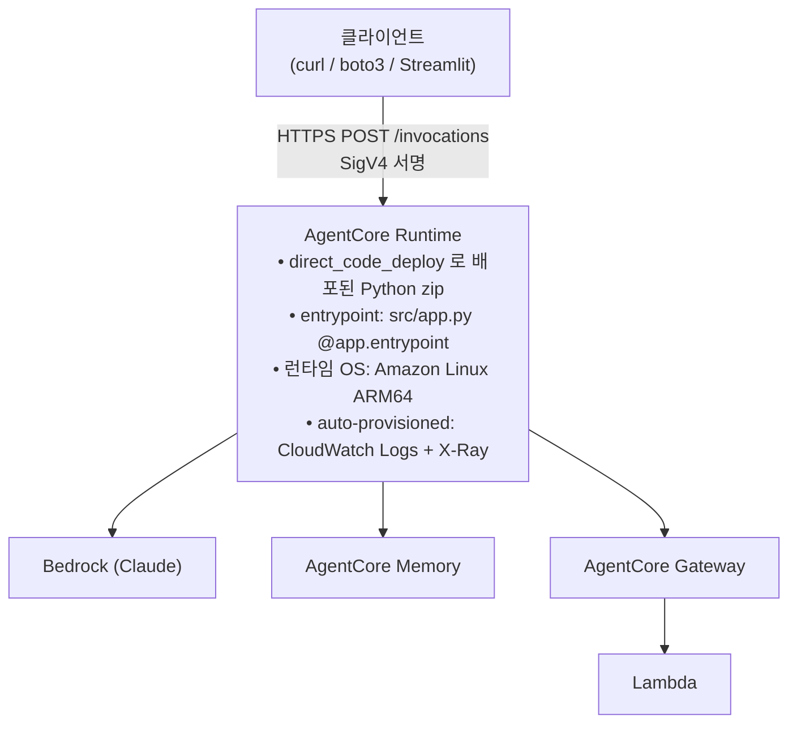

# Lab 5. 실제 서비스처럼 배포하기 — AgentCore Runtime

*— 로컬 Python 스크립트를 HTTPS 엔드포인트로 노출, SigV4 인증으로 다른 시스템이 호출 가능하게*

**예상 소요 시간**: 45분

> **전제**: Lab 4 까지 완료. `KB_ID`, `AGENTCORE_MEMORY_ID`, `AGENTCORE_GATEWAY_URL`, `AWS_REGION` 이 설정돼 있어야 합니다.
>
> **⚠️ CLI 안내 — 꼭 읽어 주세요**
>
> 이 Lab 은 Python `bedrock-agentcore-starter-toolkit` 의 `agentcore` CLI 를 사용합니다. 실행하면 다음 배너가 뜹니다.
>
> ```
> ⚠️ Recommendation: The Starter Toolkit CLI is no longer supported.
>    Please use the AgentCore CLI (@aws/agentcore) ...
> ```
>
> **워크샵 실습은 그대로 진행하면 됩니다** — starter-toolkit 은 현재도 정상 동작합니다. 배너는 `AGENTCORE_SUPPRESS_RECOMMENDATION=1` 로 끌 수 있습니다.
>
> 다만 **AWS 공식 권장 경로는 새 AgentCore CLI(`npm install -g @aws/agentcore`)** 이고, 신규 기능은 새 CLI 에만 추가됩니다. 워크샵이 starter-toolkit 을 유지하는 이유는 새 CLI 가 **Node.js 20+ · AWS CDK · `cdk bootstrap`** 과 별도 IAM 권한을 요구하는데, 워크샵 환경에 준비돼 있지 않기 때문입니다.
>
> 실제 프로젝트에 적용하실 때는 → [**새 CLI 이전 가이드**](새-cli-이전-가이드.md) 를 참고하세요. 명령 대응표, entrypoint 계약 차이, 기존 리소스 `import` 방법을 정리해 두었습니다. 이 Lab 에서 배우는 개념(Runtime · entrypoint · 배포 방식 · prompt caching)은 두 CLI 에서 동일합니다.

## 이 Lab 의 목표

- **AgentCore Runtime** 이 왜 필요한지 — Lambda / ECS / SageMaker 대비 이점
- **direct_code_deploy vs container** 두 배포 방식의 선택 기준
- `.bedrock_agentcore.yaml` 의 각 필드 의미와 튜닝 포인트
- **Prompt caching** 이 왜 system prompt 에서 동작하고, Memory 주입을 user message 에 두는 이유

## 지금 만드는 구조



## Runtime 선택 기준 — 다른 배포 옵션과 비교

| 옵션 | 장점 | 단점 | 이 워크샵에서 왜 안 쓰나 |
|---|---|---|---|
| **Lambda** | 서버리스, 초저비용 | 15분 timeout, 컨테이너 없음 | Strands + Memory SDK 의 초기화가 무겁고, 세션 유지 힘듦 |
| **ECS Fargate** | 컨테이너 완전 제어 | VPC, ALB, autoscaling 세팅 부담 | 인프라 오버헤드가 워크샵 취지에 안 맞음 |
| **EKS (Kubernetes)** | Pod / HPA / Sidecar 등 K8s 표준 도구 그대로 사용, 다른 마이크로서비스와 같은 cluster | 노드를 상시 가동하므로 idle 시간에도 비용 발생, agent 전용 관측·세션 라우팅을 직접 구현 필요 | 이미 EKS 기반 마이크로서비스 운영 중이라면 유지가 합리적 |
| **SageMaker endpoint** | 모델 서빙 최적화 | agent 워크로드엔 과잉 설계 | Strands agent 는 일반 Python 서버라 더 단순한 옵션이 낫음 |
| **AgentCore Runtime** (이 Lab) | Agent 전용 최적화, OAuth/SigV4/Observability 기본 제공, 요청 단위 과금 | 오케스트레이션 루프를 직접 코드로 작성해야 함 | ✅ 워크샵 선택 — 코드로 배우는 취지에 부합 |
| **AgentCore Harness** | model/tools/memory를 설정값으로 선언하면 오케스트레이션 루프를 AWS가 관리. 코드 불필요 | 프레임워크 선택 불가, bidirectional streaming/hooks 미지원 | 워크샵은 Strands 코드를 직접 작성하며 학습 — Harness 는 실제 서비스 구축 시 대안 |

**AgentCore Runtime 을 쓰는 실질적 이유**:
- OTel 계측 + X-Ray + CloudWatch Logs 가 **배포 시 자동 연결**
- Session ID 기반 고정 라우팅 (동일 session 은 동일 instance 로 → Memory 캐시 효율)
- HTTP 서버 코드 작성 불필요 — `@app.entrypoint` 데코레이터 하나로 endpoint 생성

### 이미 EKS 를 쓰고 있다면

기존 EKS cluster 를 운영 중인 경우, AgentCore Runtime 으로 옮기는 결정은 **트래픽 패턴과 운영 비용** 에 따라 달라집니다.

| 측면 | EKS 유지 | AgentCore Runtime 전환 |
|---|---|---|
| 비용 모델 | 노드 상시 가동 — idle 시간에도 EC2/Fargate 시간당 과금 | 요청 단위 — idle 시 0 |
| 세션 라우팅 | sticky session (ALB / Service / annotation) 직접 설정 | session ID 기반 자동 |
| 관측성 | Prometheus / Grafana / OpenTelemetry 직접 구성 | GenAI Observability + CloudWatch 자동 |
| 워크로드 길이 | 무제한 | 세션 최대 8시간 / 단일 요청 타임아웃 15분 (스트리밍 60분) |
| Sidecar / DaemonSet / ServiceMesh | 그대로 사용 가능 | 사용 불가 |

**판단 기준 요약**:
- agent 트래픽이 **spiky** 하고 idle 비율이 높다 → AgentCore 가 비용 면에서 유리할 가능성
- agent 외 다른 워크로드와의 **K8s 내부 호출 / Sidecar / NetworkPolicy** 가 핵심 → EKS 유지가 합리적
- 두 가지가 섞이면 **AgentCore 로 agent 만 분리** 하고 EKS 는 기존 마이크로서비스 유지하는 하이브리드도 가능

> 절대 비용 비교는 트래픽 패턴·요청 길이·노드 idle 비율에 따라 결과가 달라지므로 워크북에 수치를 명시하지 않습니다. 이전 부하 데이터로 PoC 를 한 번 돌려 비교하시는 편이 정확합니다.

### AgentCore Runtime vs Harness — 어느 쪽으로 만들어야 할까

AgentCore 에는 배포 옵션이 두 가지입니다. **Runtime** (이 Lab) 은 오케스트레이션 루프를 코드로 작성하는 방식이고, **Harness** 는 model·tools·memory 를 설정값으로 선언하면 루프 자체를 AWS 가 관리하는 방식입니다.

| 결정 기준 | **AgentCore Runtime** (이 Lab) | **AgentCore Harness** |
|---|---|---|
| 오케스트레이션 루프 | 직접 코드로 작성 (`@app.entrypoint`) | AWS 관리 — 설정만 선언 |
| 프레임워크 | Strands, LangGraph, CrewAI 등 자유 선택 | Strands 고정 |
| Memory 연동 | SDK 직접 호출 | 설정 한 줄 |
| Gateway / Browser / Code Interpreter 연동 | SDK 직접 호출 | 설정 한 줄 |
| 모델 전환 | 코드 변경 + 재배포 | 설정 변경만 |
| Bidirectional streaming | ✅ | ❌ |
| Hooks / 커스텀 루프 로직 | ✅ | ❌ |
| 비용 추가 | 없음 (Runtime 비용만) | 없음 (Runtime 비용만) |

**언제 Harness 를 선택하나**
- 프로토타입을 빠르게 만들고 싶을 때 — 코드 없이 설정만으로 Memory·Gateway·Browser 를 붙일 수 있음
- 모델을 자주 교체하며 실험하는 단계 — provider 전환이 설정 변경 한 줄
- 표준 ReAct 루프로 충분한 agent — 커스텀 루프 로직이 필요 없는 경우

**언제 Runtime 을 선택하나**
- 프레임워크를 직접 선택해야 하는 경우
- bidirectional streaming, hooks, 커스텀 context 관리 등 루프 제어가 필요한 경우
- 이 워크샵처럼 "내부 동작을 코드로 이해하며 배우는" 경우

공식 비교: [AgentCore harness vs. Runtime](https://docs.aws.amazon.com/bedrock-agentcore/latest/devguide/harness-vs-runtime.html)

## 배포 방식 — Direct Code Deploy vs Container

| 방식 | 시점 | 실행 | 언제 쓰나 |
|---|---|---|---|
| **direct_code_deploy** (이 워크샵) | Python zip → S3 업로드 → Runtime 이 uv 로 실행 | Docker 불필요, 빠름 | 보통의 Python agent 대부분 |
| **container** | Dockerfile → ECR → Runtime 이 컨테이너 실행 | Docker 환경 필요 | OTel 계측 커스텀, 시스템 패키지 추가 |

공식 가이드: [Direct code deployment](https://docs.aws.amazon.com/bedrock-agentcore/latest/devguide/runtime-get-started-code-deploy.html) · [CLI 가이드](https://docs.aws.amazon.com/bedrock-agentcore/latest/devguide/runtime-get-started-cli.html)

## 1단계. Runtime 엔트리포인트 (src/app.py) 이해

### 개념 먼저

AgentCore Runtime 은 **HTTP POST `/invocations`** 를 받아 JSON 으로 응답하는 서버를 기대합니다. `BedrockAgentCoreApp` 이 이 서버를 추상화:

```python
from bedrock_agentcore import BedrockAgentCoreApp

app = BedrockAgentCoreApp()

@app.entrypoint
def thewhoo_chat(payload: dict) -> str:
    # payload: 클라이언트가 POST 로 보낸 JSON
    # return: str → BedrockAgentCoreApp 이 {"response": ...} JSON 으로 감싸 응답
    ...
```

이 Lab 의 entrypoint 는 Lab 4 의 `thewhoo_chat()` 을 거의 그대로 재사용합니다:

```python
@app.entrypoint
def thewhoo_chat(payload: dict) -> str:
    user_message = payload.get("message", "")
    session_id = (
        _get_runtime_session_id()        # AgentCore Runtime 헤더에서 우선 추출
        or payload.get("session_id")
        or str(uuid.uuid4())
    )

    context = retrieve_session_context(ACTOR_ID, session_id)
    prompt = f"[이전 대화 맥락]\n{context}\n\n[현재 요청]\n{user_message}" if context else user_message

    response = orchestrator(prompt)
    response_str = str(response)

    save_turn(ACTOR_ID, session_id, user_message, response_str)
    return response_str
```

**핵심 포인트**:

| 설계 요소 | 값 | 이유 |
|---|---|---|
| `payload` 구조 | `{message, session_id}` | 클라이언트가 어떤 스키마로 보낼지 합의 |
| `session_id` 우선순위 | Runtime 헤더 → payload → 새 UUID | `agentcore invoke --session-id` 가 헤더로 전달되므로 Runtime 헤더 최우선 |
| `retrieve_session_context` 호출 | 매 invoke 시 | Memory 는 비싸지 않으므로 매번 조회 OK |
| `save_turn` 호출 | 매 invoke 시 | 동기. 응답 지연 우려 시 비동기 큐로 옮길 수 있음 |
| return 형식 | `str` (답변 본문만) | SDK 가 자동으로 `{"response": ...}` 로 감쌈. dict 를 반환하면 이중 래핑됨 |

### 실제 서비스에 적용할 때 조정할 것

- **payload 스키마 확장**: 다국어 지원 시 `locale`, 다중 테넌트면 `tenant_id`, A/B 테스트면 `variant` 같은 필드 추가
- **에러 응답 포맷**: try/except 로 감싸서 `{error: "...", code: "..."}` 형태로 응답 통일
- **streaming**: Strands 의 streaming 응답을 AgentCore Runtime 에서 SSE 로 노출할 수 있습니다 (고급 토픽)
- **auth header 검증**: SigV4 이외에 JWT bearer token 을 직접 검증하려면 `payload` 에 안 오는 header 처리 로직 필요

## 2단계. 설정 파일 `.bedrock_agentcore.yaml` 생성

### 개념 먼저

`.bedrock_agentcore.yaml` 은 `agentcore configure` 가 **현재 환경(계정 ID, 절대경로, 실행 role 등) 에 맞춰 자동 생성** 하는 파일입니다. 워크샵 git 레포에는 의도적으로 포함시키지 않았으니 (참가자 환경마다 다름), 셋업 직후 한 번 생성해야 합니다.

생성된 yaml 의 주요 필드:

📖 **참고용 — 자동 생성되는 yaml 의 모양**

```yaml
default_agent: thewhoo_chat
agents:
  thewhoo_chat:
    name: thewhoo_chat
    entrypoint: /home/sagemaker-user/thewhoo-agentcore-workshop/src/app.py   # 자동 채움
    source_path: /home/sagemaker-user/thewhoo-agentcore-workshop/src         # 자동 채움
    deployment_type: direct_code_deploy
    requirements_file: requirements.txt
    runtime_type: PYTHON_3_12
    aws:
      execution_role: arn:aws:iam::<acct>:role/thewhoo-agent-role-w001
      account: "<12-digit>"   # 자동 채움
      region: us-east-1
```

| 필드 | 역할 | 함정 / 조정 포인트 |
|---|---|---|
| `entrypoint` | `app.entrypoint` 가 있는 Python 파일 | **절대경로** 필수. `agentcore configure` 가 자동으로 채웁니다. |
| `source_path` | 배포 시 zip 에 포함될 루트 | 이 아래 전체가 패키징. 불필요 파일 많으면 zip 이 커집니다. |
| `deployment_type` | `direct_code_deploy` / `container` | 보통 `direct_code_deploy` 로 시작. |
| `requirements_file` | Python 의존성 목록 | Runtime 이 Linux ARM64 에서 `pip install`. |
| `runtime_type` | `PYTHON_3_11` / `PYTHON_3_12` | **필수**. 빠지면 `'NoneType' object has no attribute 'upper'` 에러. |
| `execution_role` | Runtime 이 assume 할 IAM role | Bedrock/Memory/Gateway 호출 권한이 있는 role. Pre-Lab 의 CFN 이 `thewhoo-agent-role-<pid>` 를 만들어 둡니다. |

▶ **실행 (Code Editor 터미널) — `.bedrock_agentcore.yaml` 자동 생성**

```bash
cd ~/thewhoo-agentcore-workshop
source .venv/bin/activate

# 혹시 이전 세팅의 옛 yaml 이 남아 있으면 백업
[ -f .bedrock_agentcore.yaml ] && mv .bedrock_agentcore.yaml .bedrock_agentcore.yaml.bak

# 현재 환경 기준으로 자동 생성
ACCOUNT_ID=$(aws sts get-caller-identity --query Account --output text)
agentcore configure \
  --entrypoint src/app.py \
  --name thewhoo_chat \
  --runtime PYTHON_3_12 \
  --deployment-type direct_code_deploy \
  --requirements-file requirements.txt \
  --execution-role "arn:aws:iam::${ACCOUNT_ID}:role/thewhoo-agent-role-w001" \
  --region us-east-1 \
  --non-interactive

# 결과 확인 — entrypoint / account 가 현재 환경 값인지
head -20 .bedrock_agentcore.yaml
```

`entrypoint` 의 절대경로가 현재 SageMaker 사용자 홈으로 시작하고, `account` 가 현재 AWS 계정 ID 와 일치하면 정상입니다.

### 실제 서비스에 적용할 때 조정할 것

- **runtime_type**: 라이브러리 호환성에 따라. Strands 는 3.11+ 요구. 3.12 가 기본 권장.
- **execution_role 최소 권한**: 워크샵은 넓게 줬지만 프로덕션은 각 리소스 ARN 으로 제한.
- **여러 agent**: `agents:` 아래 여러 개 정의 가능. 도메인별 agent 를 한 프로젝트에서 관리.
- **network_mode**: PUBLIC (기본) / VPC. 사내 API 호출이 필요하면 VPC 설정.

## 3단계. 로컬에서 먼저 실행 (agentcore dev)

### 개념 먼저

`agentcore dev` 는 배포 없이 로컬에서 Runtime 을 시뮬레이션합니다:

- `uv` 로 격리된 Python 환경 자동 구성
- `--port 8080` 에 HTTP 서버 기동
- 코드 변경 시 hot-reload

**용도**: entrypoint 가 정상 동작하는지, payload 처리가 맞는지 배포 전 검증.

> 시작하기 전에 venv 와 환경변수가 설정돼 있어야 합니다. 새 터미널을 열었다면:
> ```bash
> cd ~/thewhoo-agentcore-workshop && source .venv/bin/activate
> eval "$(./scripts/print-env.sh w001)"
> ```

▶ **실행 (Code Editor 터미널 — dev 서버 전용 창으로 사용)**

```bash
# 프로젝트 루트에서
agentcore dev --port 8080 \
  --env KB_ID=$KB_ID \
  --env AGENTCORE_MEMORY_ID=$AGENTCORE_MEMORY_ID \
  --env AGENTCORE_GATEWAY_URL=$AGENTCORE_GATEWAY_URL \
  --env AWS_REGION=us-east-1
```

▶ **실행 (다른 터미널에서 호출 — venv 활성화 + 환경변수 export 후)**

```bash
# 1) raw 출력 (\n escape 그대로)
agentcore invoke --dev '{"session_id":"local-1","message":"보습크림 추천"}'

# 2) 예쁘게 출력 (줄바꿈·이모지 정상 렌더, dev 서버 호출)
./scripts/chat.sh -s local-1 "보습크림 추천"
```

> CLI 의 raw 출력은 JSON-encoded 문자열이라 `\n` 이 그대로 보입니다. 실제 Streamlit / 웹 챗 UI 에서는 줄바꿈으로 정상 렌더됩니다. CLI 에서도 보고 싶으면 `chat.sh` 사용.

### 실제 서비스에 적용할 때 조정할 것

- **`--env` 는 개발용**: 프로덕션은 yaml 의 `environment` 섹션 또는 Secrets Manager 연동
- **hot-reload 범위**: `source_path` 아래 파일만. 외부 모듈 변경 시 재시작 필요

## 4단계. AgentCore Runtime 에 배포

### 개념 먼저

`agentcore deploy` 가 자동으로 수행하는 것:

1. **의존성 빌드**: `requirements.txt` 를 **Linux ARM64 wheel** 로 크로스 컴파일 (로컬이 Mac/Linux 상관없이)
2. **S3 업로드**: 코드 + 의존성을 zip 으로 묶어 `bedrock-agentcore-codebuild-sources-*` 버킷에 업로드
3. **Runtime 생성/갱신**: Agent Runtime 리소스 등록, 새 version 발행
4. **Observability 자동 연결**: CloudWatch Logs resource policy, X-Ray destination, Transaction Search index 자동 설정
5. **ARN 반환**

▶ **실행 (Code Editor 터미널)**

```bash
agentcore deploy \
  --env KB_ID=$KB_ID \
  --env AGENTCORE_MEMORY_ID=$AGENTCORE_MEMORY_ID \
  --env AGENTCORE_GATEWAY_URL=$AGENTCORE_GATEWAY_URL \
  --env AWS_REGION=us-east-1
```

약 3-5분 후 다음과 같은 출력이 나오면 성공입니다.

📖 **참고용 — 출력 예시**

```
✅ Deployment completed successfully
Agent ARN: arn:aws:bedrock-agentcore:us-east-1:<account>:runtime/thewhoo_chat-<id>
```

▶ **재배포 시 (코드 변경 후)**

```bash
agentcore deploy --auto-update-on-conflict \
  --env KB_ID=$KB_ID \
  --env AGENTCORE_MEMORY_ID=$AGENTCORE_MEMORY_ID \
  --env AGENTCORE_GATEWAY_URL=$AGENTCORE_GATEWAY_URL \
  --env AWS_REGION=us-east-1
```

### 실제 서비스에 적용할 때 조정할 것

- **CI/CD 연결**: `agentcore deploy` 는 CI 에서 직접 호출 가능. GitHub Actions / CodePipeline 에서 release 태그 push 시 자동 배포
- **versioning**: `--image-tag v1.0.3` 으로 명시적 버전. 롤백 시 이전 tag 로 재deploy
- **실행 환경변수**: `--env` 는 명령줄 인자. yaml 의 `environment:` 섹션에 고정값을 박아두는 것도 가능

## 5단계. 배포된 Agent 호출

> **session_id 길이 제약** — AgentCore Runtime API 의 `runtimeSessionId` 는 **33자 이상** 이어야 합니다. 짧은 값은 `Invalid length for parameter runtimeSessionId, valid min length: 33` 으로 거부됩니다. 안전하게 UUID 사용.

CLI:

```bash
SID="prod-$(python3 -c 'import uuid; print(uuid.uuid4())')"
agentcore invoke --session-id "$SID" '{"message":"보습크림 추천"}'
```

boto3:

```python
import boto3, json, uuid

client = boto3.client("bedrock-agentcore", region_name="us-east-1")
resp = client.invoke_agent_runtime(
    agentRuntimeArn="<배포 후 출력된 ARN>",
    runtimeSessionId=f"prod-{uuid.uuid4()}",      # 33자 이상 필수
    payload=json.dumps({
        "message": "보습크림 추천",
    }),
)
print(resp["response"].read().decode())
```

`invoke_agent_runtime` 이 SigV4 자동 서명. IAM 에 `bedrock-agentcore:InvokeAgentRuntime` 권한만 있으면 됩니다.

## 6단계. Streamlit UI — 원격 호출 체감

Lab 4 UI 와 동일해 보이지만 답변이 **로컬이 아닌 배포된 Runtime 에서 옵니다**.

```bash
cd ~/thewhoo-agentcore-workshop
source .venv/bin/activate
export AGENT_RUNTIME_ARN=<위에서 배포한 ARN>
streamlit run src/streamlit_lab5.py --server.port 8505
```

브라우저로 여는 법은 [Streamlit on Code Editor 가이드](streamlit-on-code-editor.md) 참고.

**로컬 (Lab 4) 과 달라진 점**:
- 여러 사용자 동시 접속 시 scale-out
- OTel trace 자동 수집 (Lab 6)
- 다른 시스템 (Slack bot, 모바일 앱, 프론트엔드) 이 boto3 로 호출 가능

## 7단계. Prompt Caching 관찰

### 개념 먼저

**Prompt caching** 은 요청의 **앞쪽 고정 영역**을 Bedrock 서버가 캐싱해 다음 호출 시 재처리 비용과 지연을 줄이는 기능입니다. 캐시 가능한 영역은 **system / tools / messages** 필드 모두이며, 명시적인 `cachePoint` 마커가 붙은 지점까지의 토큰이 캐시됩니다.

- **비용 절감**: 캐시 히트 구간의 입력 토큰은 크게 할인됩니다.
- **지연 단축**: 캐시된 토큰은 재처리가 빨라 첫 토큰 응답 시간이 감소합니다.
- **모델별 최소 토큰 요건**: Sonnet 4.6 은 1,024 토큰, Haiku 4.5 는 4,096 토큰 이상이어야 캐시 체크포인트가 활성화됩니다. TTL 은 5분(기본) 또는 1시간을 선택할 수 있습니다.

> 최신 요건과 가격 할인율은 [Bedrock prompt caching 문서](https://docs.aws.amazon.com/bedrock/latest/userguide/prompt-caching.html) 와 모델 카드에서 확인하세요.

**이 워크샵 구조의 캐싱 레이어**

```
[system prompt — 모든 사용자 공통, 고정]     ← 캐시 대상
[등록된 tools — 고정]                         ← 캐시 대상
[사용자 프로필 — 사용자마다 다름]             ← 캐시 프리픽스 이후, 매번 재처리
[사용자 질문 — 매 호출 변경]                  ← 매번 재처리
```

**Memory 프로필을 user message 에 배치한 이유** (Lab 2, Lab 4 와 동일 원칙)

Bedrock prompt caching 은 캐시 프리픽스(앞쪽 고정 영역)에서 히트가 발생합니다. system prompt 를 모든 사용자 공통으로 유지하면 system / tools 영역 전체가 캐시 대상이 되고, 프로필은 그 뒤의 user message 에 두어 가변 부분만 새로 처리되게 합니다. 반대로 사용자마다 다른 프로필을 system prompt 에 넣으면 프리픽스 자체가 사용자별로 달라져 캐시 히트율이 크게 떨어집니다.

### 워크샵 코드의 caching 활성화

`src/agents/orchestrator.py` 의 `BedrockModel` 에 다음 옵션이 박혀 있습니다:

```python
from strands.models import BedrockModel
from strands.models.model import CacheConfig

model = BedrockModel(
    model_id="us.anthropic.claude-sonnet-4-6",
    cache_config=CacheConfig(strategy="auto"),
    ...
)
```

`cache_config=CacheConfig(strategy="auto")` 는 Strands 가 system / tools / messages 모두에 cachePoint 를 자동 삽입하도록 지시합니다. (Strands 1.39 의 deprecated `cache_prompt` / `cache_tools` 는 system / tools 만 커버해서 멀티턴 대화에서 messages 영역이 prefix 길이 기준을 못 채우면 cache 가 동작하지 않습니다.)

옵션이 없으면 Bedrock 측에선 cache 를 만들지 않아 GenAI Dashboard 의 `cache_read_input_tokens` 가 0 으로만 보입니다.

### 확인 방법 — GenAI Observability Dashboard

같은 `session_id` 로 invoke 를 두 번 발생시키고, 두 번째 trace 를 확인합니다. (TTL 기본 5분 안에 호출해야 함)

▶ **실행**

```bash
# runtimeSessionId 는 33자 이상이어야 함 (AgentCore Runtime API 제약)
SESSION_ID="cache-test-$(python3 -c 'import uuid; print(uuid.uuid4())')"
agentcore invoke --session-id "$SESSION_ID" "{\"message\":\"보습크림 추천해줘\"}"
agentcore invoke --session-id "$SESSION_ID" "{\"message\":\"성분도 알려줘\"}"
```

5-10분 trace 인덱싱 대기 후:

1. CloudWatch Console → **GenAI Observability** → Agents → `thewhoo_chat` → Sessions
2. echo 로 출력된 `cache-test-` 로 시작하는 SESSION_ID 값으로 세션 검색 후 클릭 → **두 번째 trace** 클릭
3. span 트리에서 **orchestrator LLM span** 클릭 (Sonnet 호출)
4. 우측 패널 attributes 에서 다음 값 확인:
   - `gen_ai.usage.cache_read_input_tokens` > 0 → **캐시 히트** ✅
   - `gen_ai.usage.cache_creation_input_tokens` (1회차에 잡혔던 write 양)
   - `gen_ai.usage.input_tokens` (이번 호출에서 새로 처리한 토큰만)

📖 **참고용 — 정상 시그널**

| 호출 | cache_creation | cache_read | input_tokens |
|---|---|---|---|
| 1회차 (cache 생성) | ~1,200 | 0 | 적음 (사용자 질문만) |
| 2회차 (cache 히트) | 0 | ~1,200 | 적음 |

`cache_read_input_tokens` 양은 **이전 호출의 prefix 중 캐시에서 재사용된 토큰 수** 입니다 (system + tools + 이전 turn 의 messages). 비용·지연이 크게 감소.

### 보조 검증 — Bedrock Converse 단독 (Strands 거치지 않고)

agent 흐름과 무관하게 Bedrock 의 caching API 자체만 테스트하려면:

```bash
python3 scripts/test-prompt-cache.py --model sonnet
```

이 스크립트는 Bedrock Converse 를 직접 호출해 cachePoint 를 박고 두 번 호출하며 `cacheWriteInputTokens` / `cacheReadInputTokens` 를 출력합니다. agent 의 caching 설정과는 별개로 모델·계정의 caching 동작 여부를 확인할 때 유용합니다.

### 실제 서비스에 적용할 때 조정할 것

- **서브 agent 에도 caching 적용**: 이 워크샵은 orchestrator 만 `cache_config=CacheConfig(strategy="auto")` 로 활성화했습니다. recommend / qa / summary agent 도 자주 호출되므로 같은 옵션을 추가하면 Haiku 호출의 cache hit 도 잡힙니다 (Haiku 는 4,096 토큰 이상 prefix 필요)
- **system prompt 길이 확보**: Sonnet 4.6 기준 1,024, Haiku 4.5 기준 4,096 토큰 이상이어야 활성화. 짧으면 정적 예시·가이드라인을 의도적으로 보강
- **cache checkpoint 배치**: 여러 prefix 구간을 개별 캐싱 가능 (예: 공통 system 끝 + 도구 정의 끝). 두 번째 cachePoint 부터 ttl 옵션 (`5m` 기본 / `1h`) 도 분리
- **TTL 5분 고려**: 트래픽이 낮은 시간대 (예: 새벽) 에는 cache 가 만료됨. 정기적 dummy 호출로 cache 유지 가능
- **모니터링 지표**: `cache_read` / `cache_creation` 비율을 지속 관찰. 급락하면 system prompt 가 실수로 가변화된 가능성

## 여기까지 됐으면 성공

- [ ] `agentcore deploy` 성공, Runtime ARN 발급
- [ ] `agentcore invoke` 결과가 Lab 4 로컬 실행과 동일
- [ ] `invoke_agent_runtime` boto3 호출도 동작
- [ ] Streamlit UI 가 원격 ARN 으로 정상 호출
- [ ] 같은 session 두 번째 invoke 의 trace 에서 `cache_read_input_tokens > 0`

## (옵션) Dockerfile 기반 컨테이너 배포

`direct_code_deploy` 로 충분하지 않은 경우(예: 시스템 패키지 설치 필요, 빌드 체인 커스텀, 특정 base image 요구) **container 배포** 로 전환할 수 있습니다. OTEL 자체는 direct_code_deploy 에서도 자동 계측되므로, 단순히 관측성만 위해 container 로 바꿀 필요는 없습니다.

공식 권장 Dockerfile 구조:

```dockerfile
# ARM64 아키텍처는 AgentCore Runtime 의 필수 조건입니다.
FROM --platform=linux/arm64 python:3.12-slim

WORKDIR /app
COPY requirements.txt .
RUN pip install --no-cache-dir -r requirements.txt aws-opentelemetry-distro

COPY . .

# OTEL 계측을 위해 opentelemetry-instrument 로 감싸서 기동합니다.
CMD ["opentelemetry-instrument", "python", "app.py"]
```

`.bedrock_agentcore.yaml` 의 `deployment_type` 을 `container` 로 바꾸고:

```bash
agentcore deploy --local-build --env ...
```

같은 ARN 으로 교체 배포됩니다. 공식 가이드: [Observability for containerized agents](https://docs.aws.amazon.com/bedrock-agentcore/latest/devguide/observability-configure.html).

## 잘 안 될 때

| 증상 | 원인 / 해결 |
|---|---|
| `agentcore configure` → `zip utility not found` 또는 `uv not found` | starter-toolkit 이 두 도구를 PATH 에서 검사합니다. `setup-python.sh` 를 다시 실행하면 자동 설치됩니다. |
| `agentcore deploy` → `ResourceNotFoundException ... Agent '<id>' was not found` | yaml 의 `agent_id` 가 이미 삭제된 Runtime 을 가리킬 때. yaml 백업 후 2단계 `agentcore configure --non-interactive` 로 재생성. |
| `agentcore deploy` → `ConflictException ... already exists` | 같은 이름의 Runtime 이 살아있는데 yaml 은 비어 있음. `--auto-update-on-conflict` 추가해 재배포. |
| 응답에 "Knowledge Base 접근에 일시적인 문제" / `AccessDenied ... bedrock:Retrieve` | Runtime role 에 `bedrock:Retrieve` 권한 누락. 최신 master 의 CFN 으로 `update-stack` 또는 `aws iam put-role-policy --role-name thewhoo-agent-role-w001 --policy-name KBRetrieveAccess --policy-document ...` 로 보강. |
| 응답에 "기술적 오류 / 데이터베이스 시스템 일시 오류" | Runtime 의 `environmentVariables` 중 하나(보통 `AGENTCORE_GATEWAY_URL`)가 빈 문자열로 박힘. `python3 scripts/sync-runtime-env.py` 로 일괄 갱신. |
| `agentcore deploy` → `Failed creating service linked role` | CloudShell 에서 `setup-day2-cloudshell.sh` 를 다시 실행하면 자동으로 SLR 두 개를 만들어 줍니다. |
| 같은 session 두 번째 invoke 의 `cache_read_input_tokens` 가 0 | 코드 변경 (orchestrator.py 의 `cache_config`) 이 deploy 에 반영 안 된 케이스. starter-toolkit 의 dependency cache 를 무효화 후 재배포: `rm -rf ~/.bedrock_agentcore_cache && agentcore deploy --auto-update-on-conflict --env ...` |
| 두 invoke 사이 5분 넘긴 후 cache_read 가 0 | TTL 만료. cache 검증은 두 invoke 를 5분 안에 연속으로 보내야 합니다. |
| `Invalid length for parameter runtimeSessionId, valid min length: 33` | `--session-id` 또는 `runtimeSessionId` 값이 33자 미만. UUID 를 붙여 33자 이상으로 만드세요: `SID="myrun-$(python3 -c 'import uuid; print(uuid.uuid4())')"` |
| `agentcore deploy` → `AccessDeniedException` 또는 role not found | yaml 의 `execution_role` 이 가리키는 role 이 존재하지 않거나 다른 PID 의 role 을 가리킴. onestop 실행 시 쓴 PID 와 yaml 의 PID 가 일치해야 합니다. <br>▶ 본인 role 이름 확인: `aws iam list-roles --query "Roles[?starts_with(RoleName, 'thewhoo-agent-role')].RoleName" --output text` <br>▶ 그 PID 로 yaml 재생성: `[ -f .bedrock_agentcore.yaml ] && mv .bedrock_agentcore.yaml .bedrock_agentcore.yaml.bak` 후 2단계 `agentcore configure --execution-role "arn:aws:iam::$(aws sts get-caller-identity --query Account --output text):role/thewhoo-agent-role-<본인PID>"` 명령 재실행 |
| invoke 시 `ThrottlingException` / `TooManyRequestsException` | Runtime 의 **계정 기본 한도**에 도달한 것입니다. us-east-1 기준 동시 세션 5,000개 · 신규 세션 25개/초 (DCD) · invoke 200건/초. 워크샵 중 개인 계정에서는 거의 발생하지 않지만, 여러 PID 가 같은 계정을 공유하거나 부하 테스트를 돌릴 때 나타납니다. Service Quotas 에서 해당 항목을 선택해 증가 요청을 제출하거나, `--no-warmup` 없이 한 번에 보내는 병렬 요청 수를 줄이세요. |

## 다음 단계

배포는 끝났지만 **운영 중 챗봇이 왜 느린지 / 어떤 도구를 왜 호출했는지** 알 수 없으면 디버깅이 어렵습니다. [**Lab 6. 운영 상태 들여다보기**](07-lab6-운영-상태-들여다보기.md) 에서 trace 와 대시보드를 설정합니다.
