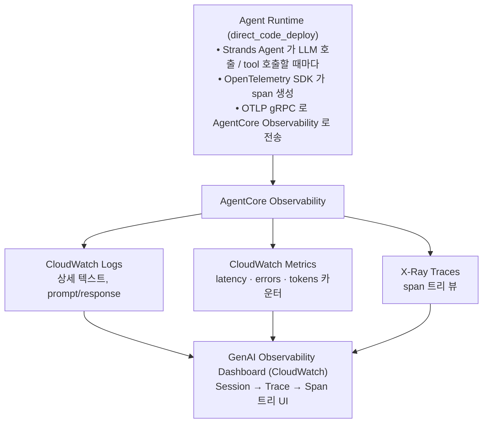

# Lab 6. 운영 상태 들여다보기 — Observability

*— 배포된 챗봇의 호출 흐름·지연·오류·토큰 사용을 trace 로 관찰*

**예상 소요 시간**: 30분

> **전제**: Lab 5 에서 AgentCore Runtime 에 배포를 완료하고 `AGENT_RUNTIME_ARN` 이 설정돼 있어야 합니다.

## 이 Lab 의 목표

- **Session / Trace / Span** 의 계층 구조 이해
- trace 가 **어디서 생기고 어떻게 수집**되는지 (OTel + X-Ray + CloudWatch)
- **GenAI Observability 대시보드** 에서 한 trace 의 span 트리 / token / 오류 읽기
- 운영 KPI 시계열·알람·비용 추적은 다음 Lab 7 에서 다룹니다.

## 지금 보는 데이터의 흐름



## Trace 계층 구조 — 3단 개념

| 단위 | 정의 | 예시 |
|---|---|---|
| **Session** | 같은 사용자의 연속 대화 전체 | 한 쇼핑 세션 (10분간 5-10회 질문) |
| **Trace** | 1회 invoke (사용자 질문 1개) 처리 전 과정 | "건성 보습크림 + 재고" 질문 1건 |
| **Span** | Trace 안의 단위 작업 (LLM 1회 호출, tool 1회 호출) | Orchestrator LLM, ask_recommend_agent, mcp.check_stock 각각 |

## OTel 계측 동작 방식

공식 문서에 따르면 **AgentCore CLI 로 배포한 Agent(direct_code_deploy / container 양쪽) 는 OpenTelemetry 계측이 자동 적용**됩니다. 추가 설정이나 라이브러리 설치 없이 trace 가 CloudWatch 로 흘러갑니다.

- `direct_code_deploy` → 자동 계측 (Runtime 이 OTEL 래핑 담당)
- `container` → Dockerfile 에서 `opentelemetry-instrument python app.py` 로 실행하면 동일하게 계측 적용 (Lab 5 옵션 섹션 참고)

**계측이 안 붙는 경우**: `agentcore deploy` 가 아닌 방식(직접 Docker run, ECS Task 등)으로 외부 호스팅할 때는 `AGENT_OBSERVABILITY_ENABLED=true` 환경변수 + OTEL 환경변수를 직접 설정해야 합니다. 이 경우 공식 [observability-get-started](https://docs.aws.amazon.com/bedrock-agentcore/latest/devguide/observability-get-started.html) 문서를 참고하세요.

## 1단계. Observability 활성화 확인

### 개념 먼저

`agentcore deploy` 는 배포 시 다음을 자동 설정합니다:

| 리소스 | 자동 설정 내용 |
|---|---|
| CloudWatch Logs resource policy | Bedrock/Agent 가 로그 그룹에 쓰기 허용 |
| X-Ray trace destination | Agent 의 OTLP export 받는 endpoint 활성화 |
| X-Ray indexing rule | 샘플링 규칙 / index attribute 설정 |
| Transaction Search | Span search 인덱스 활성화 |
| GenAI Observability Dashboard | CloudWatch 안의 프리셋 대시보드 |

### 확인

```bash
agentcore status
```

📖 **참고용 — 정상 출력 예시 (starter-toolkit 0.3.x)**

```
╭─ Agent Status: thewhoo_chat ────────────────────────────╮
│ Ready - Agent deployed and endpoint available          │
│                                                        │
│ Agent ARN: arn:aws:bedrock-agentcore:...:runtime/...   │
│ Endpoint: DEFAULT (READY)                              │
│                                                        │
│ 📋 CloudWatch Logs:                                    │
│    /aws/bedrock-agentcore/runtimes/...-DEFAULT         │
│                                                        │
│ 🔍 GenAI Observability Dashboard:                      │
│    https://console.aws.amazon.com/cloudwatch/...       │
╰────────────────────────────────────────────────────────╯
```

핵심 신호 세 가지:
- `Ready - Agent deployed and endpoint available` — 배포 완료
- `Endpoint: DEFAULT (READY)` — 호출 가능 상태
- `🔍 GenAI Observability Dashboard` 링크 — 관측 활성

### 실제 서비스에 적용할 때 조정할 것

- **샘플링 비율**: 기본은 trace 전부 수집. 고트래픽 환경에선 X-Ray 샘플링 규칙으로 10-20% 로 제한 (비용 절감)
- **사용자 식별자 attribute**: `session_id`, `user_id` 를 span attribute 로 추가해 필터링 가능
- **custom metric**: 도메인별 지표 (추천 성공률, 결제 전환율) 를 CloudWatch metric 으로 emit

## 2단계. 트래픽 생성

복합 질의 한 건을 invoke 해 span 트리 학습 자료를 만듭니다. 같은 session_id 안에 두 turn 으로 보내 Sessions 탭에서 묶어 보이도록:

▶ **실행**

```bash
# runtimeSessionId 는 33자 이상이어야 함 (AgentCore Runtime API 제약)
SID="lab6-demo-$(python3 -c 'import uuid; print(uuid.uuid4())')"
agentcore invoke --session-id "${SID}" "{\"message\":\"건성 피부야 보습크림 추천해줘\"}"
agentcore invoke --session-id "${SID}" "{\"message\":\"성분이랑 재고도 알려줘\"}"
echo "session_id: ${SID}"
```

> trace 가 `aws/spans` 에 인덱싱되기까지 **5-10분** 걸립니다. 대시보드가 비어 있어도 정상이며, 잠시 후 4단계 GenAI Dashboard 에서 위 session_id 로 검색해 확인합니다.

## 3단계. CLI 로 Trace 즉시 확인 (보조 — 4단계 GenAI Dashboard 가 정답)

### 개념 먼저

`agentcore obs` 명령은 X-Ray 를 CLI 에서 뒤져 trace / span 을 보여줍니다. 대시보드가 갱신되기 전에 빠르게 확인하고 싶을 때만 쓰세요. 워크샵 검증은 4단계의 GenAI Observability Dashboard 에서 합니다 (Strands 내부 span 트리가 OTLP 경로로 가기 때문에 CLI 보다 대시보드가 더 풍성).

▶ **실행**

```bash
# 세션 내 trace 목록
agentcore obs list --session-id "<session_id>"

# 가장 최근 trace 상세 (span 트리)
agentcore obs show --session-id "<session_id>"

# 특정 trace ID 상세
agentcore obs show --trace-id "<trace-id>"

# 실패한 trace 만
agentcore obs show --session-id "<session_id>" --errors
```

### 실제 서비스에 적용할 때 조정할 것

- **CI 에서 회귀 탐지**: PR 마다 대표 trace 몇 개를 CLI 로 export 해 이전 배포와 span 트리 diff
- **slow span alert**: 특정 span (`mcp.*` 등) 이 N ms 이상이면 CloudWatch alarm

## 4단계. GenAI Observability Dashboard 에서 trace 드릴다운

▶ **실행**

1. CloudWatch Console → 좌측 **GenAI Observability** → Agents → `thewhoo_chat`
2. **Sessions** 탭 → 우상단 시간 범위 "Last 1 hour"
3. 2단계에서 echo 로 출력된 `lab6-demo-` 로 시작하는 session_id 를 검색창에 붙여넣어 클릭 → 두 turn 의 trace 가 보임
4. trace 한 건 클릭 → span 트리 + Strands Agents span 클릭 → 우측 attributes 패널

### 무엇을 봐야 하나

Trace 의 root span (`AgentCore.Runtime.Invoke`) 아래 자식 span 들이 보입니다. 우리 워크샵의 한 trace 는 보통 다음 구조:

- **invoke_agent Strands Agents** (kind=INTERNAL) — 이 한 span 의 attributes 에 가장 풍성한 정보가 박혀 있습니다.

핵심 attribute:

| 이름 | 의미 | 읽는 법 |
|---|---|---|
| `gen_ai.usage.input_tokens` | 이번 호출에서 새로 처리한 입력 토큰 | 비용의 1차 단위 |
| `gen_ai.usage.output_tokens` | 응답 생성 토큰 | input 보다 보통 작음 |
| `gen_ai.usage.cache_read_input_tokens` | 캐시 히트로 재처리 회피한 토큰 | 두 번째 호출부터 잡혀야 정상 (Lab 5 의 cache_config 효과) |
| `gen_ai.usage.cache_write_input_tokens` | 캐시 신규 생성한 토큰 | 처음엔 큼, 같은 prefix 가 재호출되면 0 |
| `gen_ai.agent.tools` | agent 가 사용한 도구 목록 | `qa_tool / recommend_tool / summary_tool` |
| `session.id` | 우리가 invoke 시 박은 session_id | Sessions 탭의 session 묶기 기준 |

> **참고** — 같은 invoke 가 두 trace 로 보이는 경우 (`AgentCore.Runtime.Invoke` + `invoke_agent Strands Agents`) 가 정상입니다. 전자는 HTTP wrapper, 후자는 Strands 내부 작업이라 분리돼 들어오기 때문. 학습은 후자 (`invoke_agent Strands Agents`) 의 attributes 를 보면 됩니다.

## 5단계. 오류 케이스 관찰

> **참고** — 존재하지 않는 상품 ID (`WHOO-99999`) 같은 도메인 에러는 우리 워크샵 코드에선 LLM 이 받아서 친절한 답변으로 정리해 내보냅니다. trace 의 span status 는 OK 로 끝나기 때문에 빨간 ! 마크가 안 뜹니다 (이게 정상 동작입니다 — agent 가 견고하게 처리하도록 설계됨).
>
> trace 화면의 빨간 ! 마크 / `UserErrors` metric 증가는 **AgentCore Runtime 자체의 invocation 실패** 시 잡힙니다. 학습 검증을 위해 다음 스크립트가 의도적인 schema validation 에러를 만들어 줍니다:

▶ **실행**

```bash
./scripts/test-error-trace.sh
```

5-10분 후 결과 확인:

1. **GenAI Dashboard → Sessions** 에서 스크립트가 출력한 session prefix (예: `error-test-1715...-1`) 검색 → trace 에 빨간 ! 마크
2. **CloudWatch → All metrics → AWS/Bedrock-AgentCore → UserErrors** → +1 datapoint 보임 (스크립트가 끝에 출력한 명령으로도 확인 가능)
3. 정상 호출 (`error-test-...-3`) 의 trace 와 비교해 빨간 마크 유무 차이 확인

### 실제 서비스에 적용할 때 조정할 것

- **에러 분류**: 일시적 (throttling) vs 영구적 (data missing) 으로 나눠 retry 정책 구별
- **on-call alarm**: `error_rate > 5%` 또는 특정 span 에서 `error=true` 지속 발생 시 Slack/PagerDuty 알림 (Lab 7 에서 알람 연결)

## 여기까지 됐으면 성공

- [ ] GenAI Observability 에서 `thewhoo_chat` agent 가 보이고 세션이 집계됨
- [ ] 복합 질의 1건의 span 트리에서 호출 순서·지연·token 확인
- [ ] 오류 케이스에서 span 이 `error=true` 로 표시됨

> 시계열 KPI 차트 (Sonnet vs Haiku 비율, P50/P95 latency, error rate, 모델별 토큰 누적 등) 는 다음 [Lab 7](08-lab7-운영-모니터링-대시보드.md) 의 사용자 정의 Dashboard 에서 다룹니다.

## 잘 안 될 때

| 증상 | 원인 / 해결 |
|---|---|
| GenAI Observability 대시보드에 **"Enable Agent observability"** 안내만 보임 | 계정 레벨 Transaction Search 가 활성화 안 된 상태. CloudShell 에서 `./scripts/setup-day2-cloudshell.sh w001` 을 다시 실행하면 4가지 prerequisite (Logs Resource Policy · Trace Segment Destination · Indexing Rule · aws/spans 로그 그룹) 가 자동 설정됩니다. |
| Trace 화면에서 일부 span 옆에 **빨간 ! 마크** | 해당 span 의 status 가 Error 라는 의미 (예: `kb_retrieve` AccessDenied, MCP 호출 실패). 정상 시그널이며, 원인을 고친 뒤 새 invoke 의 trace 에는 사라집니다. KB Retrieve 권한 케이스는 Lab 5 의 "잘 안 될 때" 표 참고. |
| Trace 는 잡히는데 **segment 1개만** (Strands 내부 LLM/tool span 누락) | OTEL auto-instrumentation 비활성. `requirements.txt` 에 `aws-opentelemetry-distro` 와 `src/app.py` 의 `StrandsTelemetry().setup_otlp_exporter()` 호출 확인 후 Runtime 삭제 → 재배포. 배포 로그에 `OpenTelemetry instrumentation enabled` 가 떠야 정상. |
| 세션이 여러 UUID 로 쪼개져 보임 | invoke 시 같은 `session_id` 를 재사용하는지 확인. |
| trace 가 인덱싱되지 않음 | 배포 직후 5-10분 대기. 그 후에도 비면 Runtime 삭제 → 재배포 (`aws bedrock-agentcore-control delete-agent-runtime --agent-runtime-id <id> --region us-east-1` 후 30초 → `agentcore deploy`). |

## 다음 단계

**"무엇이 호출됐는지"** 는 trace 로 관찰할 수 있게 됐습니다. 하지만 24시간 운영 모니터링은 trace 한 건씩 보는 것보다 **시계열 KPI 대시보드 + 알람** 이 적합합니다.

[**Lab 7. 운영 모니터링 대시보드**](08-lab7-운영-모니터링-대시보드.md) 에서 호출량·지연·토큰·비용을 한 화면에서 추적하는 CloudWatch Dashboard 를 구성합니다.
