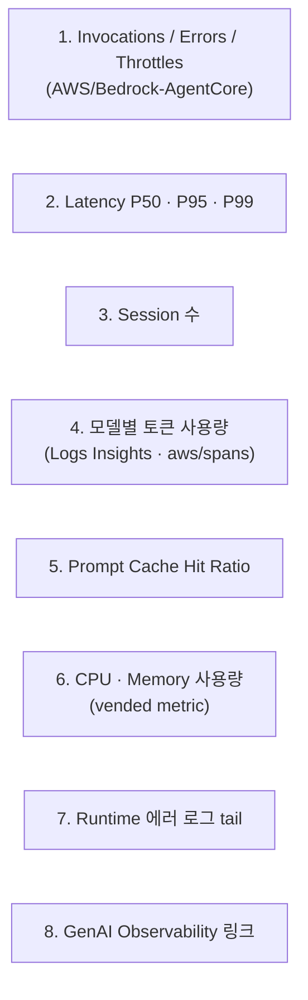

# Lab 7. 운영 모니터링 대시보드 — KPI · 알람 · 비용

*— 호출량·지연·토큰·CPU 를 한 화면에서 24시간 추적하고 이상 신호에 알람*

**예상 소요 시간**: 30분

> **전제**: Lab 6 에서 GenAI Observability 로 trace 를 한 건씩 읽어봤습니다. 이제 운영자 관점으로 시야를 넓힙니다.

## 이 Lab 의 목표

- GenAI Observability 와 사용자 정의 Dashboard 의 **역할 분담** 이해
- AgentCore Runtime 이 자동 emit 하는 **native CloudWatch metric** 5종 활용
- `aws/spans` 의 OTLP semantic 으로부터 **모델별 토큰·캐시 효율** 시계열 추출
- 운영 알람 4종 (지연·에러·캐시·CPU) 을 **CloudWatch Alarm** 으로 연결

## 두 대시보드의 역할 분담

| | GenAI Observability | 사용자 정의 CloudWatch Dashboard (이 Lab) |
|---|---|---|
| 주 용도 | 단일 trace 디버깅 — "이 한 건의 질문이 왜 느렸나" | 24시간 KPI 모니터링 · 알람 |
| 차트 구성 | AWS 가 정한 프리셋 | 위젯 자유 구성 |
| 알람 연결 | 불가 | 위젯 → CloudWatch Alarm 직접 연결 |
| URL 공유 | 동일 계정 사용자만 | 전용 URL · IAM 권한 부여로 외부 공유 |
| Logs Insights 쿼리 위젯 | 제한적 | 자유 |

GenAI Observability 는 디버깅용, 사용자 정의 Dashboard 는 모니터링용이라고 기억하면 됩니다.

## 만들 위젯 8개



각 위젯 데이터 소스:

- **1·2·3**: AgentCore Runtime 이 자동 emit 하는 `AWS/Bedrock-AgentCore` namespace metric (분 단위 집계)
- **4**: `aws/spans` 에 OTLP semantic 으로 기록된 `gen_ai.usage.input_tokens` / `output_tokens` / `cache_read_input_tokens`. Sonnet vs Haiku 호출 비율을 한 화면에서 확인
- **5**: `cache_read / 전체 input × 100` 비율. ⚠️ **분모 주의** — prompt caching 이 켜지면 `input_tokens` 는 **캐시되지 않은 토큰만** 의미합니다 (공식: `total input = inputTokens + cacheRead + cacheWrite`). 그래서 `cache_read / input_tokens` 로 계산하면 100% 를 넘을 수 있는 무의미한 값이 됩니다. 이 위젯은 분모에 세 항목을 모두 더합니다. **전 모델 합산**이라 이 워크샵 구성에서는 **20~40% 대가 정상**입니다 (`cache_config` 를 켠 Orchestrator(Sonnet) 만 캐시를 쓰고 Haiku 서브에이전트 3개는 캐시가 없습니다 — 서브에이전트에 캐시를 걸어도 **Haiku 4.5 의 최소 4,096 토큰**을 못 넘겨 실제로는 안 잡힙니다. Sonnet 4.6 은 1,024 라 Orchestrator 의 1,996 토큰 프롬프트가 통과합니다). 평소 수준에서 **급락**하면 system prompt 가 가변화된 신호입니다
- **6**: `CPUUsed-vCPUHours` / `MemoryUsed-GBHours` (vended metric, 최대 60분 지연). 컨테이너 throttle 과 OOM 의 조기 신호이자 청구 추정의 1차 근거
- **7**: Runtime 컨테이너 애플리케이션 로그 — KB AccessDenied, MCP 호출 실패 같은 도메인 에러가 즉시 보임

## 1단계. Dashboard 생성

▶ **실행 (Code Editor 터미널)**

```bash
cd ~/thewhoo-agentcore-workshop
source .venv/bin/activate
./scripts/create-cloudwatch-dashboard.sh
```

스크립트 출력의 마지막 줄에 Dashboard URL 이 나옵니다. 클릭해서 열면 위젯 8개가 나타나는데, 이 시점엔 metric 이 아직 publish 되기 전이라 위젯 1·2·3·6 은 비어 있습니다.

## 2단계. 트래픽 발생 — 위젯 채우기

여러 사용자 + 멀티턴 대화 + 의도된 에러까지 한 번에 시뮬레이션합니다. 10명 × 4턴 = **40 정상 invoke** + **5 schema 위반 invoke** = 총 45건.

▶ **실행 — 풀 시뮬레이션** (약 8-10분)

```bash
./scripts/simulate-traffic.sh
```

빠르게만 채워보고 싶으면 (3명 × 2턴 + 에러 2건, 약 3분):

```bash
./scripts/simulate-traffic.sh --quick
```

📖 **참고용 — 시나리오 구성**

| 사용자 시나리오 (각 4턴) | 의도된 에러 페이로드 |
|---|---|
| 건성 보습크림 / 지성 토너 / 콜라겐 크림 / 민감 진정 | message 필드 누락 |
| 봄 신상 / 데일리 선크림 / 민감 클렌저 | JSON 파싱 실패 |
| 20대 아이크림 / 수분 마스크팩 / 립밤 | session_id 만 |
| | 빈 페이로드 |
| | message 가 number 타입 |

이후 5-10분 대기. Dashboard 새로고침 후 채워지는 위젯:

| 위젯 | 결과 |
|---|---|
| 1. 호출량 / 에러 / Throttle | Invocations ~45. **에러 3종은 0 이 정상입니다** — 아래 설명 참고 |
| 2. Latency P50/P95/P99 | 정상 호출 ~40개로 분포 풍부 |
| 3. Session 수 | 사용자 수 + 에러 주입 건수 (에러 payload 는 `--session-id` 없이 보내 각각 새 세션이 됩니다) |
| 4. 모델별 토큰 사용량 | Sonnet (orchestrator) + Haiku (sub-agent) 누적 |
| 5. Prompt Cache Hit Ratio | **20~40%** (실측 29%. Orchestrator 만 캐시 사용 — 아래 설명 참고). 0% 면 cache 미동작 |
| 7. Runtime 에러 로그 tail | **비어있는 게 정상** — 컨테이너 내부에서 Python Exception 이 raise 될 때만 row 가 추가됩니다. "no news = good news" 위젯. |
| 6. CPU/Memory | vended metric — 최대 60분 지연. 1시간 뒤 확인. |

> **왜 `UserErrors` / `SystemErrors` 가 0 인가 — 정상입니다**
>
> `simulate-traffic.sh` 가 보내는 의도된 잘못된 페이로드(`{"foo":...}`, 비-JSON 등)는
> Runtime API frontend 에서 거부되지 않고 **컨테이너까지 전달**됩니다. 그리고 `src/app.py` 는
> 메시지가 비어 있으면 예외를 던지지 않고 `"메시지를 입력해주세요."` 를 **정상 응답(HTTP 200)** 으로
> 반환합니다. 따라서 에러 metric 이 올라가지 않습니다.
>
> 이것은 버그가 아니라 **의도된 방어적 설계**입니다. 실서비스에서도 잘못된 입력에 500 을
>던지는 것보다 안내 문구를 돌려주는 편이 낫습니다. 다만 그 대가로 **"입력 오류" 가 metric 에
> 드러나지 않습니다** — 운영 관점에서 이런 케이스를 추적하려면 `app.py` 에서 별도
> custom metric(`PutMetricData`) 이나 구조화된 WARN 로그를 남겨야 합니다.
>
> 즉 위젯 1 의 에러 3종은 **실제 장애(권한 실패·타임아웃·throttle)가 있을 때만** 올라갑니다.
> 워크샵 시나리오에서는 0 이 정상이고, 0 이 아니라면 진짜 문제를 봐야 한다는 신호입니다.

## 3단계. 비용 추정의 출발점

이 Dashboard 의 위젯 4·6 만으로 비용 1차 추정이 가능합니다.

| 비용 축 | 위젯 | 환산 방법 |
|---|---|---|
| **모델 호출 비용** | 위젯 4 (모델별 token sum) | input/output token × 모델 단가 |
| **Runtime 인프라 비용** | 위젯 6 (vCPU-Hours · GB-Hours) | 시간당 단가 × 사용량 |

> 절대 금액은 리전·할인·약정에 따라 달라집니다. 현재 가격은 [Bedrock AgentCore Pricing](https://aws.amazon.com/bedrock/agentcore/pricing/) 과 [Bedrock Model Pricing](https://aws.amazon.com/bedrock/pricing/) 에서 확인하세요.

운영 단계에선 **Cost Explorer** 가 정답이지만, 그건 1일 지연이라 실시간 이상 감지에는 못 씁니다. 이 위젯들이 "이번 시간에 비용이 튀고 있다" 같은 실시간 신호 역할을 합니다.

## 4단계. 알람 4종 연결

운영 환경에서 가장 자주 거는 알람:

| 알람 | 트리거 조건 | 이상 신호 의미 |
|---|---|---|
| (a) Latency P95 ↑ | P95 > 5초 30분 지속 | 모델 throttle 또는 도구 호출 지연 |
| (b) UserErrors 비율 ↑ | 5% 초과 | 클라이언트 입력 오류 또는 권한 회귀 |
| (c) Cache Hit Ratio ↓ | 평소 대비 **급락** 후 30분 지속 (예: 29% → 5%) | system prompt 회귀로 비용 급증 신호. 절대 임계값보다 평소 대비 변화를 보세요 |
| (d) CPU spike | baseline × 1.5 | 동시 invoke 폭주 또는 prompt loop |

▶ **실행 — (a) P95 latency 알람**

```bash
ACCOUNT_ID=$(aws sts get-caller-identity --query Account --output text)
RUNTIME_ID=$(aws bedrock-agentcore-control list-agent-runtimes \
  --region us-east-1 \
  --query "agentRuntimes[?contains(agentRuntimeName, 'thewhoo')].agentRuntimeId | [0]" \
  --output text)
RUNTIME_ARN="arn:aws:bedrock-agentcore:us-east-1:${ACCOUNT_ID}:runtime/${RUNTIME_ID}"
# Name dimension 은 agent_name (ID suffix 제거) + "::DEFAULT" 형식
AGENT_NAME="${RUNTIME_ID%-*}"

aws cloudwatch put-metric-alarm \
  --alarm-name thewhoo-chat-latency-p95-high \
  --metric-name Latency \
  --namespace AWS/Bedrock-AgentCore \
  --dimensions Name=Resource,Value=$RUNTIME_ARN \
               Name=Operation,Value=InvokeAgentRuntime \
               Name=Name,Value=${AGENT_NAME}::DEFAULT \
  --extended-statistic p95 \
  --period 300 \
  --evaluation-periods 6 \
  --threshold 5000 \
  --comparison-operator GreaterThanThreshold \
  --treat-missing-data notBreaching \
  --region us-east-1
```

(b)(c) 는 콘솔에서 위젯 ⋮ → **Create alarm** 으로 만드는 게 빠릅니다 (특히 Logs Insights 기반 (c) 는 metric 으로 export 하는 단계가 콘솔에 자동화돼 있음).

▶ **실행 — (d) CPU spike 알람**

```bash
aws cloudwatch put-metric-alarm \
  --alarm-name thewhoo-chat-cpu-spike \
  --metric-name CPUUsed-vCPUHours \
  --namespace AWS/Bedrock-AgentCore \
  --dimensions Name=Service,Value=AgentCore.Runtime \
  --statistic Sum \
  --period 300 \
  --evaluation-periods 3 \
  --threshold 1 \
  --comparison-operator GreaterThanThreshold \
  --treat-missing-data notBreaching \
  --region us-east-1
```

> threshold 는 예시입니다. 실서비스에선 baseline 1주일 측정 후 평소 값의 1.5-2배로 잡으세요.

## 5단계. SNS 연결로 알림 채널 확장

알람을 만들면 기본적으로 콘솔에서만 보입니다. Slack / Email 로 보내려면 SNS Topic 을 알람의 alarm action 에 연결합니다.

```bash
# (1) Topic 생성
TOPIC_ARN=$(aws sns create-topic --name thewhoo-chat-alerts --region us-east-1 \
  --query 'TopicArn' --output text)

# (2) Email 구독 (구독 메일에 confirm 링크 클릭 필요)
aws sns subscribe --topic-arn $TOPIC_ARN \
  --protocol email --notification-endpoint your-team@example.com \
  --region us-east-1

# (3) 알람에 action 추가
aws cloudwatch put-metric-alarm \
  --alarm-name thewhoo-chat-latency-p95-high \
  --alarm-actions $TOPIC_ARN \
  --region us-east-1 \
  ...   # 위 (a) 의 나머지 인자 그대로
```

Slack 으로 보내려면 SNS → AWS Chatbot → Slack workspace 연결이 필요합니다 ([AWS Chatbot 가이드](https://docs.aws.amazon.com/chatbot/latest/adminguide/setting-up.html)).

## 여기까지 됐으면 성공

- [ ] Dashboard 에 위젯 8개 표시
- [ ] 위젯 1·2 에 시계열 데이터 (Invocations, Latency) 들어옴
- [ ] 위젯 4 에 Sonnet/Haiku 토큰 분포 표
- [ ] 알람 (a) P95 latency 가 콘솔 Alarms 페이지에 등록됨

## 잘 안 될 때

| 증상 | 원인 / 해결 |
|---|---|
| 위젯 1·2·3 이 비어있음 | CloudWatch metric 은 약 1분 배치로 publish (span/trace 인덱싱은 별개로 최대 10분) 됩니다. 2단계의 트래픽 발생 명령을 한 번 더 돌리고 10분 대기. 검증: `aws cloudwatch list-metrics --namespace AWS/Bedrock-AgentCore --region us-east-1` 결과에 metric 이 나오면 publish 시작된 것. |
| 위젯 4·5 (Logs Insights) 가 비어있음 | invoke 가 발생한 직후라면 trace 인덱싱 대기 (5분). 그 후에도 비면 Lab 6 의 잘 안 될 때 표 참고. |
| 위젯 6 (CPU/Memory) 가 비어있음 | vended metric 은 최대 60분 지연. 정상이며 1시간 후 재확인. |
| 위젯 1·2·3 데이터가 보이는데 dashboard 차트는 비어있음 | dashboard 의 dimension 이 metric 과 안 맞는 케이스. `./scripts/create-cloudwatch-dashboard.sh` 다시 실행 (스크립트가 정확한 dimension 으로 dashboard 를 덮어씀). |
| 알람이 즉시 ALARM 상태 | threshold 가 baseline 보다 낮게 설정됨. baseline 1주일 관측 후 1.5-2배로 조정. |

## 실제 서비스에 적용할 때 조정할 것

- **다중 환경 분리**: dev / staging / prod 별 Dashboard 분리 (`agentRuntimeName` 에 환경 suffix)
- **비용 KPI 위젯 추가**: Math expression 으로 token × 단가 직접 계산해 실시간 비용 차트
- **Synthetics canary**: 5분마다 대표 질문 1개를 invoke 해 실 사용자 트래픽 없을 때도 SLA 추적
- **알람 → PagerDuty / Opsgenie**: SNS 대신 EventBridge → 사고 관리 도구로 라우팅

## 다음 단계

호출이 정상이고 비용이 예측 가능해도, **답변 품질이 좋은지** 는 메트릭만으로 알 수 없습니다.

[**Lab 8. 답변 품질 평가하기**](09-lab8-답변-품질-평가하기.md) 에서 AgentCore Evaluations 로 골든셋 기반 LLM-as-Judge 평가를 구성합니다.
