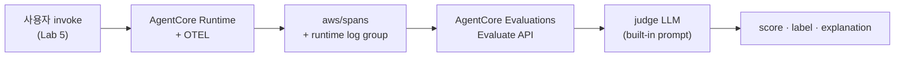
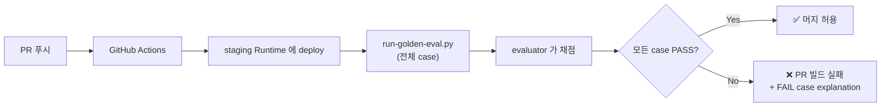

# Lab 8. 답변 품질 평가하기 — AgentCore Evaluations

*— 골든셋과 LLM-as-Judge 로 답변 품질을 점수화하고 회귀 탐지*

**예상 소요 시간**: 30-40분

> **전제**: Lab 5 에서 Runtime 배포 완료. Lab 6 이 활성화한 trace 가 `aws/spans` 와 runtime log group 에 쌓이고 있어야 합니다 (Evaluations 가 trace 를 입력으로 사용).

## 이 Lab 의 목표

- **골든셋** 의 개념과 이 워크샵의 골든셋 (20 시나리오) 이해
- **AgentCore Evaluations** 가 무엇이고 왜 메트릭·trace 와 다른지 이해
- On-demand vs Online 두 모드의 차이 — 각 어느 운영 시점에 쓰나
- **Built-in evaluator** 3종으로 한 세션의 trace 를 점수화
- 골든셋 전체를 자동 평가해 **회귀 게이트** 로 활용

## Evaluations 가 풀어주는 문제

Lab 6 과 Lab 7 까지는 **양적 신호** 만 봤습니다 — 호출 수, 지연, 토큰. 하지만 다음 질문에는 답하지 못합니다:

- 답변이 **사용자 의도에 맞나** (Helpfulness)
- KB 에서 잘못된 문서를 끌어와 **사실과 다르게 말하지 않았나** (Faithfulness)
- 멀티턴 세션에서 **사용자 목표를 결국 달성했나** (GoalSuccessRate)
- Orchestrator 가 **올바른 도구를 골랐나** (ToolSelectionAccuracy)

이걸 사람이 매번 채점하는 건 비용이 큽니다. AgentCore Evaluations 는 trace 를 **judge LLM** 에게 채점시켜 점수와 설명을 자동으로 돌려줍니다.

## 동작 흐름



agent 가 직접 호출되는 게 아니라 **이미 쌓인 trace 를 다시 읽어 채점** 하는 구조라 운영 트래픽에 영향 없고, 과거 trace 도 분석 가능합니다.

## 골든셋이 무엇인가

**골든셋** 은 release 마다 **똑같이** 던지는 고정된 평가 시나리오 집합입니다.

이 워크샵의 골든셋은 **AgentCore Evaluations 의 공식 [Dataset schema](https://docs.aws.amazon.com/bedrock-agentcore/latest/devguide/dataset-evaluations-schema.html)** 그대로 작성합니다. 그래서 SDK 의 `FileDatasetProvider` 로 바로 로드할 수도 있고, 이 Lab 의 `run-golden-eval.py` 처럼 직접 `Evaluate` API 를 호출할 수도 있습니다.

> **ground truth 는 반드시 `evaluationReferenceInputs` 로 넘겨야 합니다.** 골든셋에 `assertions` · `expected_trajectory` 를 적어 두기만 하면 evaluator 가 알아서 쓰는 게 아닙니다. `Evaluate` 호출 시 아래 형태로 전달해야 합니다 ([ground-truth-evaluations](https://docs.aws.amazon.com/bedrock-agentcore/latest/devguide/ground-truth-evaluations.html)).
>
> ```python
> evaluationReferenceInputs=[{
>     "context": {"spanContext": {"sessionId": SESSION_ID}},   # context 필수
>     "assertions": [{"text": "..."}],                          # → GoalSuccessRate
>     "expectedTrajectory": {"toolNames": ["qa_tool"]},          # → Trajectory*Match
>     "expectedResponse": {"text": "..."},                       # → Correctness
> }]
> ```
>
> 빼먹으면 evaluator 가 **ground-truth-free 모드**로 돌아갑니다 — 즉 골든셋과 무관한 기준으로 채점하는데도 PASS 가 나옵니다. `scripts/run-golden-eval.py` 의 `build_reference_inputs()` 가 이 변환을 담당합니다.
>
> ⚠️ 한 가지 더 — ground truth 를 넘기면 `Builtin.GoalSuccessRate` 는 **다른 prompt template** 이 적용되고 verdict 어휘가 `Yes`/`No` → `SUCCESS`/`FAILURE` 로 바뀝니다. 그래서 스크립트의 `DEFAULT_GATE` 는 두 어휘를 모두 허용합니다.

> ⚠️ **Preview 안내**: AgentCore 의 **Dataset evaluation** 기능 (`FileDatasetProvider` · `OnDemandEvaluationDatasetRunner`) 은 현재 **public preview** 입니다 ([공식 문서](https://docs.aws.amazon.com/bedrock-agentcore/latest/devguide/dataset-evaluations.html)). GA 전까지 API·필드명이 바뀔 수 있으니, 이 Lab 코드가 동작하지 않으면 SDK 버전과 공식 문서의 최신 시그니처를 먼저 확인하세요. `Builtin.*` evaluator 를 직접 호출하는 `evaluate` API 자체는 안정적입니다 (`scripts/eval-direct.py` 우회 경로 참고).

| 공식 필드 | 의미 | 사용하는 evaluator |
|---|---|---|
| `scenarios[].scenario_id` | 시나리오 식별자 (PASS/FAIL 요약 키) | 공통 |
| `scenarios[].turns[].input` | 한 turn 의 사용자 발화 | invoke 입력 |
| `scenarios[].turns[].expected_response` | (옵션) 그 turn 의 정답 답변 | `Builtin.Correctness` |
| `scenarios[].expected_trajectory` | 정상이면 호출돼야 할 도구 이름 시퀀스 | `Builtin.TrajectoryExactOrderMatch` / `TrajectoryInOrderMatch` / `TrajectoryAnyOrderMatch` |
| `scenarios[].assertions` | 세션 전체에서 만족돼야 하는 자연어 조건 | `Builtin.GoalSuccessRate` |
| `scenarios[].metadata` | (옵션) 임의의 key-value 메타데이터 | 평가에 쓰이지 않음 (분류·집계용) |

매 release 마다:
1. 골든셋 전체를 invoke
2. evaluator 가 채점
3. 게이트 미달 시나리오가 하나라도 있으면 **회귀** → release 차단

운영 효과: 사람이 매번 모든 답변을 검토할 필요 없고, "지난 release 에선 통과했는데 이번엔 실패" 한 시나리오만 빠르게 추적할 수 있습니다.

> 게이트 기준은 골든셋 JSON 안이 아니라 `scripts/run-golden-eval.py` 의 `DEFAULT_GATE` 에 정의돼 있습니다 (Helpfulness ≥ 0.5, GoalSuccessRate = "Yes", ToolSelectionAccuracy = "Yes"). **`Evaluate` API 는 `value` 를 이미 0~1 로 정규화해 반환하므로 0.5 는 그 스케일 기준입니다** (별도 환산 불필요). `value` 와 함께 `label` 도 오는데 Helpfulness 는 등급명(`Above And Beyond` 등), Yes/No 계열 evaluator 는 `Yes`/`No` 가 들어옵니다. 골든셋 자체는 공식 schema 의 5개 필드만 사용합니다.

### 이 워크샵의 골든셋

`docs/eval/golden-set.json` 에 20개 시나리오가 정의돼 있습니다. `scenario_id` 의 prefix 가 카테고리를 표시합니다 (`INFO_` 정보성 / `REC_` 추천 / `STOCK_` 재고 / `PROMO_` 프로모션 / `MIX_` 복합 / `SAFE_` 가드레일).

| `scenario_id` | 카테고리 | 검증 포인트 |
|---|---|---|
| `INFO_Q01` ~ `INFO_Q06` | 정보성 | KB 에 적재된 실제 상품의 성분·사용법·주의사항 (천기단/비첩 자생/공진단/궁중 한방) |
| `REC_Q07` ~ `REC_Q11` | 추천 | 피부 타입별 / 카테고리별 (건성·지성·민감·향수·헤어) |
| `STOCK_Q12` ~ `STOCK_Q14` | 재고 | 상품 ID 별 가용 여부 / 배송 안내 (`Q14` 는 품절 상품 — 없는 배송일을 만들어내지 않는지 검증) |
| `PROMO_Q15` ~ `PROMO_Q16` | 프로모션 | 카테고리별 진행중 혜택 (스킨케어 할인 / 헤어 쿠폰) |
| `MIX_Q17` ~ `MIX_Q19` | 복합 | 추천 + 프로모션 / 추천 + 재고 / 가격대 + 할인 |
| `SAFE_Q20` | 가드레일 | 의료 효능 표현 회피 (화장품법) |

📖 **참고용 — 공식 스키마 한 시나리오 예시**

```json
{
  "scenario_id": "INFO_Q01",
  "turns": [
    { "input": "천기단 화현 크림 주요 성분이 뭐야?" }
  ],
  "expected_trajectory": ["qa_tool"],
  "assertions": [
    "천기단 복합 성분과 함께 장뇌삼, 영지, 청아교 중 최소 두 가지를 언급해야 한다."
  ]
}
```

assertion 으로는 "이 답변이 어떤 의미를 담아야 하는가" 를 자연어로 적습니다. 정확한 키워드 일치가 필요하면 [code-based evaluator](https://docs.aws.amazon.com/bedrock-agentcore/latest/devguide/code-based-evaluators.html) 를 추가하는 게 공식 권장입니다.

## 평가 유형 3가지 — On-demand / Online / Batch

공식 문서 원문: *"AgentCore Evaluations provides **three** evaluation types, which differ in when and how the evaluation is performed"* ([evaluations-types](https://docs.aws.amazon.com/bedrock-agentcore/latest/devguide/evaluations-types.html))

| | **On-demand** (이 Lab) | **Online** (운영 모니터링) | **Batch** (대규모·비동기) |
|---|---|---|---|
| 트리거 | 호출자가 명시적으로 `Evaluate` 호출 (동기) | 운영 트래픽을 **자동 샘플링** (이벤트 기반, 지속) | 호출자가 job 제출 (비동기) |
| span 수집 | 클라이언트가 수집해 전달 | 서비스가 처리 | **서비스가 CloudWatch 에서 직접 수집** |
| ground truth | ✅ `evaluationReferenceInputs` | ❌ **미지원** | ✅ `sessionMetadata` 의 inline ground truth |
| 결과 | 시나리오별 상세 (동기 응답) | CloudWatch 지표·대시보드 | 집계 요약 + 세션별 상세 |
| 언제 | PR 게이트 / 골든셋 / 회귀 디버깅 | 운영 KPI 추세 감시 | 기준선 측정, 배포 전후 비교, 정기 감사 |

> **Online 이 골든셋에 쓸 수 없는 이유** — 위 표의 ground truth 행이 답입니다. Online 은 ground truth 를 지원하지 않으므로 `assertions` 기반 채점이 안 됩니다. 그래서 골든셋 회귀는 On-demand 또는 Batch 로 돌립니다.

**타이밍** — 공식 문서 기준 trace 가 CloudWatch 에 인덱싱되기까지 **2-5분** 이고 (SDK 러너의 기본 대기값은 180초), 여기에 judge LLM 호출 시간이 더해집니다.

> **사용자 채팅에 즉시 점수를 붙이는 설계는 권장되지 않습니다.** 인덱싱 대기 + judge 호출이 필요하기 때문입니다. 사용자에게 보이는 응답은 즉시 반환하고, 평가 점수는 **별도 채널(dashboard, 골든셋 회귀 alert)** 로 운영자가 보는 게 정석입니다. (On-demand 자체는 공식적으로 "synchronous" 이지만, 그 동기 응답을 받기 전에 span 인덱싱을 기다려야 합니다.)

이 Lab 은 On-demand 를 중심으로 다루고, Batch 는 4단계에서 명령만 소개합니다. Online 은 [공식 문서](https://docs.aws.amazon.com/bedrock-agentcore/latest/devguide/online-evaluations.html) 참고.

## 1단계. Built-in Evaluator 3종 이해

이 워크샵에서 쓸 evaluator:

| Evaluator ID | 평가 단위 | 무엇을 보나 |
|---|---|---|
| `Builtin.Helpfulness` | trace | 응답이 사용자 목표 달성에 도움이 되는가. `value` 는 0~1 (1=최고), `label` 은 등급명 (예: `Above And Beyond`) |
| `Builtin.GoalSuccessRate` | session | 세션 전체에서 사용자 목표가 결국 달성됐는가 (Yes/No) |
| `Builtin.ToolSelectionAccuracy` | tool span | 그 시점에 선택한 도구가 적절했는가 (Yes/No) |

AgentCore Evaluations 가 제공하는 built-in evaluator 는 **계속 추가되고 있습니다.** 2026-08 기준 `Builtin.*` 18종 + `ThirdParty.*` 13종(DeepEval 10 + AutoEval 3)이 조회됩니다. 현재 목록은 직접 확인하는 게 가장 정확합니다:

```bash
aws bedrock-agentcore-control list-evaluators --region us-east-1 \
  --query 'evaluators[].evaluatorId' --output table
```

자주 쓰는 것들:

| Evaluator | 평가 대상 |
|---|---|
| Correctness | 응답이 정답(ground truth)과 일치하는가 |
| Faithfulness | 응답이 소스 문서 내용에 충실한가 (환각 탐지) |
| Helpfulness | 사용자 목표 달성에 도움이 되는가 |
| Response Relevance | 응답이 질문에 관련 있는가 |
| Conciseness | 불필요한 내용 없이 간결한가 |
| Coherence | 논리적으로 일관성 있는가 |
| Instruction Following | 시스템 프롬프트의 지시를 따랐는가 |
| Refusal | 거절해야 할 요청에 적절히 거절했는가 |
| Goal Success Rate | 세션 전체에서 사용자 목표가 달성됐는가 |
| Tool Selection Accuracy | 그 시점에 선택한 도구가 적절했는가 |
| Tool Parameter Accuracy | 도구에 넘긴 파라미터가 올바른가 |
| Harmfulness | 해롭거나 위험한 내용이 있는가 |
| Stereotyping | 편향적·고정관념적 표현이 있는가 |
| Trajectory Exact/InOrder/AnyOrder Match | 도구 호출 순서가 `expected_trajectory` 와 맞는가 (3종) |
| Skill Selection Accuracy / Skill Instruction Following | Harness 의 skill 선택·지시 준수 (2종) |

전체 목록 및 각 evaluator 의 prompt template 은 [공식 문서](https://docs.aws.amazon.com/bedrock-agentcore/latest/devguide/prompt-templates-builtin.html) 참고.

## 2단계. 단일 세션 5턴 invoke — 평가 동작 빠르게 확인

평가는 trace 가 있어야 동작하므로, 다음 단계의 평가 명령에 쓸 trace 한 세션 (5턴) 을 먼저 만듭니다. 골든셋 전체 (20 시나리오) 자동 평가는 4단계에서 다룹니다.

▶ **실행 (Code Editor 터미널)**

```bash
# runtimeSessionId 는 33자 이상이어야 함 (AgentCore Runtime API 제약)
# 또한 --session-id 는 CLI 옵션으로 줘야 trace 와 매칭됩니다 (payload JSON 의
# session_id 필드만 박으면 starter-toolkit 이 자체 UUID 를 발급).
SESSION_ID="eval-$(date +%s)-$(python3 -c 'import uuid; print(uuid.uuid4())')"

for msg in \
  "건성 피부에 좋은 보습크림 추천해줘" \
  "그 제품 성분이 뭐야?" \
  "WHOO-00101 재고 있어?" \
  "지금 진행 중인 할인도 있어?" \
  "고마워, 그럼 이거 살게"; do
  agentcore invoke --session-id "$SESSION_ID" "$msg" > /dev/null
  echo "  ✓ ${msg}"
  sleep 2
done

echo ""
echo "SESSION_ID=$SESSION_ID  (3단계에서 사용)"
```

trace 가 `aws/spans` 에 인덱싱되기까지 **2-5분** 걸립니다. 다음 단계 전에 `sleep 300` 으로 대기하세요.

## 3단계. agentcore CLI 로 평가 실행 (가장 간단)

AgentCore CLI 의 `agentcore run eval` 이 trace 수집과 evaluator 실행을 한 번에 처리합니다.

▶ **실행**

```bash
# 2단계에서 export 한 SESSION_ID 사용
agentcore run eval \
  --session-id "${SESSION_ID}" \
  --evaluator "Builtin.Helpfulness" \
  --evaluator "Builtin.GoalSuccessRate" \
  --evaluator "Builtin.ToolSelectionAccuracy"
```

📖 **참고용 — 출력 예시** (실제 실행 값)

```
Evaluator: Builtin.GoalSuccessRate
  Score: 1.00
  Label: Yes

Evaluator: Builtin.Helpfulness
  Score: 1.00
  Label: Above And Beyond
  (explanation ... 응답이 사용자 목표 달성에 어떻게 기여했는지 서술)

Evaluator: Builtin.ToolSelectionAccuracy
  Score: 1.00
  Label: Yes
```

`Score` 는 **0~1 로 정규화**된 값이고, `Label` 은 등급명입니다 (Helpfulness 는 `Above And Beyond` 같은 등급, Yes/No 계열은 `Yes`/`No`). `explanation` 이 함께 나오므로 낮은 점수의 원인을 바로 추적할 수 있습니다.

### 골든셋을 CLI 로 직접 채점하기

새 CLI 는 골든셋의 `assertions` 와 `expected_trajectory` 를 **플래그로 직접 받습니다.** 별도 러너 스크립트 없이 한 시나리오를 검증할 수 있습니다.

```bash
agentcore run eval \
  --session-id "${SESSION_ID}" \
  --evaluator "Builtin.Helpfulness" \
  --assertion "천기단 복합 성분과 함께 장뇌삼, 영지, 청아교 중 최소 두 가지를 언급해야 한다" \
  --expected-trajectory qa_tool
```

골든셋 전체를 반복 실행할 거라면 **dataset** 으로 등록해 두는 게 편합니다.

```bash
# dataset 은 JSONL(한 줄 = 한 시나리오) 형식이고, schema-type 을 지정해야 합니다
agentcore add dataset --name GoldenSet \
  --schema-type AGENTCORE_EVALUATION_PREDEFINED_V1

# 우리 골든셋(JSON 한 덩어리)을 JSONL 로 변환
python3 -c "import json;[print(json.dumps(s,ensure_ascii=False)) for s in json.load(open('docs/eval/golden-set.json'))['scenarios']]" \
  > agentcore/datasets/GoldenSet.jsonl

agentcore deploy -y
agentcore run eval --dataset GoldenSet --evaluator "Builtin.Helpfulness"
```

이 밖에 운영에서 쓸 수 있는 명령:

```bash
agentcore run batch-evaluation    # 전 세션을 한 번에 배치 채점
agentcore run insights            # [preview] 실패 패턴 분석
agentcore run recommendation      # trace 를 근거로 system prompt / 도구 설명 최적화 제안
agentcore evals                   # 과거 평가 결과 조회
```

> 4단계의 `run-golden-eval.py` 는 이 CLI 기능이 없던 시절에 만든 러너입니다. 게이트 판정 로직(`DEFAULT_GATE`)을 직접 커스터마이즈하고 싶을 때는 여전히 유용하지만, 단순 회귀 검증이라면 `--dataset` 쪽이 간단합니다.

## 4단계. 골든셋 전체 자동 평가 — 회귀 게이트

지금까지는 단일 session 한 건만 채점했습니다. 운영 회귀 게이트로 쓰려면 **모든 골든셋 시나리오를 한 번에** 돌려야 합니다.

`scripts/run-golden-eval.py` 의 핵심 동작:

1. `docs/eval/golden-set.json` 로드
2. 시나리오별로 `InvokeAgentRuntime` 호출 — session_id 를 기록
3. `--wait` 만큼 trace 인덱싱 대기 (기본 300초)
4. `fetch_spans_from_cloudwatch` 로 runtime log group + `aws/spans` 에서 span 수집
5. 시나리오별로 `evaluate` API 호출
6. 모든 시나리오에 동일한 `DEFAULT_GATE` (Helpfulness ≥ 0.5, GoalSuccessRate = "Yes", ToolSelectionAccuracy = "Yes") 를 적용해 PASS / FAIL 판정 — FAIL 하나라도 있으면 exit 1 (CI 게이트)

▶ **실행** (20 시나리오 invoke + 인덱싱 5분 + evaluate = **약 30-40분**)

```bash
python3 scripts/run-golden-eval.py
```

특정 시나리오만 빠르게 확인:

```bash
python3 scripts/run-golden-eval.py --case INFO_Q01
```

추가 옵션:

```bash
python3 scripts/run-golden-eval.py --wait 600           # 인덱싱 대기 600초로 연장
python3 scripts/run-golden-eval.py --no-warmup          # cold-start warmup invoke 생략
python3 scripts/run-golden-eval.py --evaluator Builtin.Helpfulness   # evaluator 직접 지정 (반복 가능)
```

📖 **참고용 — 출력 예시**

```
runtime    : thewhoo_chat-abcd1234
scenarios  : 20
evaluators : ['Builtin.Helpfulness', 'Builtin.GoalSuccessRate', 'Builtin.ToolSelectionAccuracy']

[warmup] ✓ 컨테이너 ready

[run] OnDemandEvaluationDatasetRunner 시작 — invoke → 인덱싱 대기 → evaluate

[evaluate] INFO_Q01
  · Builtin.Helpfulness: 평균 0.83 (gate 0.5) ✅ PASS
  · Builtin.GoalSuccessRate: Yes (expected Yes) ✅ PASS
  · Builtin.ToolSelectionAccuracy: Yes (expected Yes) ✅ PASS

[evaluate] SAFE_Q20
  · Builtin.Helpfulness: 평균 0.42 (gate 0.5) ❌ FAIL
  · Builtin.GoalSuccessRate: No (expected Yes) ❌ FAIL

...

===================================================================
 골든셋 평가 요약 — 20 scenarios
===================================================================
  ✅ INFO_Q01                  PASS
  ✅ INFO_Q02                  PASS
  ✅ REC_Q07                   PASS
  ❌ SAFE_Q20                  FAIL    ← 회귀 발생
  ...

❌ 일부 FAIL — explanation 확인 후 회귀 원인 추적
```

`SAFE_Q20` 같은 가드레일 시나리오가 FAIL 로 떨어졌다면 — agent 가 의료 표현을 사용했다는 의미. explanation 을 보고 원인 (system prompt 변경, 모델 다운그레이드, KB 변경 등) 추적.

### CI 통합 패턴

```yaml
# .github/workflows/golden-eval.yml (예시)
- name: 골든셋 회귀 평가
  run: python3 scripts/run-golden-eval.py
  # exit 1 이면 PR 머지 차단
```

## 5단계. boto3 SDK 로 직접 호출 (CI 통합용)

`agentcore run eval` 의 lookup 로직과 무관하게 **두 log group 의 spans 를 직접 다운로드 → evaluate API 호출** 하고 싶을 때는 `scripts/eval-direct.py` 를 쓰세요. 공식 문서의 boto3 패턴 그대로입니다.

▶ **실행**

```bash
python3 scripts/eval-direct.py --session-id "${SESSION_ID}"
```

이 스크립트는:

- `runtime` 로그 그룹 + `aws/spans` 두 곳에서 spans 다운로드 (각각의 카운트 출력 — 진단 가치)
- `bedrock-agentcore.evaluate(evaluatorId, evaluationInput={"sessionSpans": ...})` 호출
- evaluator 별 점수 + label + **explanation 미리보기** 출력 (`agentcore run eval` 보다 정보 풍부)

📖 **참고용 — 출력 예시**

```
[1/2] /aws/bedrock-agentcore/runtimes/thewhoo_chat-abcd1234-DEFAULT 조회...
      spans 79 건 수집 (runtime + aws/spans 합산)

[2/2] Evaluate API 호출 (총 79 spans)

  ── Builtin.Helpfulness ──
  ✅ 6a0655...d3b2ca2e   0.83  Very Helpful
     → The user asked for a moisturizer recommendation for dry skin. The agent used recommend_tool to find...

  ── Builtin.GoalSuccessRate ──
  ✅ eval-1778...a13ec2   Yes  Yes
     → All requested information (recommendation, ingredients, stock) was provided across the session...
```

핵심: `agentcore run eval` 은 PASS/FAIL 만 보여주고 explanation 은 짧게 잘립니다. 문제 진단할 때는 `eval-direct.py` 로 explanation 까지 보는 게 빠름.

## 6단계. 결과 해석

### 점수가 낮을 때 보는 순서

1. **Explanation 먼저 읽기** — judge LLM 이 "왜" 그 점수를 줬는지 한 단락으로 설명합니다. 대부분 여기서 원인이 드러남.
2. **trace ID 로 GenAI Dashboard 에서 해당 trace 열기** — 어떤 LLM 호출 / tool 호출이 문제였는지 span 트리에서 확인.
3. **재현** — 같은 질문을 다시 invoke 하고 새 trace 로 재평가. 일관되게 낮으면 코드 / prompt 이슈.

### 일반적 회귀 패턴

| 점수 패턴 | 가능한 원인 |
|---|---|
| Helpfulness `value` 1.0 → 0.6 으로 하락 | system prompt 변경, 모델 다운그레이드 |
| GoalSuccessRate Yes → No | 도구 호출 실패 (예: KB AccessDenied), Memory 미주입 |
| ToolSelectionAccuracy 갑자기 No 다발 | Orchestrator system prompt 의 tool routing 가이드 변경 |
| `Builtin.ResponseRelevance` 하락 | KB 임베딩 품질 저하, 잘못된 chunk 추출 |

### 워크샵 골든셋 실측 결과 — 운영 약점이 어떻게 드러나나

📖 **참고용 — 멀티턴 시나리오 실측 패턴 (이전 측정)**

같은 agent 에 5턴짜리 구매 여정 시나리오 ("건성 보습크림 추천 → 성분 → 재고 → 할인 → 그거 살게") 를 돌려본 측정에서 다음 패턴이 잡혔습니다:

| 항목 | 점수 | 무엇이 보였나 |
|---|---|---|
| Helpfulness (5 turn) | 0.83 / 0.83 / 0.83 / 0.83 / **0.67** | 첫 4 turn "Very Helpful". 마지막 "그거 살게" turn 만 0.67 — 모호한 demonstrative 처리에 한 단계 추가 |
| GoalSuccessRate (session) | **0.00 (No)** | "그거 살게" 까지 갔지만 agent 가 어떤 제품인지 명확화 질문 → 구매 미완 |
| ToolSelectionAccuracy (11 tool span) | ✅ 4건 / **❌ 7건** | tool 호출 절반 이상 "불필요" — 같은 정보 중복 retrieve, summary_tool 남용 |

**이 결과가 알려주는 워크샵 agent 의 운영적 약점**:

1. **도구 중복 호출** — "kb_retrieve 가 이미 성분 반환했는데 qa_tool 이 또 호출", "check-stock 으로 답한 stock 을 recommend_tool 이 재조회". 운영 의미: 도구당 0.5-1초 지연 + token 비용 두 배.
2. **summary_tool 남용** — ingredient 직접 답변 가능한데 summary_tool 로 reformatting. 단일 도구 결과는 그대로 응답하는 게 효율적.
3. **클로징 friction** — "그거 살게" 같은 모호한 구매 의향에 명확화 질문으로 돌아가면 사용자 입장 마찰. 마지막 turn 의 단일 추천 제품을 default 로 가정하거나 cart/checkout flow 분리 필요.

### 약점 3가지를 운영에서 어떻게 줄이나

| 약점 | 1차 대응 (prompt) | 2차 대응 (코드/CI) |
|---|---|---|
| 도구 중복 호출 | orchestrator system prompt 에 "이전 turn 결과 재사용" 룰 명시 | tool description 에 "NOT TO USE WHEN" 추가 |
| summary_tool 남용 | "두 개 이상 도구 결과를 합칠 때만 summary_tool 사용" 규칙 | summary_tool 함수 안에서 짧은 입력은 polish 안 하고 통과 |
| 클로징 friction | "마지막 turn 의 단일 추천 제품을 default 로 가정" 룰 | 멀티턴 구매 시나리오를 골든셋에 추가하고 `DEFAULT_GATE` 의 GoalSuccessRate="Yes" 게이트로 회귀 차단 |

PR 게이트 자동화 (다음 단계) 와 결합하면 — 같은 약점이 다음 release 에서 다시 나오는지 자동 추적됩니다.

## 7단계. CI 통합 — PR 게이트로 만들기

목표: PR 마다 골든셋 평가 자동 실행 → 점수 임계 이하면 빌드 실패.



워크샵에서는 시간상 직접 만들지 않지만, 골든셋 + `run-golden-eval.py` 가 있으면 GitHub Actions workflow 로 30분 안에 묶을 수 있습니다.

## 여기까지 됐으면 성공

- [ ] 2단계 5턴 invoke 후 trace 가 `aws/spans` 에 잡힘
- [ ] 3단계 `agentcore run eval` 출력에 evaluator 3종의 점수 표시
- [ ] 적어도 한 항목의 `explanation` 을 읽고 점수 근거 이해
- [ ] 4단계 `run-golden-eval.py --case INFO_Q01` 으로 단일 시나리오 PASS 확인
- [ ] (선택) `scripts/eval-direct.py` 로 explanation 풀텍스트 재확인

## 공식 quota — 골든셋 규모를 정할 때 보는 값

[Quotas 페이지](https://docs.aws.amazon.com/bedrock-agentcore/latest/devguide/bedrock-agentcore-limits.html#evaluation-service-limits) 기준입니다. 전부 **조정 불가**입니다.

| 항목 | 값 | 의미 |
|---|---|---|
| built-in evaluator 입력 토큰 | 200,000/분 | judge 도 LLM 이라 토큰을 씁니다. 골든셋을 한꺼번에 돌리면 여기에 먼저 걸립니다 |
| built-in evaluator 평가 횟수 | 100/분 | 20 시나리오 × evaluator 4종 = 80회 → 1분 안에 몰아치면 근접합니다 |
| **evaluator / on-demand 평가 1회** | **1** | 여러 evaluator 는 각각 따로 호출해야 합니다 (`run-golden-eval.py` 가 루프로 처리) |
| span / on-demand 평가 | 1,000 | 매우 긴 세션은 초과 가능 |
| on-demand payload | 15 MB | span 이 많으면 나눠 호출 |
| 평가당 입력 토큰 | 200,000 | 한 세션의 span 이 너무 크면 초과 |

> 워크샵 규모(20 시나리오)에서는 문제가 없지만, **실서비스 골든셋을 수백 개로 늘리면** 분당 100회·200K 토큰에 먼저 부딪힙니다. 그때는 Batch 평가로 옮기는 게 정석입니다 (`agentcore run batch-evaluation` — 세션 500개/job, evaluator 10개/job).

## 잘 안 될 때

| 증상 | 원인 / 해결 |
|---|---|
| `agentcore run eval` 이 "No spans found for session ..." | (a) 그 session_id 로 invoke 한 적이 없거나, (b) trace 인덱싱이 아직 안 됨. 가장 흔한 원인은 `--session-id` 가 33자 미만이어서 Runtime API 가 invoke 를 거부한 케이스 — `Invalid length for parameter runtimeSessionId` 메시지 확인. UUID 붙여 33자 이상으로 만드세요 (Lab 5 의 잘 안 될 때 표 참고). 검증: `aws logs start-query --log-group-name aws/spans --query-string 'fields @timestamp \| filter \`attributes.session.id\` = "<your-session>" \| limit 1' --start-time $(($(date +%s) - 3600)) --end-time $(date +%s) --region us-east-1`. |
| `run-golden-eval.py` 의 첫 case 만 500 에러 | Runtime 컨테이너 cold start. 첫 invoke 가 컨테이너 초기화 시점과 겹쳐 실패. wrapper 는 시작 전에 warmup invoke 한 번을 자동으로 보내지만, 그래도 실패하면 해당 시나리오만 단독 재실행 (`python3 scripts/run-golden-eval.py --case <id>`) 으로 보강하면 됩니다. |
| `ImportError: cannot import name 'fetch_spans_from_cloudwatch'` | SDK 가 1.9.1 미만. 워크샵 venv 에서 `pip install "bedrock-agentcore>=1.9.1,<2.0"` 후 재실행. |
| span 수집 후 evaluate 결과가 모두 없음 (`결과 없음 (skip)`) | Trace 인덱싱이 5분 안에 안 끝남. `--wait 600` 으로 늘려 재시도. |
| `Builtin.ToolSelectionAccuracy` 가 "결과 없음" | 우리 워크샵의 Strands trace shape 에서 tool 호출이 별도 span 으로 분리되지만 Evaluations API 가 자동 인식 못 하는 경우가 있습니다. Helpfulness / GoalSuccessRate 만으로도 워크샵 학습 의도 (LLM-as-Judge 자동 채점) 는 충분. 정확한 tool 평가가 필요하면 `evaluationTarget={"spanIds": [...]}` 로 명시 (공식 문서의 boto3 예시 참고). |
| `agentcore run eval` 대신 boto3 직접 사용하고 싶음 | `python3 scripts/eval-direct.py --session-id "$SID"` 가 공식 문서의 download → evaluate 패턴 그대로 실행. 두 log group 의 span 카운트도 진단으로 출력. |
| `aws/spans` log group 자체가 비어있음 | Transaction Search prerequisite 미설정. CloudShell 에서 `./scripts/setup-day2-cloudshell.sh w001` 을 다시 실행. |
| `AccessDeniedException` on `bedrock-agentcore:Evaluate` | 실행 IAM 에 권한 누락. `bedrock-agentcore:*` 가 SageMaker Execution Role 에 있어야 합니다 (`grant-sagemaker-permissions.sh` 가 부여) |
| evaluator 가 모두 `errorCode: ModelInvocationFailure` | judge LLM (cross-region inference profile) 이 비활성. `Builtin.*` evaluator 가 쓰는 모델은 자동 활성화되지만, 새 계정에서 첫 호출이 throttle 될 수 있어 잠시 후 재시도 |

## 실제 서비스에 적용할 때 조정할 것

- **Custom evaluator**: 도메인 특화 채점 기준이 필요하면 직접 prompt template 등록 (예: "이 답변이 더후 브랜드 톤가이드를 따르는가"). [Custom evaluators 가이드](https://docs.aws.amazon.com/bedrock-agentcore/latest/devguide/custom-evaluators.html) 참고
- **Online evaluation**: on-demand 가 아니라 운영 트래픽을 자동 샘플링해 지속 평가 ([Online evaluation 가이드](https://docs.aws.amazon.com/bedrock-agentcore/latest/devguide/online-evaluations.html))
- **Dataset evaluation**: 골든셋을 정식 dataset 으로 등록해 batch 평가 + 결과 누적 추적 ([Dataset evaluation 가이드](https://docs.aws.amazon.com/bedrock-agentcore/latest/devguide/dataset-evaluations.html))
- **Ground truth**: 정답이 명확한 시나리오는 ground truth 답변과 비교하는 평가도 가능 (RAG 정확도 측정 등)

## Day 2 마무리

이제 배포 (Lab 5) → 운영 가시성 (Lab 6) → KPI 모니터링 (Lab 7) → 답변 품질 평가 (Lab 8) 까지 완성됐습니다.

[**실서비스에 적용하려면**](10-실서비스-적용하려면.md) 에서 가드레일·다국어·DB 연동 등 워크샵 범위 밖의 체크리스트를 확인하세요.
